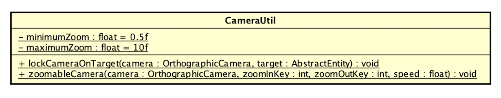

In our game, we have camera and debug camera. Both of them are OrthographicCamera type which will gave the player a top down view of the game.
- The main camera will be used for rendering the main game
- The debug camera will be used for rendering the debug info

# CameraUtil

## API
| Method | Description |
| ------ | ------ |
| **lockCameraOnTarget**(OrthographicCamera camera, AbstractEntity target) | Call this function to attach a specific camera to an entity object |
| **zoomableCamera**(OrthographicCamera camera, int zoomInKey, int zoomOutKey, float speed) | Make a target camera able to zoom in or out on 2 specific keys (2 variables **maximumZoom** and **minimumZoom** are the limit zoom range for the camera) |

# Documentation by @jayhuynh239
