# Description
At the very start of the game, before entering the first level, two combinations of knight and wizard will be shown to players. Then players will select either one to play with. 

_The design utilises and references already developed character design from [Wizard Design](combat/Wizard-design) & [Attack Design](combat/Attack-Design)._

# Combination Design
A combination includes one knight and one wizard. There are four wizards with different skills corresponding to the four elements: air, earth, fire, and water. On the other hand, knights have special powers as well but the design is planned to be equal for all, unlike the wizards. So four combination designs were created.
* The knight design was nicely derived from [Attack Design](combat/Attack-Design).
* Each wizard design references [Wizard Design](combat/Wizard-design).
* The 'mech' design was ignored because there are mechs corresponding to each wizard.

The aim was to design wizards similar but different. Like how a fire element can be implemented in the fire wizard's design. This was expected to make it more obvious for users to identify one another.

**Version 1.0**
* Firstly, the air wizard can be seen with an air ball and an air symbol placed at the top right like a card. Additionally, a light blue background matches the colour of the sky.
* Secondly, the earth wizard can be seen with elevating rocks behind and an earth symbol placed at the top right as well. This time the background is set to dark brown matching the ground, soil, or dirt.
* Thirdly, the fire wizard can be seen with tiny fire above his hand and a fire symbol placed at the top right. The background is set between orange and brown which is a secondary colour of fire after red.
* Lastly, the water wizard is quite similar to the air wizard holding a water ball. Water symbol at the top right and a dark blue background matching the deeper part of the sea. Also, to differ from the air wizard design.

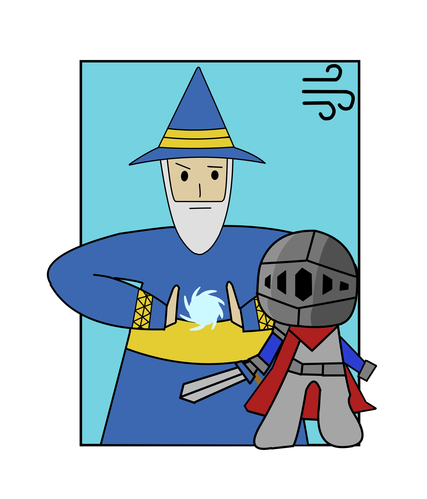
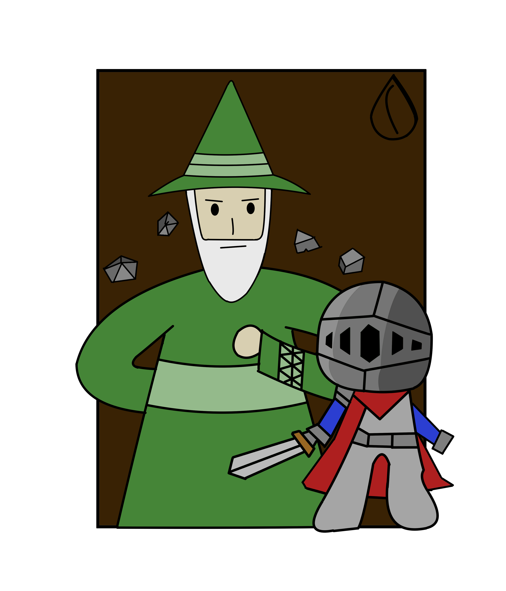
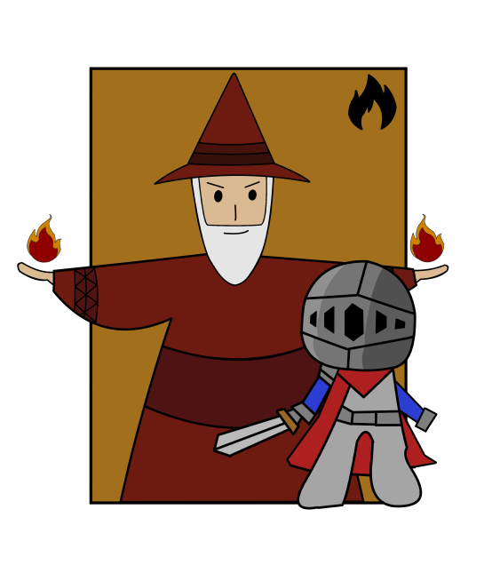
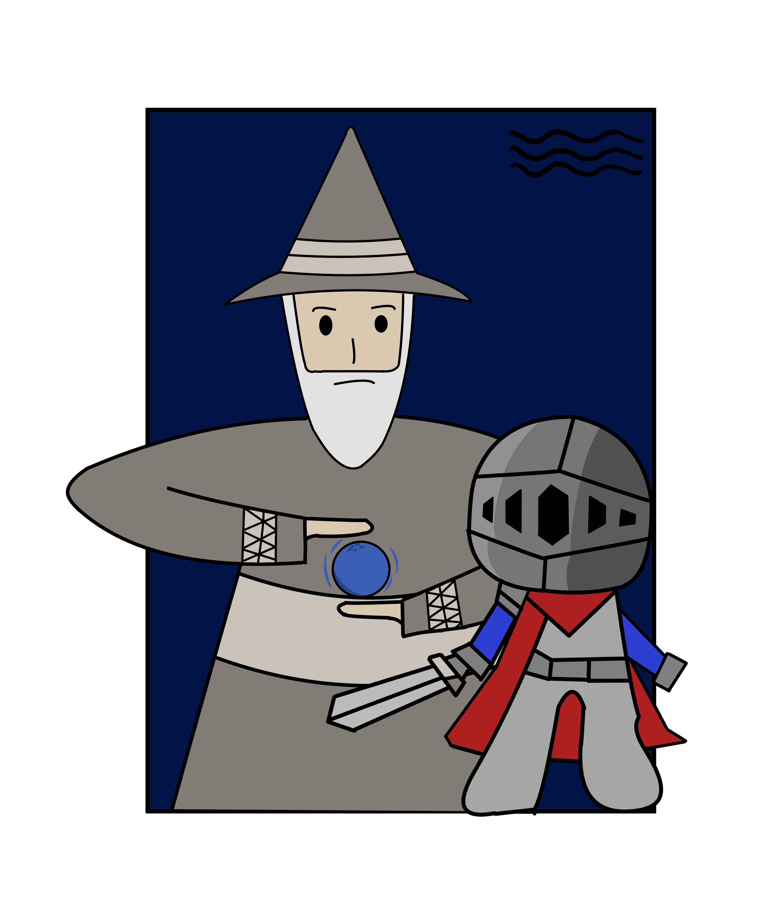

**Version 1.5**
Instead leaving the knight design exactly the same for all, it was decided to change it up a little. For example, different colours for each knights. Additionally to make it look like a team, the area characters took up in the design should be even. Therefore, a bigger canvas has been used to contain both characters equal in size.

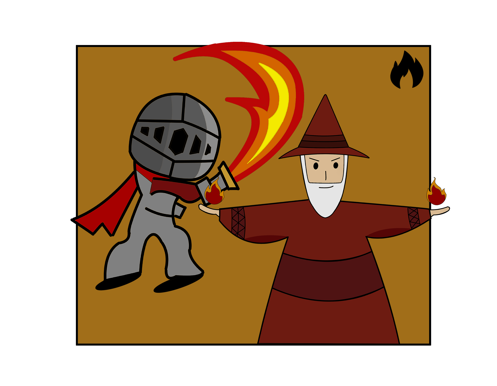
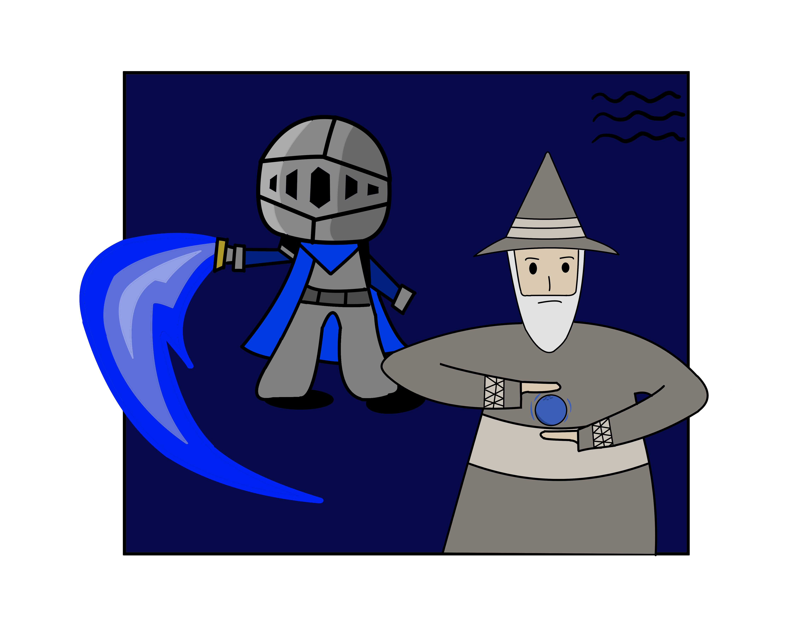

# Team Selection Design
The selection screen is designed simple as possible since the main attraction is the combination design. Below the combination design, a simple name of the combination will be placed. Since the combinations are straightforward, for instance, Fire Knight & Fire Wizard and Water Knight & Water Wizard. The background colour is obviously black to make the combination design stand out. But, the opacity of the background is reduced to 60% so the screen won't feel entirely blacked out. 

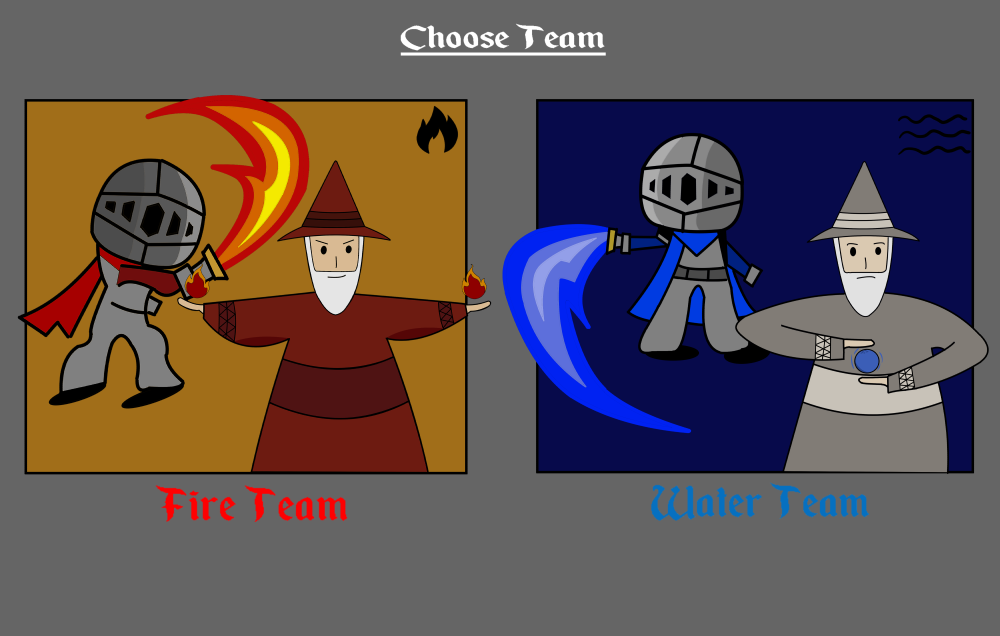

**NOTE:** only fire and water types are functional in game. Earth and air types will be completed later...

# Team Skill List Box Design
Before selecting a team, players will be able to see what skills they'll gain from a team. To give them more insight into each team. It utilises the same box design seen in world transition screens to keep the consistency.

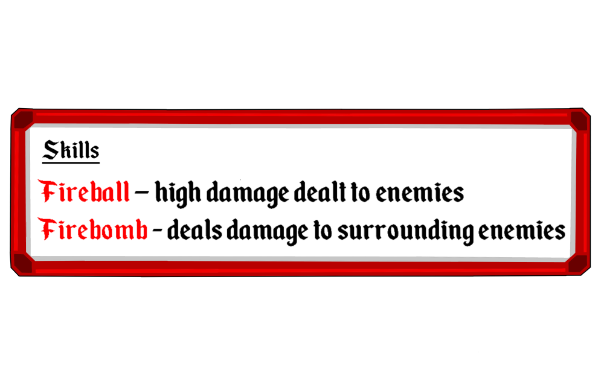
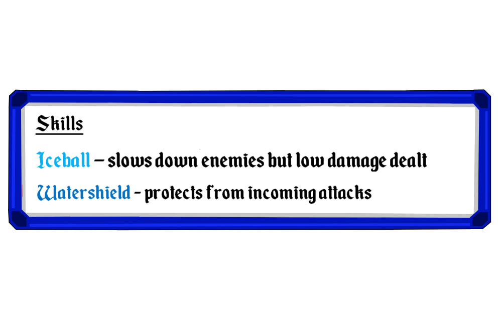

**Inspiration**

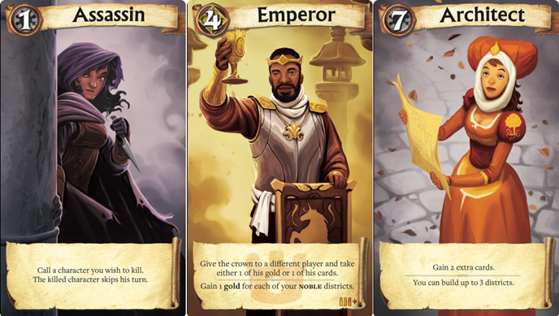

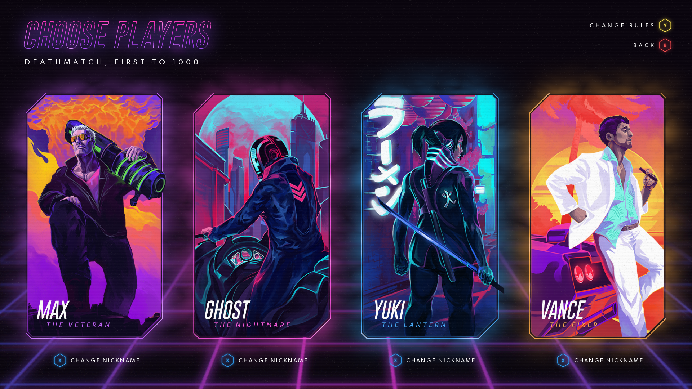

# Reference
* Law. K (2017), Citadels Is Still One of the Best Games to Play in Groups of Four or More. Image retrieved from: https://www.pastemagazine.com/games/citadels/citadels-review/
* HYPER JAM (2017), Character selection from HYPER JAM. Image retrieved from: https://www.reddit.com/r/outrun/comments/5b9us0/character_selection_from_hyper_jam_a_topdown/
* Portable City Designs (2020), Light Fingers Player Character Design Process. Image retrieved from: https://www.portablecity.net/light-fingers-player-character-design-process/

### Designer: @jisungkim.k
### Programmer: @quan281999
### Documentation by: @jisungkim.k