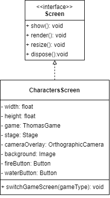
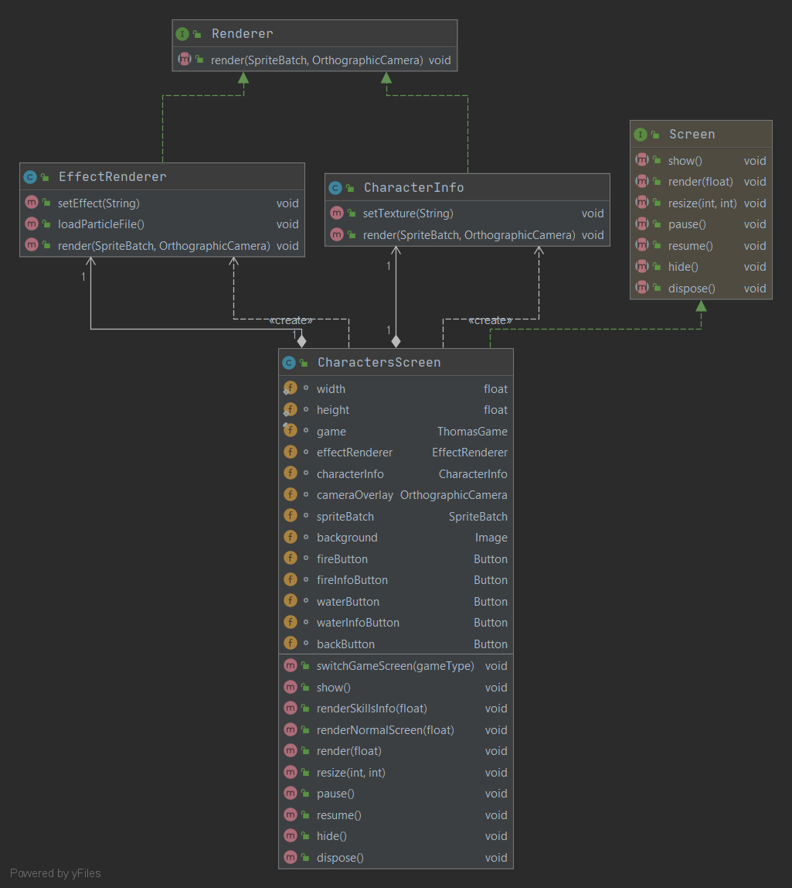
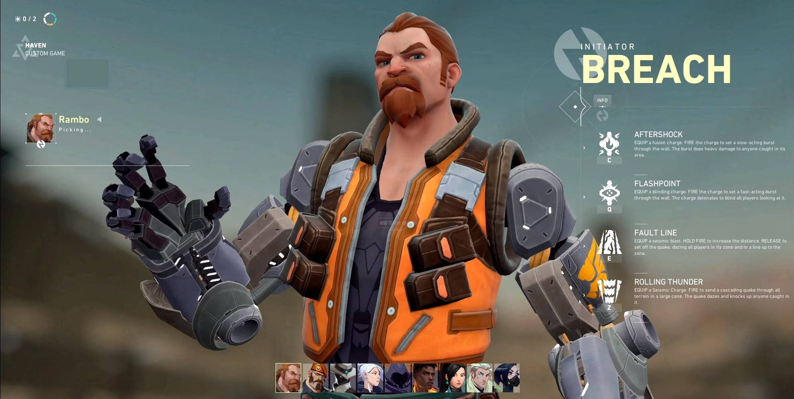

# renderers/EffectRenderer.java
* This class implements `Renderer`.
* `COMMON_DIR_PATH`: Root of the path to the directory that contains all the necessary files.
* `effect`: (_"fire"_ or _"water"_).
* `setEffect()`: Set the value of `effect`.
* `loadParticleFile()`: Load the respective particle effect file based on the value of `effect`.
# renderers/CharacterInfo.java
* This class implements `Renderer`.
* It renders the information about a specific character.
# screens/CharactersScreen.java
* This class implements `Screen`.
* The `render()` method calls `renderSkillsInfo()` or `renderNormalScreen()` depends on the variable `showSkillsInfo`.
* The `renderSkillsInfo()` method renders the information about the character that the player clicks.
* The `renderNormalScreen()` method renders the background of the screen and 4 buttons.
  * `fireButton`: the player clicks this button when they want to select the 'Fire' team.
    * Set the 'Fire' wizard and 'Fire' knight and start the game.
  * `fireInfoButton`: the player clicks this button when they want to know about the skill of the 'Fire' team.
    * Set the `effectRenderer` and `characterInfo` to show 'Fire' team.
  * `waterButton`: the player clicks this button when they want to select the 'Water' team.
    * Set the 'Water' wizard and 'Water' knight and start the game.
  * `waterInfoButton`: the player clicks this button when they want to know about the skill of the 'water' team.
    * Set the `effectRenderer` and `characterInfo` to show 'water' team.
* `switchGameScreen()`: This method changes the screen to the game screen with a transition effect (1 second of fading out). 
* `resize()`: This method updates the width and the height of the stage of the screen whenever the game is resized.
# UML Diagram
* Version 1.0  

* Version 2.0 (10/10/2020)

# User Testing
* The main purpose of this user testing is to find out what users think about the design of the Characters Selection Screen and determine any point that must be improved. The user testing was done via Zoom and TeamViewer to make sure that all the participants can experience the entire flow of the game. Firstly, the users were asked about their experience of the video games they have played. Secondly, the users were introduced briefly to the game so that they could have an overview of what they are about to be interacted with. Finally, they were allowed to play through the game before answering some finishing questions on their opinion.
* General background of the users:
  * In total, there are 5 people who participated in this user testing. The majority of them are university students doing Graphic Design, IT, or Engineering. All of them have greater knowledge and experience in user testing and UX/UI. Four out of five participants play video games in their free time (game such as Final Fantasy, World of Warcraft, Diablo, and League of Legends).
* Questions:
  * Are you familiar with the design of this screen?
  * Does this Choosing Character Screen look similar to the ones in the games you've played before?
  * Do you like the color and font used in this screen?
  * Is the screen descriptive and instructive enough?
  * You want to be able to choose a character at the start of the game or at the start of every game?
* Valuable feedback:
  * It is great that the design of the screen is consistent with other designs of the whole game.
  * The arrangement of the screen is clean and reasonable.
  * Five out of five participants agreed that the player should only be allowed to choose a character at the start of the game. 
  * One major defect of the screen is not informative (the player is not informed about the strengths and weaknesses of the characters). It is hard for the player to make a decision about which type of characters to choose since they do not know the attributes and skills of the characters. The participants said that in those games that they have played, accompanying each character is detailed information about that character. One participant suggested that the screen should be implemented that whenever the player hovers the cursor over the character, the modal which contains the information will be displayed. Another participant showed the Characters Selection Screen in the game he played recently.

Source: https://mobalytics.gg/blog/valorant-characters-agents-abilities-overview/
  * One participant recommended that when the player clicks the 'Play Again' button, he/she should be redirected to the Characters Selection Screen (currently, when the button is clicked, the player is redirected directly to the game). He said that when the player dies and wants to play again, he/she might want to try another character. Moreover, this way of implementation could encourage the player to try out every available character in the game
* Works that need to be done based on the results of user testing:
  * Add information (description of strengths and weaknesses) of each character.
  * Modify the ‘Play Again’ button so that it allows the player to choose a new character when they want to play again.

### Programmer: @quan281999
### Documentation by: @quan281999
