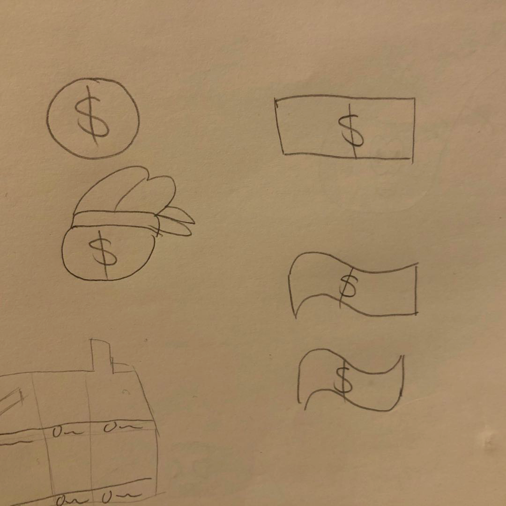
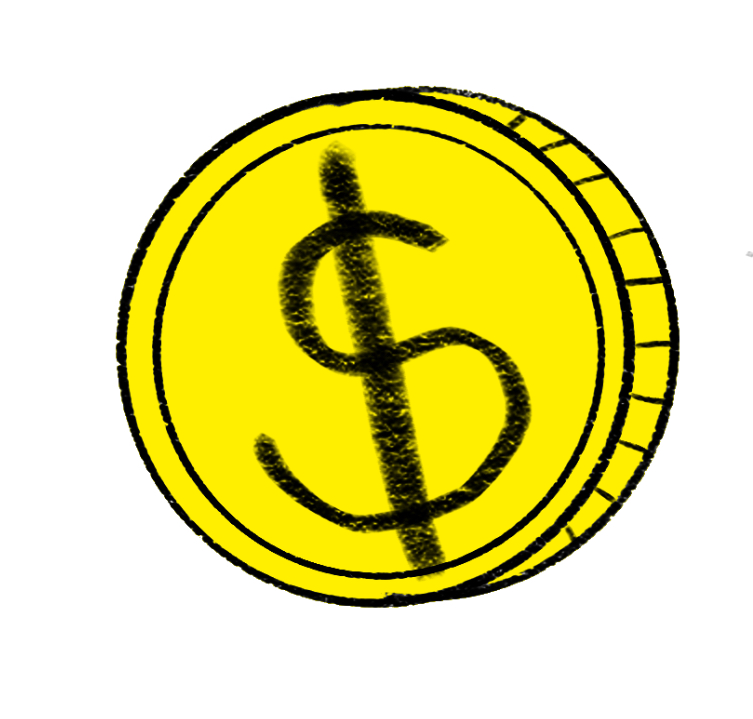
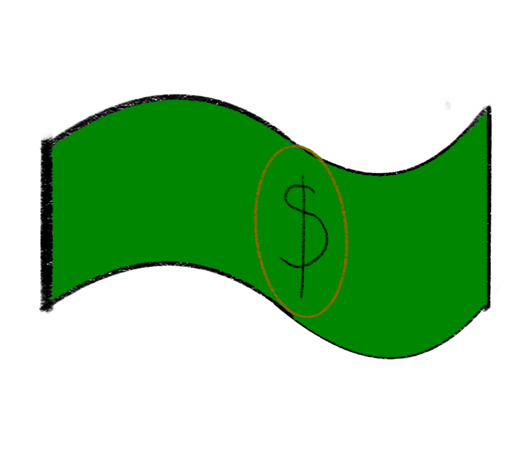
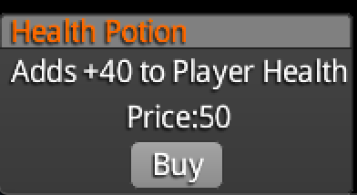
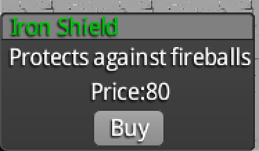
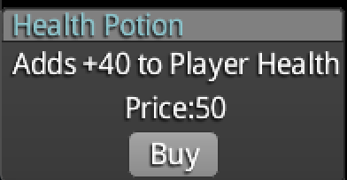
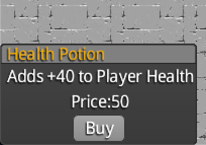

# **Design Processes:** 
For the choice of currency, we used the most common coins and banknotes as a reference. 

# **user test**
After design completed, a user testing will be conducted to test the acceptance of the design concept. The participants who will be invited for testing are students outside our studio, and they will be given the pictures and asked few questions based on the design.

User testing was done to find out which of the two currency designs provides best player interaction and experience. And the user test was done by online chatting with 5 interviews. First, we introduce the game concept to them to explain how the game works. And then, we ask some question to them:   
1,Will you buy things in the game？   
2,How do the games you play most often provide currency？   
3,Which currency do you prefer?   
   
4, Here are each environment’s dialog boxes, do you have any advice?
   

Through the user test, all four respondents chose the first currency because they felt that the appearance of gold coins was more in line with medieval elements.   
For user feedback: 
The first gold coins will be use, that's more suitable for medieval game. And the dialog box should add small NPC on and use different colors to distinguish weapons and potions.   
Next, the selected currency style should be used in the game, and improvements should be made based on the feedback given by users.
