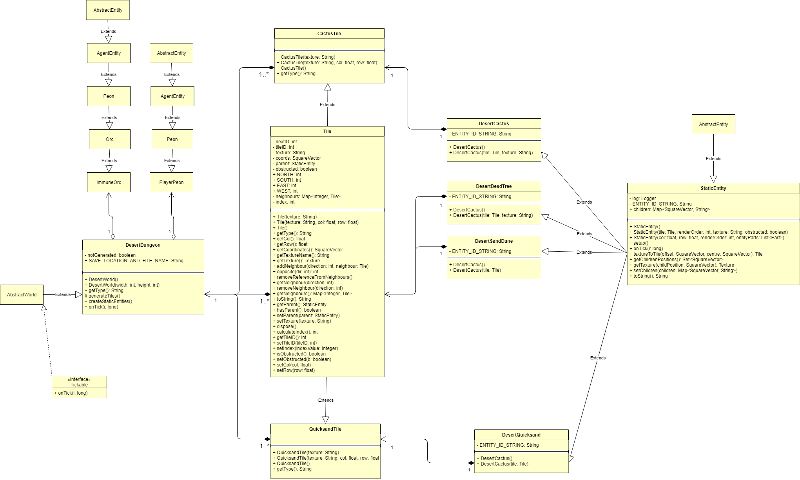
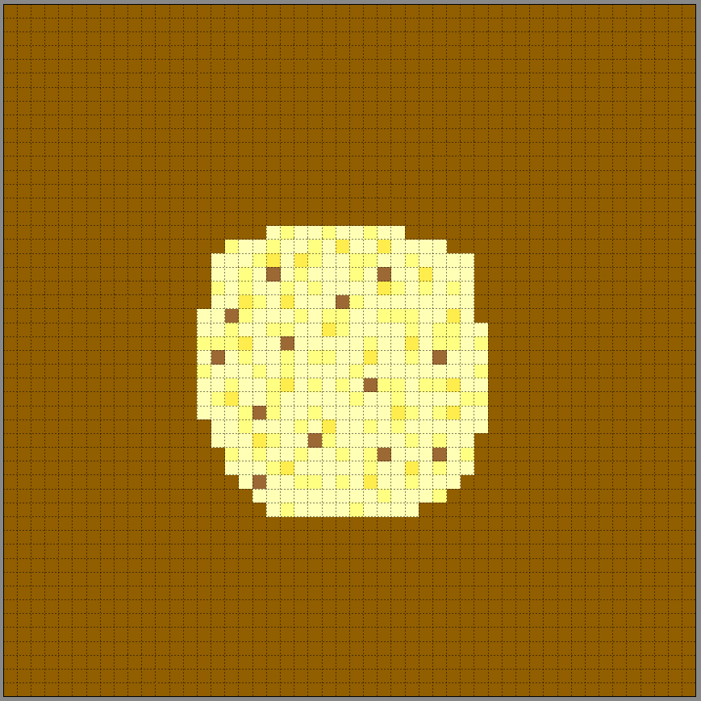

# Wiki last updated 11/10 - End of Sprint 3

## Description 
The Desert Dungeon is an Area-styled world, where the player must fight a unique enemy - an Orc which is immune to all forms of player-inflicted damage. The only way to escape the dungeon is to kill the Orc, who can only take damage from environmental sources - i.e. by standing on cactus plant neighbours and quicksand tiles. So, the solution to the dungeon is to evade the Orc and lure him into standing on damaging tiles. Once the Orc is defeated, the player is granted a new skill, Sandtornado, and a portal is spawned to bring the player back to the Desert World.

## Design Decisions
Just like with the normal Desert World, the Desert Dungeon forces the player to be very careful about their movement. Now, the player must constantly evade a fast Orc enemy and try to defeat him by bringing him close to damaging tiles. In doing so, the player must also be careful not to walk on a damaging tile themselves or to let the Orc get too close. To avoid the player being confused about how to complete the dungeon, a dialog box is shown upon entry which gives a hint on how to defeat the Orc.

## Classes
### DesertDungeon
The main class for the dungeon, which handles the rendering of the world, creating all the static entities and spawning the Immune Orc. This class extends AbstractWorld and implements methods in the same way as the Desert World class - see its Wiki here: https://gitlab.com/uqdeco2800/2020-studio-2/2020-studio2-henry/-/wikis/Desert-Zone/edit
Unlike the Desert World class, the DesertDungeon class also shows a dialog box upon entering the zone and spawns a lone Immune Orc enemy. The DesertDungeon also does not need to spawn additional enemies, items, NPCs or a boss.

### ImmuneOrc
The class for the unique Orc enemy of the Desert Dungeon. This class extends from Orc and only overrides three methods from this parent class:
* applyDamage: overridden so that only the NOT_IMMUNE damage type can damage this orc. This type can only be applied by Desert World environmental status effects.
* death: overridden so that in addition to handling a normal Orc death, the player is also granted the new Sandtornado skill and an exit portal back to the Desert World is spawned.
* deepCopy: overridden so that a new ImmuneOrc is returned, rather than a regular Orc.

The Immune Orc also has higher base stats that regular Orcs - notably much faster speed (0.2f), health (100) and damage (30).

### DesertDungeonDialog & DesertDungeonOpeningDialog
These classes extend from LibGDX's Dialog class and provide a simple basis for showing the opening dialog box when the player enters the dungeon.

## Desert Dungeon Class Diagram // UML:

## Desert Dungeon Tileset

## Improvements: 
This Dungeon could be improved by providing the player with a better means of understanding how to kill the unique enemy. Currently, the player is never explicitly taught that quicksand and cactus tiles can damage the player peon or that they can be used to damage enemies - some information on this could be added to the tutorial section of the game.
The Dungeon could also be balance tested to see if its difficulty should be increased or decreased in response to user testing. This would be as simple as increasing or decreasing the Immune Orc's combat stats.
Changes could also be made to the Immune Orc's attack pattern, as currently it appears to take a long time to actually deal its damage to the player - even if the Orc and the player are in adjacent tiles.
Lastly, the Immune Orc could be given a new texture to signify that it is a different type of Orc to the one that might have been fought in the Desert World.

## Testing:
Currently no tests have been written explicitly for the Desert Dungeon. Although, much of the functionality for the new classes is covered by existing tests. For example:
* The DesertWorld class has tests which cover the majority of the methods in the DesertDungeon class
* The Orc class has tests which cover the majority of the methods in the ImmuneOrc class, etc.

That said, in Sprint 4 more tests should be written to provide more complete coverage of the new classes.

# Documentation by @zachary_oar (Zachary Oar)