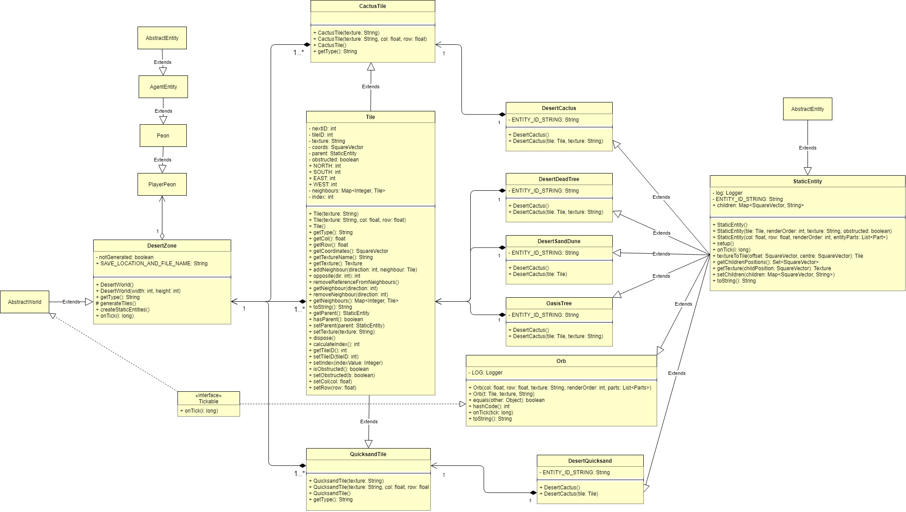

# **Desert Zone Wiki - Last updated end of Sprint 1 - 06/09/2020**
## Description
The Desert World is one of four main zones in Polyhedron.  It is a landscape with a desert aesthetic - with tiles coloured like sand, trees being mostly dead, and entities such as cactus plants, sand dunes and quicksand scattered across the zone.  The world is 50x50 tiles, with large walls separating key areas.  The Boss and orb of the zone are located in the north-east quadrant of the map, near an oasis (which features water-coloured tiles and palm tree entities to fit the theme).  Players spawn near the centre of the world and must traverse several obstacles to reach the oasis and take on the Boss.  After the Boss is defeated, it drops an orb.  If the player walks over this orb, they are teleported to the next Zone.

## Design Decisions
The Desert World is designed to make a player focus closely on their movement.  This is done with a few key features:
* Large sand dune wall sections that stretch across the world, separating key areas of the map (which could be used for questing, etc.),
* Quicksand maze sections, which force a player to walk a specific path to avoid taking damage from the quicksand,
* Cactus plants, which damage the player if they stand too close - once again influencing a player's movement decisions.

## Classes
### DesertWorld
The main class for creating this Zone and all of its entities.  This class extends `AbstractWorld` and implements several methods to construct the Zone:
* `generateTiles()`, which calls `DatabaseManager.loadWorld` with the json save file (located at `resources/environment/desert/desert_map.json`).  This loads all tiles on the map from a predetermined setup.  Then, this function adds the Boss and other enemies to the Zone.
* `createStaticEntities()`, which adds all static entities such as cactus plants, sand dunes and quicksand to the map.  Entities are added based on the `Tile` textures - e.g. all `Tiles` with texture "desert_5" have a sand dune entity added to them.
* `onTick(long i)`, which first calls `createStaticEntities()` if entities have not yet been generated, and then handles all necessary actions that must be taken by the DesertZone class for this tick of the game.
### CactusTile
This class extends the base `Tile` class, but has an overridden `getType()` method - so that is now returns "Cactus", instead of "Tile".  This will be important in future sprints when environment damage is implemented and cactus plant entities can inflict damage to the player.  The `CactusTile` will always have a cactus plant entity on top of it.
### QuicksandTile
Similar to CactusTile, this class extends the base `Tile` class, but its `getType()` method returns "Quicksand" instead of "Tile".  Once again, this will be useful in future sprints when quicksand entities can damage the player.  The `QuicksandTile` will always have a quicksand entity on top of it.

## Entities
All entities created for this Zone extend from `StaticEntity` and have an `ENTITY_ID_STRING` variable which signifies its name.  Entities can be `obstructed`, which means that the player cannot walk over them.
### DesertCactus
The cactus entity for this world.  The `ENTITY_ID_STRING` of this entity is "DesertCactus".  This entity is constructed with one of four different textures, and is always `obstructed`.  In future sprints, the player will be damaged if they walk on a neighbouring `Tile` to this entity.
### DesertDeadTree
A dead tree entity for this world.  The `ENTITY_ID_STRING` of this entity is "DesertDeadTree".  This entity is constructed with one of two textures, and is always `obstructed`.  These entities are randomly scattered around the map and provide a small obstruction of the player's movement.
### DesertQuicksand
The quicksand entity for this world.  The `ENTITY_ID_STRING` of this entity is "DesertQuicksand".  This entity is constructed with one texture, and is not `obstructed`, meaning the player can walk over it.  In future sprints, the player will be damaged and slowed if they walk over this entity.
### DesertSandDune
The sand dune entity for this world.  The `ENTITY_ID_STRING` of this entity is "DesertSandDune".  This entity is constructed with one texture, and is always `obstructed`.  These entities are placed in specific areas of the Zone to create large walls that obstruct player movement and separate key areas.
### OasisTree
The oasis tree entity for this world.  The `ENTITY_ID_STRING` of this entity is "OasisTree".  This entity is constructed with one of two textures, and is always `obstructed`.  These entities are randomly placed in the Zone's oasis area, to provide a small obstruction to the player.

## Future Sprints
In future sprints, the main addition required for this zone is the damage/slowing functionality of the quicksand and cactus plant entities.  The player should be damaged when standing on a neighbouring `Tile` of a cactus plant entity, or when standing on top of a quicksand entity.  Additionally, the player should have slower movement speed when walking over a quicksand entity.  This will make the quicksand maze sections of the map functional - unlike now, where the player can simply ignore them.

Other improvements to the zone include:
* Polishing the static entity textures, since some textures are sized incorrectly and stretch beyond their assigned Tiles.
* Placing enemies in key areas of the map, rather than random placement.  This way, they player is required to fight several enemies along their path to the Boss.
* Tailoring enemies to fit the design aesthetic of the Zone, rather than being default orcs.
* Adding quests and trading places to the Zone, which would encourage the player to explore new areas of the map (such as the south-eastern quadrant, where the player must traverse a quicksand maze).

## UML Diagram of the DesertZone Class

## Testing
Due to DesertWorld requiring a functioning GameManager class (which stores instances of every other type of Manager class), it was not possible to develop tests for the DesertWorld class.  Also, since the new static entity classes essentially consist of nothing more than constructors, it was deemed that tests for these classes were unncecessary.  Tests have been written for the CactusTile and QuicksandTile classes, providing proper code coverage.

In future sprints, efforts should be made to refactor the DesertWorld class so that proper tests can be conducted on its Tile and Entity compositions.

# Documentation by @zachary_oar (Zachary Oar)