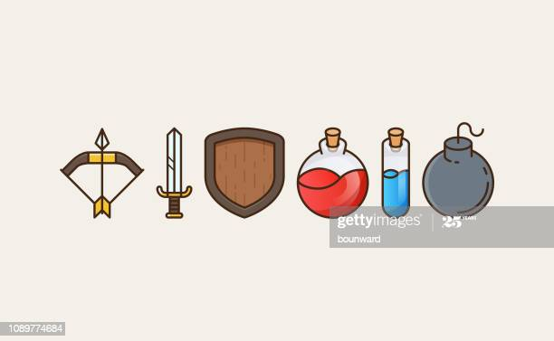
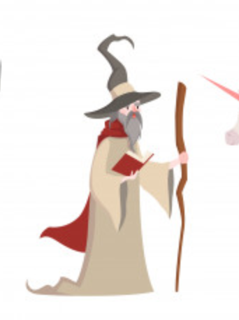
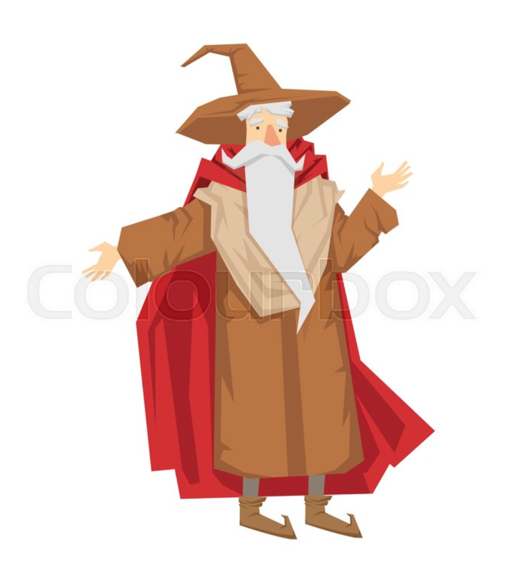
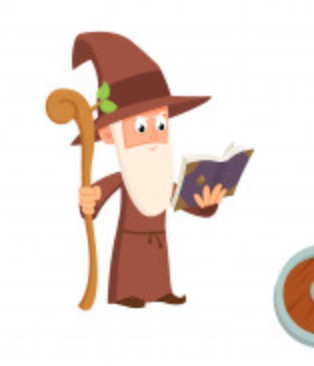
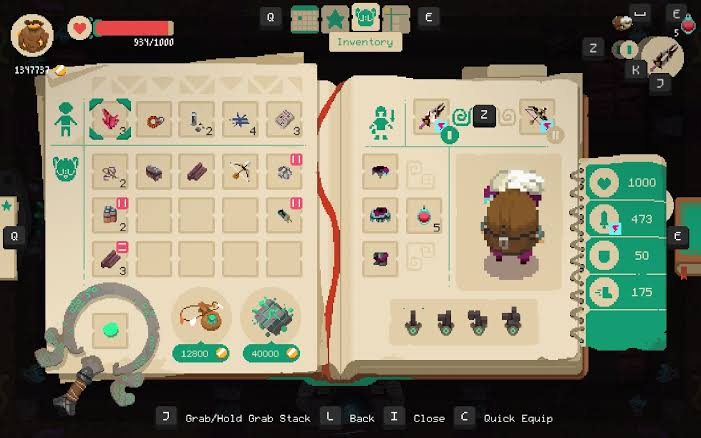
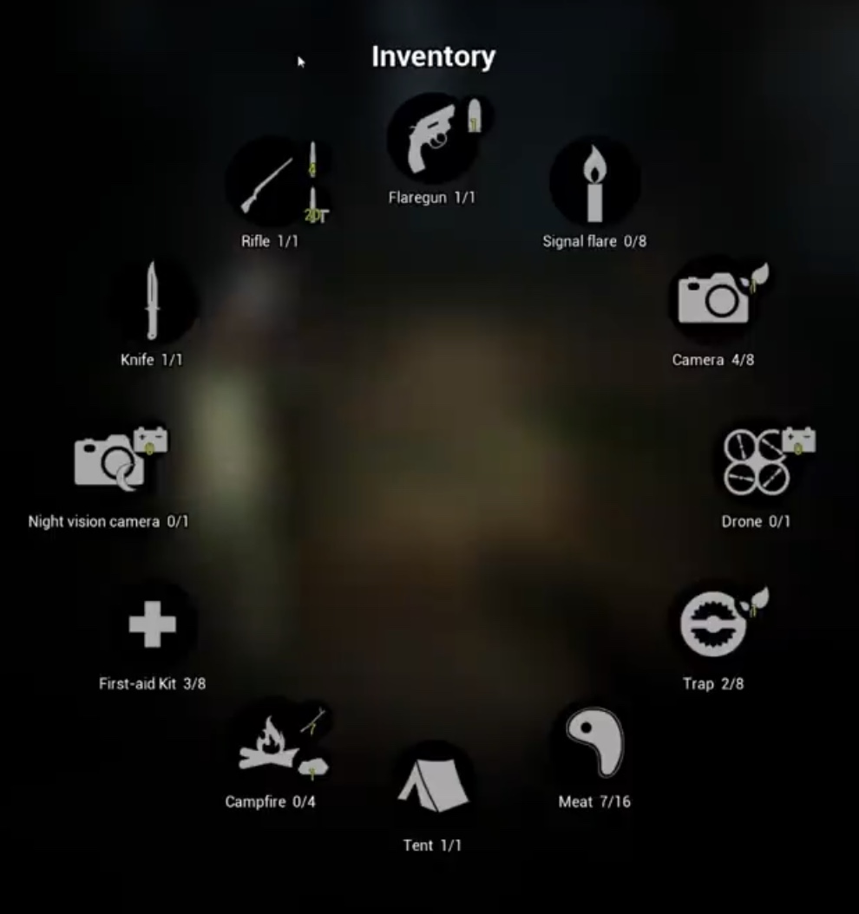
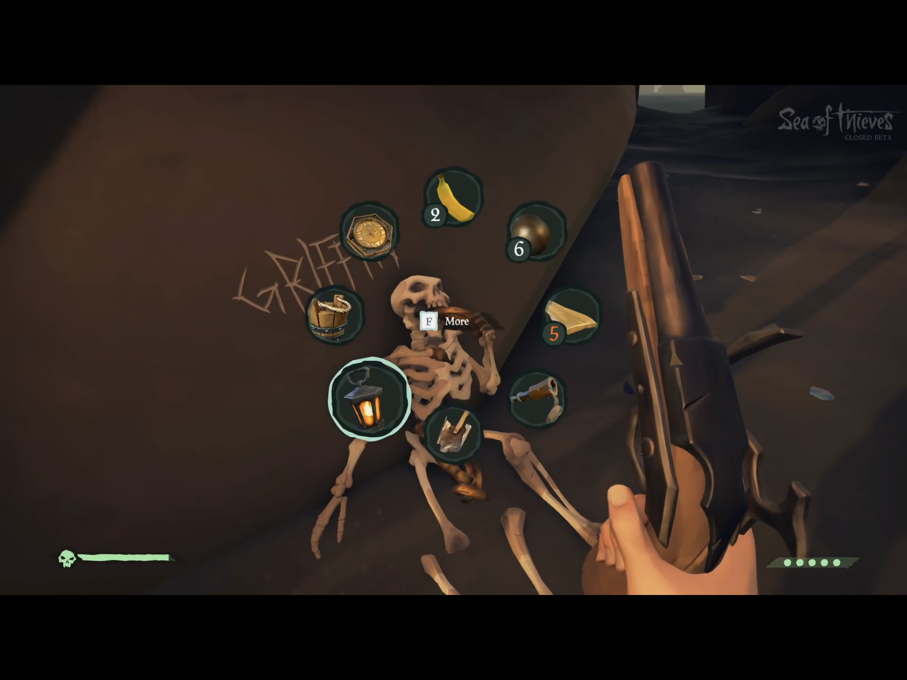

This is the design guide.

[[_TOC_]]

# Art Style
Art Style: not pixel art
Hand drawn art.

## Drawing Style
Medieval game?
Setup and inspiration board - take inspiration for character / enemy / item design.

## Design Inspiration
**item**

reference: https://www.gettyimages.com.au/illustrations/potion?family=creative&mediatype=illustration&phrase=potion&sort=mostpopular

**wizard**

**Inventory Screen**

Reference: 
1. https://www.rockpapershotgun.com/2019/01/28/overthinking-games-how-moonlighters-inventory-combats-your-greed/
2. https://youtu.be/E7wPy3X8fyA
3. https://www.indiedb.com/games/samutale/news/finished-the-new-inventory
4. https://youtu.be/KjkyXkbxMzU

# Colours
Colours for each section of the map, establish a colour palette for each zone.

## Colour Palettes
- Environment 1
- ... 

# Design Methods
Design around the environment, informed by colour scheme for each environment.
Characters have their own colour scheme, should be sufficiently different from the environment.

## Design Tools
- Adobe Illustrator - good for flat design - vector art.
- SketchBook - good for colour the pics
- PicsArt - make image to transparent
- Tayasui Sketches Pro - sketch, colour, transparency background all in one for $9.90 (if you okay with paying :) )