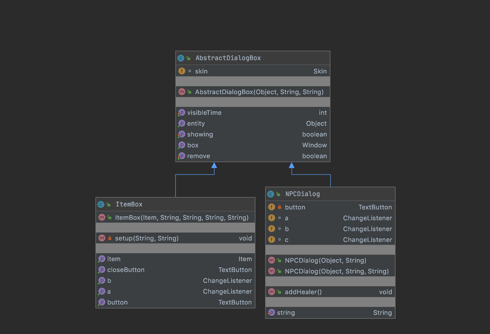
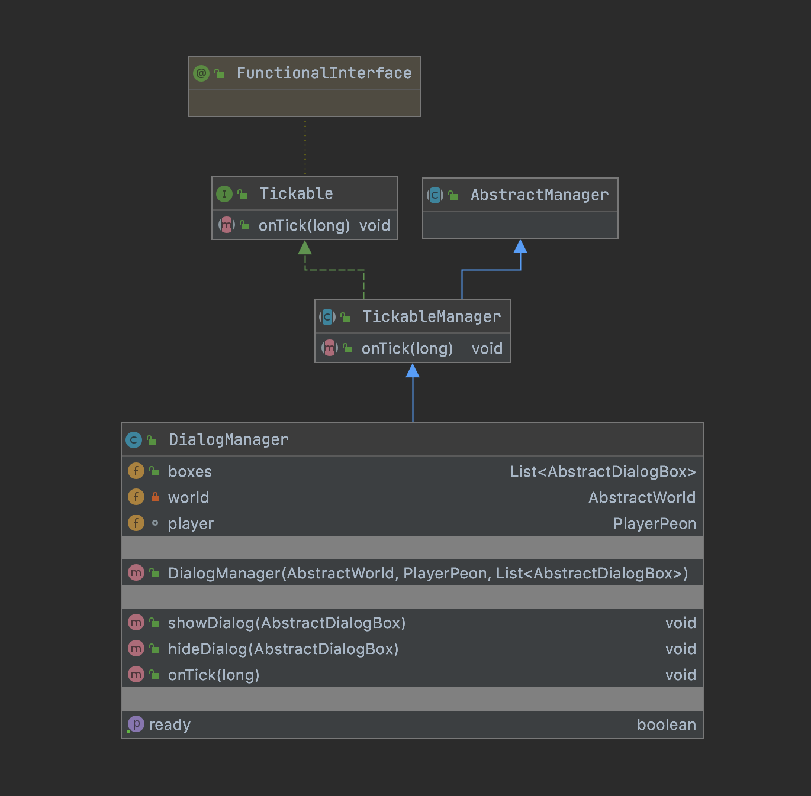

## **Description** 
Dialog Boxes are displayed on the screen if the player interacts with an NPC or an item. For NPCs, they display NPC Dialogue. For items, they include two types of text buttons. 

When created, all items and NPCs also create an Object of type AbstractDialogBox. All these Abstract Dialog Boxes are managed by a Dialog Manager. 
## **Abstract Dialog Box**
The Abstract Dialog Box class is the parent class of ItemBox and NPCDialog. It creates a window Widget with the uiskin. It contains the common getter and setter methods both ItemBox and NPCDialog use to communicate with Dialog Manager about the whether the dialogBox is visible or not, etc. When items or NPCs are created in each World, their Abstract Dialog Box members are added to an ArrayList of All[World_Name]Dialogues. 

#### Public Methods

Returns true if the AbstractDialogBox is displayed on Game Screen. 
```java 
public boolean isShowing()
```

Sets whether AbstractDialogBox is displayed on GameScreen or not. 
```java 
public void setShowing(boolean value)
```

Increases count of how long AbstractDialogBox has been displayed on GameScreen. 
```java 
public void setVisibleTime(int time)
```
Returns how long AbstractDialogbox has been displayed on GameScreen.
```java 
public int getVisibleTime()
```

Returns Window widget for this AbstractDialogBox 
```java
public Window getBox() {
```

Sets boolean value checking whether to remove entity or not. If true, entity is removed.
```java
public void setRemove(boolean rem)
```

Returns remove value. If true, entity to be removed from GameScreen.
```java
public void getRemove()
```

Returns the entity (Item or NPC) connected to this AbstractDialogBox. 
```java
public Object getEntity()
```

### **Item Box**
ItemBox is a subclass of AbstractDialogBox made specifically for Items. ItemBox creates an Abstract Dialog Box with two buttons. If the item is a Treasure, it creates a window with two buttons - "Open" and "Close". If the item is a potion or shield, it creates a window with buttons "Buy" and "Close". On clicking "Open"/"Buy" buttons, the item is removed from the map and window is hidden from Game Screen. On clicking "Close" button, only the window is hidden from the game Screen.

### Public Methods
Returns the primary text button. TextButton has text Open if Item is Treasure, and Buy otherwise.
```java
public TextButton getButton()
```

Returns the close button.
```java
public TextButton getCloseButton()
```

 Sets up Window and Button widgets with correct information. 
```java
private void setup(String description, String price) 
```

Returns the ChangeListener for button TextButton.
```java
public ChangeListener getA() 
```
 
Returns the ChangeListener for close TextButton. 
```java
public ChangeListener getB() 
```

### **NPC Dialog**
NPCDialog is a subclass of AbstractDialogBox which allows NPCs to display multi-stage dialogue.

#### Public Methods 
Sets the text for the TextButton
```java
public void setString(String str)
```
Returns dialogue displayed on dialog box
```java
public String getLine(String str)
```

### **UML Diagram**


## **Dialog Manager**
DialogManager manages all AbstractDialogBoxes in the current world. 
It ensures: 
- No action is done until the gameManager screen has been set up (is not null). 
- Only one box is displayed on the game screen at a time. 
- If an item is bought, or treasure box is opened, the entity is removed from the game world. 

### **UML Diagram** 


## Testing 
Unit testing was completed for ItemBox, AbstractDialogBox and DialogManager to ensure they worked as expected.


#### Public Methods 
 Displays the given dialogBox on Game Screen. 
```java
public void showDialog(AbstractDialogBox dialogBox) 
```

Hides the dialogBox from the Game Screen. 
```java
public void showDialog(AbstractDialogBox dialogBox) 
```

 Returns whether the DialogManager is ready to show AbstractDialogBoxes.
```java
public boolean getReady()
```

 Manages actions happening as time passes in game world.
```java
public void onTick(long i)
``` 

## Possible Extensions & Future Testing 
- Changing design of boxes with new environment-specific skins. 
- Closing all other dialog boxes before another one is made visible on the screen

Future Testing Options
- Test different styles of boxes for different environments, NPCs. 
- Change button layout. e.g. an x in top right corner for a familiar Windows-OS like experience. 
- Test various types of dialog box sizes and positioning on the screen. 


#### Last Updated: 
End of Sprint 3: Oct 10.
