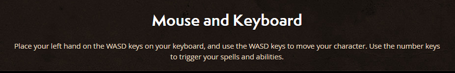
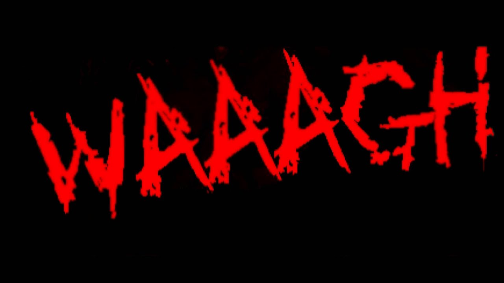
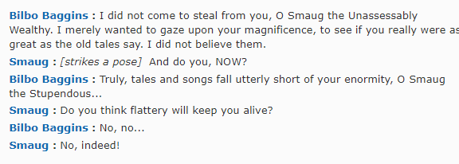

This document will contain information related to how the dialogue will be stored and accessed. There will also be the dialogue content and it's design progression.

**Version 1.0**

Tutorial Dialogs

- Welcome to (Game Name) Intro about the state of this world.
the world has been devastated with the reemergence of the five pythagoras Orbs. In order to save this world, you will need to collect all of the orbs and restore balance to the world.
- Movement (WASD)
The movements for this game are W for up, S for down, A for left, D for right, please move to the checkpoint marked with a flag to proceed.

- Combat (Attack keybind)
An enemy is infront of you, click (attack key) to kill the monster

- Get orb (Interaction)
There is a (object) in front of you, would you like to pick it up?

- Complete (Automated)
Congratulations on completing the tutorial, would you like to move to the next stage

Characters Dialogs

Dialog for the different characters before starting a quest

4 Wizards

Fire wizard

- I am the wizard of fire, pick me and I'll burn all your enemies to ashes.

Water wizard

- I am the wizard of water, pick me and I'll drown all your enemies.

Air wizard

- I am the wizard of air, pick me and I'll blow all your enemies away.

Earth wizard

- I am the wizard of earth, pick me and I'll crush all your enemies to ground.

2 Knights 

Shield Knight

- I am the shield knight, nothing can stop my advance

Sword Knight

- I am the sword knight, i will make quick work of your enemies

4 zones dialogs

Quest guy dialog (win conditions)
- Dialog before the start of each quest
- Welcome adventure to (zone name) , to complete this stage, you will have to locate the orb of (depend on zone). The monsters here are vulnerable to (element) and hashave high defense(attack/defense) but low attack(attack/defense). Choose your character wisely.

Cutscene dialogue

- Congratulations for completingcollecting the orb and completing the quest, you will now proceed on to the next stage. 

Random NPC (unknown)

Monster dialog (sounds)

Dead Dialogs

- Dialog from when you die
- Too bad, you died, would you like to restart from your previous checkpoint? 

End credits Dialogs

- Dialog for when you finish the game
- End results (Your dead/Good job you won)
- Congratulations, you have collected all the orbs and restored peace to the world.

After some user testing, this dialogue was found to be a bit repetitive and bland. The dialogue should be more unique but still fitting of the genre. Changes were made so that the repetitive nature was removed while remaining within the genre of fantasy.

**Version 2.0**

Tutorial Dialogues

- Welcome to (Game Name) the world has been devastated with the re-emergence of the five pythagoras orbs. In order to save this world, you will need to collect all the orbs and restore balance to the world.

- Movement (WASD). 
To move your character press W for up, S for down, A for left, D for right, please move to the checkpoint marked with a flag to proceed.

- Combat (Attack keybind)
An enemy is in front of you, get closer and click (attack key) to kill the monster

- Get orb (Interaction)
There is an orb in front of you, pick it up by interacting with it.
Complete (Automated)

- Congratulations on completing the tutorial, would you like to move to the next stage or redo the tutorial?

Singleplayer

- Welcome to (Game Name) the world has been devastated with the re-emergence of the five pythagoras orbs. In order to save this world, you will need to collect all the orbs and restore balance to the world.

Characters Dialogs

- Dialog for the different characters before starting a quest

4 Wizards

Fire wizard

- I am a Pyromancer,, pick me and I'll burn all that stands before you to 
ashes.

Water wizard

- I am a Hydromancer , pick me and I'll drown all our enemies.

Air wizard

- I am a Anemancer, pick me and I'll unleash a hurricane on our foes.

Earth wizard

- I am a Geomancer, pick me and I'll crush all monsters with mother earth.

2 Knights
Shield Knight

- I am the shield knight, nothing shall get past my shield.

Sword Knight

- I am the sword knight, i will make quick work of your enemies.

4 zones dialogs

Quest guy dialog (win conditions)

- Dialog before the start of each quest
- Welcome adventure to (zone name) , to complete this stage, you will have to locate the orb of (depend on zone). The monsters here are vulnerable to (element) and have high (attack/defense) but low (attack/defense). Choose your character wisely.

Cutscene dialogue

- Congratulations for collecting the orb and completing the quest, you will now proceed on to the next stage. 
Random NPC

Monsters

- Roar
- Grrrr

Dead Dialogs

Dialog from when you die
- Too bad, you died, would you like to restart from your previous checkpoint or start anew? 

End credits Dialogs

Dialog for when you finish the game
- Congratulations hero, you have collected all the orbs and restored peace to the world.

**Version 3.0**
Changes made due to other teams naming conventions

Tutorial Dialogs

- Welcome to Decodia Intro about the state of this world.
the world has been devastated with the reemergence of the five pythagoras Orbs. In order to save this world, you will need to collect all of the orbs and restore balance to the world.

- Combat (Attack keybind)
An enemy is in front of you, get closer and click M1 to kill the monster

4 zones dialogs
Quest guy dialog (win conditions)

- Dialog before the start of each quest
- Welcome adventure to Swamp Zone to complete this stage you will have to locate the orb of muck. The monsters here are vulnerable to air.

- Welcome adventure to Volcano Zone to complete this stage you will have to locate the orb of lava. The monsters here are            vulnerable to earth.

- Welcome adventure to Tundra Zone to complete this stage you will have to locate the orb of ice. The monsters here are vulnerable to fire.

- Welcome adventure to Desert Zone to complete this stage you will have to locate the orb of sand. The monsters here are              vulnerable to water.

**Version 4.0**

Tutorial Dialogues

- Greetings my students, you must save the world of Decodia by defeating the dragons and collecting the orbs they have stolen. You will have to use your combined powers of steel and magic to prevail against the looming terrors.

- Movement (WASD). 
To move your mech press W for up, S for down, A for left, D for right, please move to the checkpoint marked with a flag to proceed.

- Combat (Attack keybind)
An enemy is in front of you, get closer and click (attack key) to kill the monster

- Get orb (Interaction)
There is an orb in front of you, pick it up by interacting with it.
Complete (Automated)

- Congratulations on completing the tutorial, would you like to move to the next stage or redo the tutorial?

Singleplayer

- Welcome to Decodia the world has been devastated with the re-emergence of the five pythagoras orbs. In order to save this world, you will need to collect all the orbs and restore balance to the world.

Characters dialogues

- Dialog for the different characters before starting a quest

4 Wizards

Fire wizard

- I am a Pyromancer,, pick me and I'll burn all that stands before you to 
ashes.

Water wizard

- I am a Hydromancer , pick me and I'll drown all our enemies.

Air wizard

- I am a Anemancer, pick me and I'll unleash a hurricane on our foes.

Earth wizard

- I am a Geomancer, pick me and I'll crush all monsters with mother earth.

2 Knights
Shield Knight

- I am the shield knight, nothing shall get past my shield.

Sword Knight

- I am the sword knight, i will make quick work of your enemies.

Cutscene zones dialogues

- Dialog before the start of each quest
- Welcome adventure to Swamp Zone to complete this stage you will have to locate the orb of muck. The monsters here are vulnerable to air.

- Welcome adventure to Volcano Zone to complete this stage you will have to locate the orb of lava. The monsters here are            vulnerable to earth.

- Welcome adventure to Tundra Zone to complete this stage you will have to locate the orb of ice. The monsters here are vulnerable to fire.

- Welcome adventure to Desert Zone to complete this stage you will have to locate the orb of sand. The monsters here are              vulnerable to water.

Orb zone dialogues
- Congratulations for collecting the orb and completing this zone, you will now proceed on to the next stage. 

Monsters

- Roar
- Grrrr

Dead dialogues

Dialog from when you die
- Too bad, you died, would you like to restart from your previous checkpoint or start anew? 

End credits dialogues

Dialog for when you finish the game
- Congratulations hero, you have collected all the orbs and restored peace to the world.

**Version 5.0**

The plot at the beginning did not explain why the orbs were needed just that they were the objective, this caused the tested users to feel the objective was lackluster and just an arbitrary win condition. The individualism and uniqueness of each zone and boss should be further upheld as the user found this repetitive so each boss was given its own name to make it more unique and not just name after the zone it is in. The noise made by the enemies was found to be boring and not unique to the monster itself so blurbs tied to the enemies character have been made.   

Tutorial Dialogues

- Greetings my students, you both must save the world of Decodia by defeating the elder dragons and collecting the orbs they have stolen. These orbs contain the great power of the elements and without them the world is out of balance. You will have to use your combined powers of steel and magic to prevail against the looming terrors.

- Movement (WASD). 
To move your mech press W for up, S for down, A for left, D for right, please move to the checkpoint marked with a flag to proceed.

- Combat (Attack keybind)
An enemy is in front of you, get closer and click (attack key) to kill the monster

- Get orb (Interaction)
There is an orb in front of you, pick it up by interacting with it.
Complete (Automated)

- Congratulations on completing the tutorial, would you like to move to the next stage or redo the tutorial?

Singleplayer

- Welcome to Decodia the world has been devastated with the re-emergence of the five pythagoras orbs. In order to save this world, you will need to collect all the orbs and restore balance to the world.

Characters dialogues

- Dialog for the different characters before starting a quest

4 Wizards

Fire wizard

- I am a Pyromancer,, pick me and I'll burn all that stands before you to 
ashes.

Water wizard

- I am a Hydromancer , pick me and I'll drown all our enemies.

Air wizard

- I am a Anemancer, pick me and I'll unleash a hurricane on our foes.

Earth wizard

- I am a Geomancer, pick me and I'll crush all monsters with mother earth.

2 Knights
Shield Knight

- I am the shield knight, nothing shall get past my shield.

Sword Knight

- I am the sword knight, i will make quick work of your enemies.

Cutscene zones dialogues

- Dialog before the start of each quest
- Welcome adventure to Swamp Zone to complete this stage you will have to locate the orb of muck. The monsters here are vulnerable to air.

- Welcome adventure to Volcano Zone to complete this stage you will have to locate the orb of lava. The monsters here are            vulnerable to earth.

- Welcome adventure to Tundra Zone to complete this stage you will have to locate the orb of ice. The monsters here are vulnerable to fire.

- Welcome adventure to Desert Zone to complete this stage you will have to locate the orb of sand. The monsters here are              vulnerable to water.

Orb zone dialogues
- You have slain Siendiadut the swamp dragon and gained the element of earth, use it to crush your foes.

- You have slain Chusulth the volcano dragon and gained the element of fire, use it to burn your foes.

- You have slain Diokiedes the tundra dragon and gained the element of water, use it to drown your foes.

- You have slain Doavnaen the desert dragon and gained the element of air, use it to blow down your foes.

Monsters

- Roar (dragon)
- Grrrr (dragon)
- WAAAAR (orc)
- Shinies (goblin)

Dead dialogues

Dialog from when you die
- Too bad, you died, would you like to restart from your previous checkpoint or start anew? 

End credits dialogues

Dialog for when you finish the game
- Congratulations hero, you have collected all the orbs and restored peace to the world.

**User Testing**
Each dialogue was read by a user and questioned for their experience and opinion on each blurb and overall theme.

1. Do you enjoy the fantasy genre?
2. Do you find the blurbs repetitive?
3. Do you find the blurbs out of place of the game?
4. Do you find the blurbs inappropriate?
5. Do you understand what the blurbs mean?
6. Any suggestions on a blurb/s? 

**Evaluation**
There were 5 interviewees, 4 of them enjoyed the fantasy genre. There were 3 participants that found the beginning of the plot to be questionable asking "So does the orb do anything?". The other two didn't care about the plot and just wanted to know the objective of the game. Due to this the beginning was kept short and clear while explaining everything involving the user's purpose. One of the user's pointed out that goblins don't really roar and that orcs can usually speak. This led to more stereotypical phrases the enemies could use while being short as it should only be appearing for a moment meaning the user will only have a short time to read it. Most of the participants didn't find the blurb repetitive with 1 participant actually liking the repetitive parts. This was due to it making the game seem more uniform. None of the users found the blurbs out of place or difficult to understand. 

### Designer: @jng94
### Written by @jng94

**References**
1.1 Tutorial - WOW

Retrieved from :https://worldofwarcraft.com/en-us/game/new-players-guide/part-two

1.2 Monster - Warhammer

Retrieved from : https://www.youtube.com/watch?v=jt_9fsA_XmA

1.3 Boss Names - The hobbit

Retrieved from : https://www.imdb.com/title/tt1170358/characters/nm1212722

