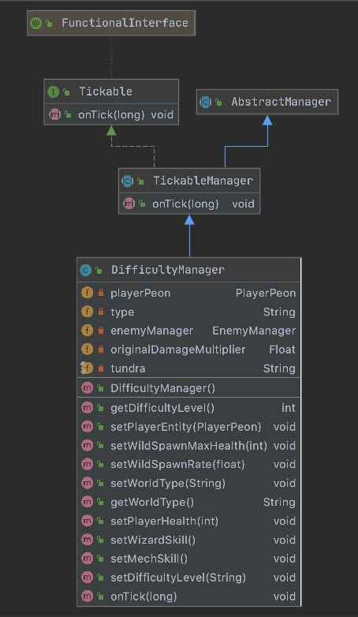
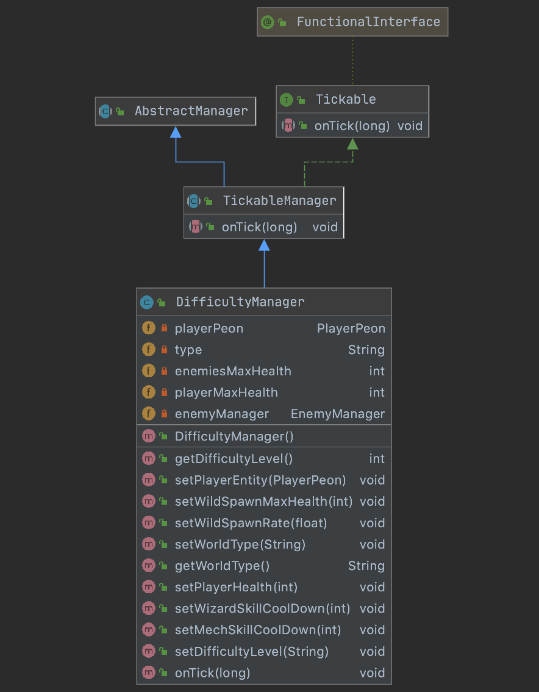
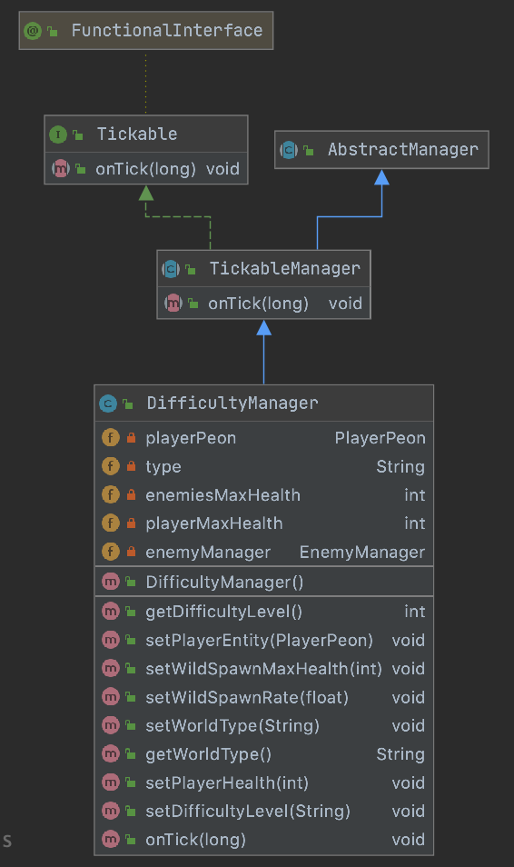
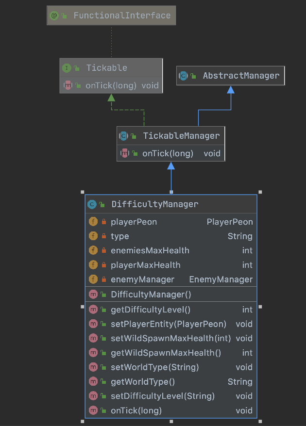

# Description

This document will contain relevant information on how the difficulty curve works.

# managers/DifficultyManager.java
<div align='center'>
<b> Version 4.0</b>
Updated the skills method to adjust according to world


</div>

# API

| Method | Description | Return |
| ------ | ------ |------ |
| <b>getDifficultyLevel()</b> | Returns difficulty level| **int** |
|<b>setPlayerEntity()</b>| Updates the player entity||
|<b>setWildSpawnMaxHealth(int Health)</b>|Sets wild spawn max health ||
|<b>setWildSpawnRate(float spawnRate)</b>|Sets the rate of spawning ||
|<b>setWorldType(String type)</b>|Sets the type of the world||
|<b>getWorldType()</b>|Returns world type|**String**|
|<b>setPlayerHealth(int difficulty)</b>|Sets the player health based on the overall world||
|<b>setWizardSkill()</b>|Changes the wizard skill damage||
|<b>setMechSkill()</b>|Changes the mech skill damage||
|<b>setDifficultyLevel(String type)</b>|Sets the difficulty of the overall world||


# Usage

Example use of <b>DifficultyManager</b>: 
Used on every world generated
Setting the overall difficulty of the world requires these 3 lines of code. 
After running this 3 lines of code other methods can be used to further customise it if needed.
```java
DifficultyManager difficultyManager = GameManager.getManagerFromInstance(DifficultyManager.class);
        difficultyManager.setPlayerEntity((PlayerPeon) this.getPlayerEntity());
        difficultyManager.setDifficultyLevel(getType());
``` 

# History:

<h3>managers/DifficultyManager.java</h3>

<div align='center'>

<b>Version 3.0</b>
- Update with some new functions for player




<b>Version 2.0</b>
- Update with some new functions



<b>Version 1.0</b>
- Intial Design of DifficultyManager


</div>

# NOTES
- <h3> Test Folder: managers/DifficultyManagerTest.java</h3>
- User testing to be carried out and finetuned in sprint 4 it will cover: 
    - Hp of Player
    - Hp of enemy
    - Hp of Boss
    - Spawn cap of enemy
    - Spawn rate of enemy
    - Damage of player
    - Skill cooldown manipulation
    - Skill damage manipulation
- Playtest carried out in [playtest](Difficulty Curve Playtest)
### Programmer: @yukaiku @jng94
### Documentation by @yukaiku

