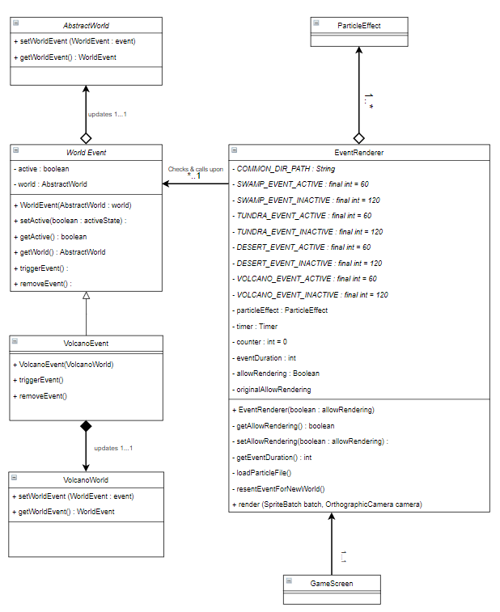

# Wiki last updated 20/09 - End of Sprint 2

## LibGDX 2D Particle Editor Software

- Download link: https://libgdx.badlogicgames.com/tools.html 

- Software Usage Documentation: https://github.com/libgdx/libgdx/wiki/2D-Particle-Editor

- Notes:
  - When done editing the particle effect, you should save the file with a `.p` extension.
  - Open the file in IntelliJ or any text editor, you will see at the end of the file is the path to the image(s) used in your effect. **Make sure that** all image(s) are placed in the same directory as the effect file.

## Description 
Dynamic Zone events are a varying states of Abstract world implementations that can modify the tiles, enemies & item spawns of a world whilst also providing visual effects & buffs to NPC's & the player at the same time.

## In renderers/EventRenderer

- `COMMON_DIR_PATH`: Part of the path to effect files that are the same for all of these files.

- `[ZONE]_EVENT_ACTIVE` and `[ZONE]_EVENT_INACTIVE` constants: The amount of time (in seconds) an event for the according zone is active or inactive. Change these values to your desired values.

- `allowRendering`: A Boolean to allow or disallow rendering of the event.

- `originalAllowRendering`: The original Boolean that is passed in when the `EventRenderer` object is first created. If `true` is passed in, the event occurs immediately and is deactivated later; vice versa if `false` is passed in.

- `getEventDuration` function:
  ```java
  private int getEventDuration() {
      AbstractWorld currentWorld = GameManager.get().getWorld();
      if (currentWorld instanceof SwampWorld) {
          return allowRendering ? SWAMP_EVENT_ACTIVE : SWAMP_EVENT_INACTIVE;
      } else if (currentWorld instanceof TundraWorld) {
          return allowRendering ? TUNDRA_EVENT_ACTIVE : TUNDRA_EVENT_INACTIVE;
      } else if (currentWorld instanceof DesertWorld) {
          return allowRendering ? DESERT_EVENT_ACTIVE : DESERT_EVENT_INACTIVE;
      } else if (currentWorld instanceof VolcanoWorld) {
          return allowRendering ? VOLCANO_EVENT_ACTIVE : VOLCANO_EVENT_INACTIVE;
      } else {
          return allowRendering ? TEST_EVENT_ACTIVE : TEST_EVENT_INACTIVE;
      }
  }
  ```
  
  - Retrieve the correct amount of time for an event to either be active or inactive based on the type of the current zone and value of `allowRendering` 

- `loadParticleFile` function:
  ```java
  private void loadParticleFile() {
      String filePath = null;
      String textureDir = null;
      AbstractWorld currentWorld = GameManager.get().getWorld();
      if (currentWorld instanceof SwampWorld) {
          filePath = "rain/blue-rain.p";
          textureDir = "rain";
      } else if (currentWorld instanceof TundraWorld) {
          filePath = "snow/white-snow.p";
          textureDir = "snow";
      } else if (currentWorld instanceof VolcanoWorld) {
          filePath = "rain/blue-rain.p";
          textureDir = "rain";
      } else if (currentWorld instanceof DesertWorld) {
          filePath = "sandstorm/sandstorm.p";
          textureDir = "sandstorm";
      } else {
          filePath = "rain/blue-rain.p";
          textureDir = "rain";
      }
      try {
          particleEffect.load(Gdx.files.internal(COMMON_DIR_PATH + filePath),
                  Gdx.files.internal(COMMON_DIR_PATH + textureDir));
      } catch (Exception e) {
          e.printStackTrace();
      }
  }
  ```

  - Load the respective particle effect file based on the type of the current zone
  
  - The image only requires the name of the directory that holds it. The effect file requires the container directory name and the correct name of the file

- Scheduling with `timer` object:
  ```java
  timer.schedule(new TimerTask() {
      @Override
      public void run() {
          if (counter == eventDuration) {
              setAllowRendering(!getAllowRendering());
              eventDuration = getEventDuration();
              counter = -1;
          }
          counter++;
      }
  }, 0, 1000);
  ```

  - This `run` function will be called once every 1 sec (hence 1000 milisecs).
  
  - `counter` is incremented until it is equal to the current `eventDuration` then `allowRendering` is inverted, `eventDuration` is reassigned accordingly and `counter` is reset back to 0.
  
  - This scheduled function call ensures that an event is interleavedly active and inactive for some amount of seconds (set with the constants mentioned above).

- Inside `render` function:
  ```java
  private void resetEventForNewWorld() {
      allowRendering = originalAllowRendering;
      counter = 0;
      eventDuration = getEventDuration();
      loadParticleFile();
  }

  if (GameManager.get().movedToNextWorld) {
      resetEventForNewWorld();
      GameManager.get().movedToNextWorld = false;
  }
  ```      
  - `movedToNextWorld` is a Boolean set to true when the `setNextWorld` function in `GameManager` finishes its call. 
  
  - When `movedToNextWorld` is true, `resetEventForNewWorld` is called to reset everything, ensuring that the event of the next zone is not affected by the event of the previous zone.

  ```java
  particleEffect.getEmitters().first().setPosition(camera.position.x - camera.viewportWidth / 2,
                      camera.position.y + camera.viewportHeight / 2);
  ```
  - The emitter of particles have a line shape with its origin placed at the left endpoint of the line.
  
  - The emitter line is now placed at the top edge of the screen for all zones. 

- The EventRenderer class is the main visual effects manager for each of the zones events that also calls `triggerEvent()` in implemented instances of WorldEvent. The call of `triggerEvent()` updates respective world tiles & entities according to the event. EventRenderer also stores static duration integers for each of the world states (event & non-event) & calls `GameManager.get().getWorld().getWorldEvent().setActive(boolean)` & `setAllowRendering` to toggle world events active states & visual effects once each of these durations have elasped. The class takes advantage of libGDX & uses one of its classes (`ParticleEffects`) from its libraries to generate particles and notify the user of an ongoing event via `loadParticleFile()` and `render()`. 

## worlds/WorldEvent.java
- An abstract skeleton class that provides a foundation for subclass implementations to manipulate their respective world tiles, entities & item as such. 

## worlds/volcano/VolcanoEvent.java
- A subclass implementation of WorldEvent, VolcanoEvent replaces the dormant, walkable, non-damaging LavaPools that are present in an inactive-event VolcanoWorld with damaging LavaPools whose tiles type changed to BurnTile (And textures to LavaTile Textures) so consequent damage can be dealt to entities that walk on the LavaPools while an event is active.

## Status Effects Class Diagram // UML:


## Improvements:
- Currently the only WorldEvent instance that can be called upon is the VolcanoWorld however it is likely that additional zone-specific events for zones such as tundra, desert & swamp will be fully polished off & implemented in future sprints.
- Multiple particles for event visual effects (Currently only support for one particle).

## Testing:
While limited testing has been developed for dynamic zone events, there remains plenty of code to be tested and as such future tests could include testing: 
- LavaPool initialisation during VolcanoWorld events.
- LavaPool tile textures & type return to their original state before the event is started.
- LavaPool damage entities during VolcanoWorld events.
- The setActive, getActive, setWorld & getWorld methods of WorldEvent.


# Documentation by @ArthurM99115 (Arthur Mitchell) and @hayden-huynh (Nguyen Thanh Hai Huynh)