Orb:

**Desert Zone:**

Cactus:

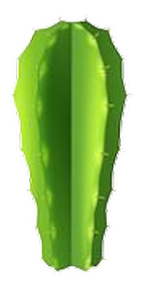

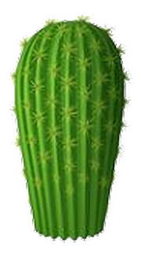

Dead Trees:

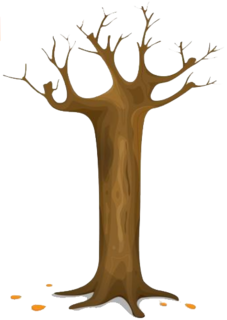

Orb:

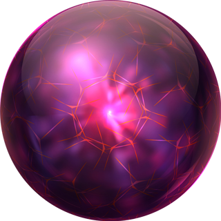

Sand:

Sand Dune:

Oasis Trees:

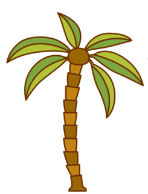

**Swamp Zone:**

Swamp Lake:

Tree Log:

Tree Stub:

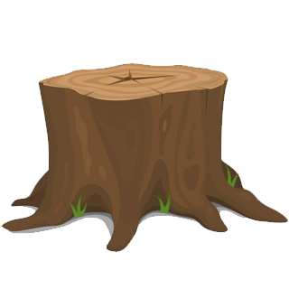

Dead Tree:

Fallen Tree:

**Tundra Zone:**

Camp File:

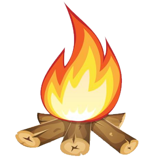

Rock:

Tree Log:

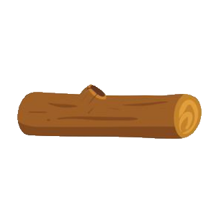

**Volcano Zone:**

Animal Skulls:

Ruins:

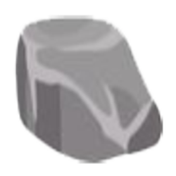

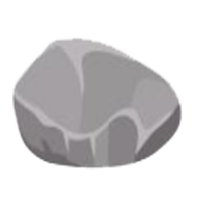

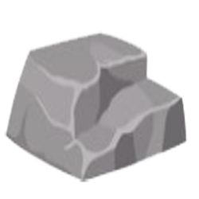

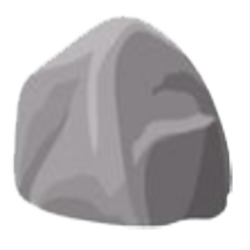

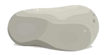

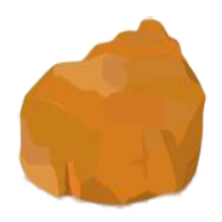

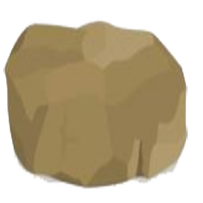

Bones:

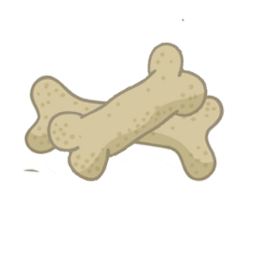

Burning Tree:

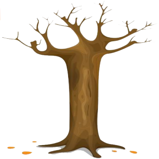
