**Entity Elements Design**

**Overall Design Style:**

The overall design style of entity elements tends to a little bright and colorful. As the theme colors of the background have been designed to be deep and dark, it would be tedious to design entity elements that are also that kinds of style. So the style of  designed entities is biased to relaxing and active as shown below.

**Entity Elements Design:**

Orbs:

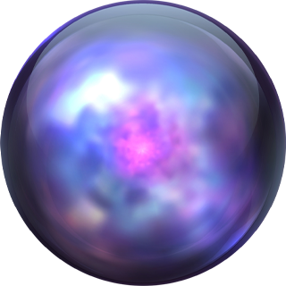

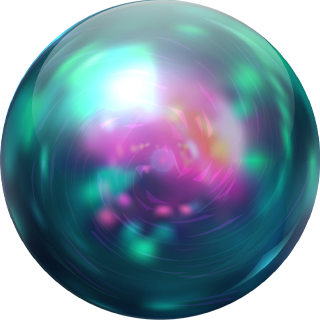

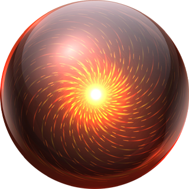

Trees:

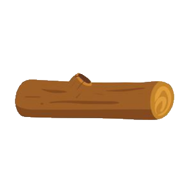

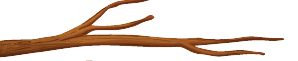

Lake:

Stones:

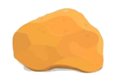

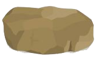

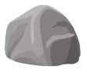

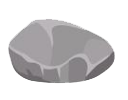

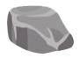

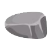

Bones:

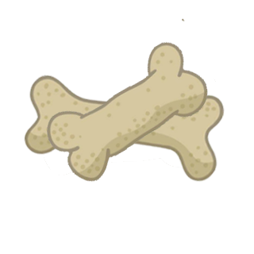

Cactus:

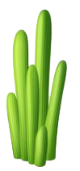

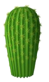

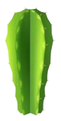

Campfile:

Shrub:

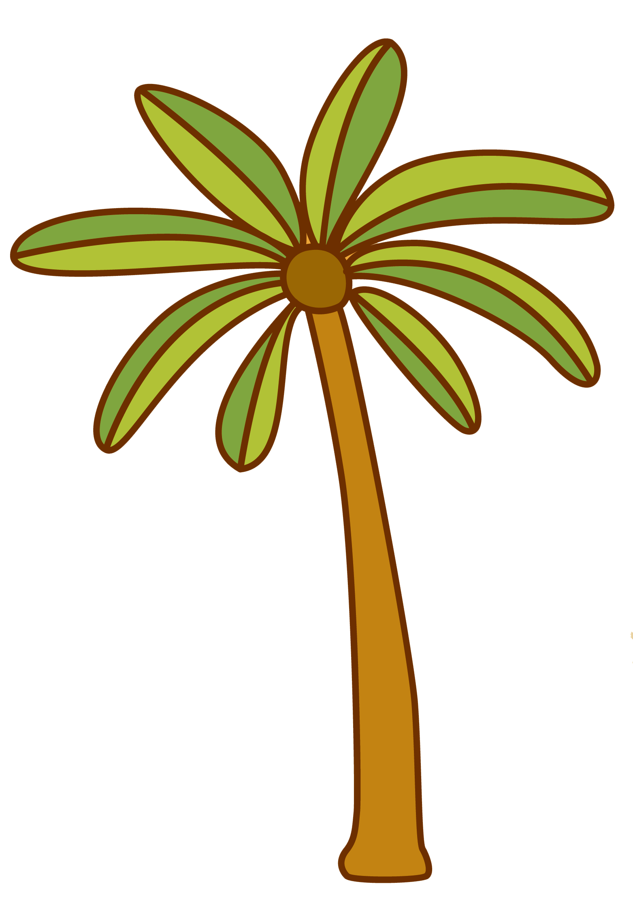

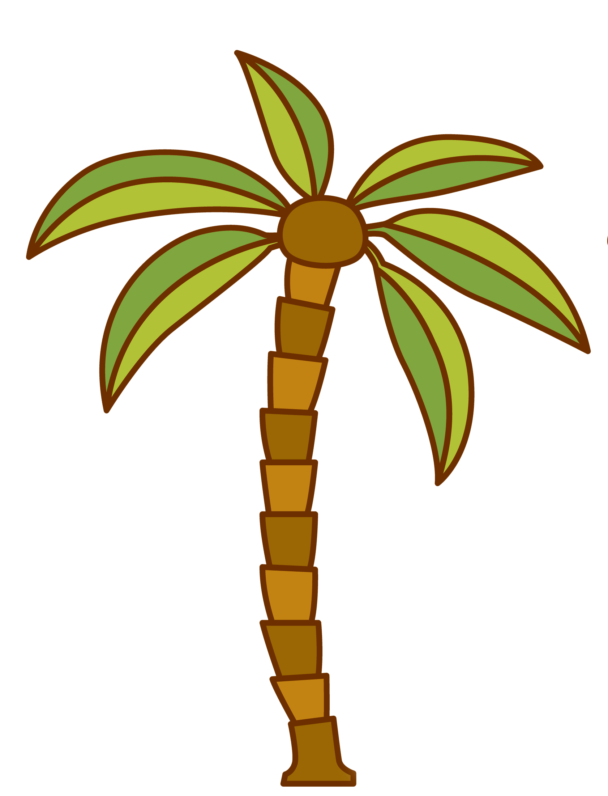

Sand dune:

