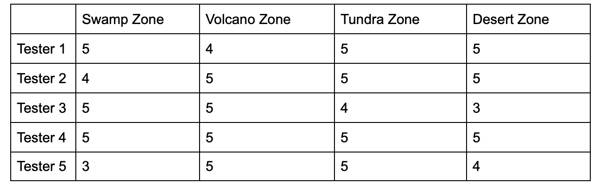
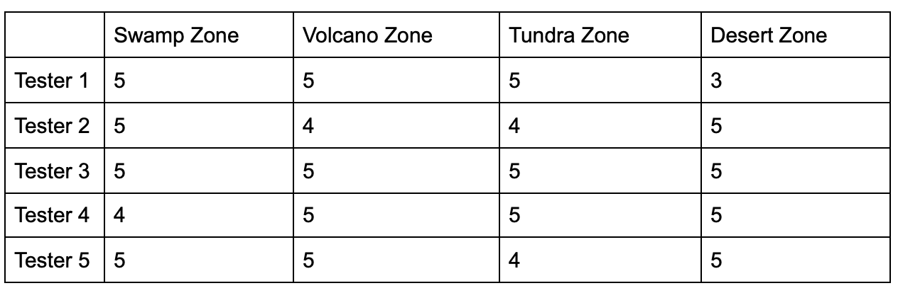
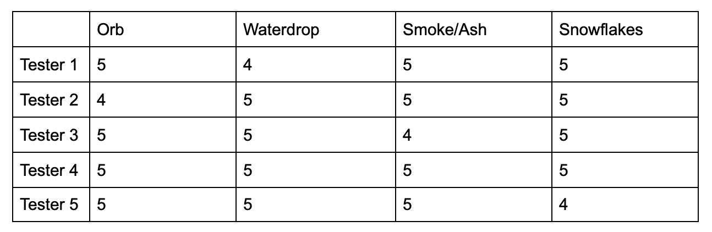
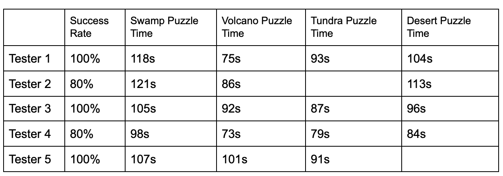

**Environment User Testing**

Session run by (name): JieLiang Yin (HoHo)

Studio and game name: Polyhedron

Feature team name: Henry

Location of testing: Online

Number of participants: 5
 

**Background**

Polyhedron is an action role-playing game set in a medieval European High Fantasy world where players customise magical mechs known as Polyhedrons and use them to fight against monsters to secure the five pythagoras Orbs and protect the Kingdom of Decodia. 

As our team focuses on the environment part, we will invite you to play the game and evaluate the environment part of the game. The whole procedure will last for about 10 minutes.

**Aims & Objectives**

The main goal of this testing is to know the usability and playability of our environment design, and get some golden feedback. 

The specific goals are: 

Test whether the look and functionalities of the 4 Zone maps are fun and attractive 

Test whether the look and functionalities of the 4 Dungeon maps are fun and attractive

Test the enjoyability/difficulty of puzzles inside each of Dungeon maps

Test whether the look and functionalities of all designed textures are fun and attractive

**Testing Approach**

Firstly I identified target users of our game including age, expertise, knowledge, background and game experience.Then I found such players on social media like Facebook and Discord and invited them to do the user testing which were conducted online via Zoom under such a special condition.

The first part of the user testing is that the player shared his/her screen, and I observed him/her playing the game in our environment and recorded the key data points. Then I interviewed him/her and asked questions based on the behavior he/she showed during the play to know the reason behind some unusual data points of him/her. Also the player could talk freely about his/her feelings and opinions about the environment of the game designed by us.

Finally he/she signed the consent form and the user testing was over. Then I evaluated the testing results, got insights from them and shared among all other teammates to improve the game together.

The test approach could be something like the following:

1. Explain game’s backstory and setting to testers (don’t explain the tested items).

2. Invite them to play the game (don’t explain the tested items).

3. Gather tester playing behavior and results data via observation while playing the tested items

4. Ask testers to rate the appearances and functions of tested items and explain why.

5. Ask testers about their feelings and thoughts on the tested items

6. Ask testers if they have any questions about the test, or the game.

7. Thank the tester for their time and input

**Testing Results**

Grading Scale:

0: not fun and attractive at all

1: very little fun and attractive

2. not fun and attractive enough 

3. a little bit fun and attractive

4. fun and attractive

5.very fun and attractive

Q1.Please rate the 4 zone maps: 

Q2.Please rate the 4 dungeon maps

Q3.Please rate the puzzles inside each of dungeon maps

Q4.Please rate the designed texture

Q5. Observe whether testers solve the puzzles successfully and the duration for them to solve

**Interview Results**

Game

> So my overall impression of the game is basically that certain levels need to be fleshed out more. Felt that the Ice level, swamp level are very basic and easy and should have been placed as the 1st level the player enters. The desert and the fire levels are much harder but I was unable to get through the fire level as everytime I made advancement to the dragon boss my game just died. That became a big problem throughout the whole experience. As you progress through each world your magic becomes stronger and I felt that I was ready to get through everything but the game just crashes as I feel as more elements appeared in the game such as more enemies the game engine was unable to handle it. so it dies fast

> The experience was great though I used more of the fire balls than the melee weapon as I felt it did not do any or much damage. Desert level is a real nightmare to navigate as cactus reach is nearly 2 squares so either way if you seem far from it you will be hit with 10 damage.

> Sand attack made you slower as most times it would, the character being placed on the grid sometimes does not align to the use of WASD pad and I had to use the mouse to make sure I'm not going to step on the sand parts to make me slower
The map helps because I get to see the boss where it is and shoot from afar but it did not seem to work with the fire one as I was still too far away. The Sand Dragon was the most powerful one I felt.

> Swamp dragon by far the easiest of them, and the Ice dragon was a challenge if you did go closer towards it. So if you stay near the start you're able to have a significant advantage.

Environment

> I would have loved to play the Tundra level because I was never able to get to that stage. The game crashes every 4th environment of the game. so I only did sand, swamp, and ice. Then when the lava level comes, I would get like a good 1 min or 2 mins time allocated to that level before I get close to the dragon and then it shuts down.

> I think another would be just making the desert being the 1st level less hectic to navigate I feel. The amount of cactus around and making it almost impossible to move around the map without losing life is a tough one.I had attempted it again and still the game shut down when i got to the lava pool area. I enjoyed the experience though and see the progress that you are doing there.

> The backgrounds add a feeling of natural look to them. I feel that it changes throughout different areas that you visit and you can see it when you enter a new area. This is true for something that is similar to Zelda and here. You can see the feel and the understanding of how it works out, from the sand to the swamp and to the ice. You can see how it changes and also changes the tone of the environment at the same time.

Four zone maps

> certain levels need to be fleshed out more. Felt that the Ice level, swamp level are very basic and easy and should have been placed as the 1st level the player enters. The desert and the fire levels are much harder but I was unable to get through the fire level as everytime I made advancement to the dragon boss my game just died. That became a big problem throughout the whole experience.
The experience was great though I used more of the fire balls than the melee weapon as I felt it did not do any or much damage.

> The map helps because I get to see the boss where it is and shoot from afar but it did not seem to work with the fire one as I was still too far away. The Sand Dragon was the most powerful one I felt.

> The ice dragon was a challenge if you did go closer towards it. So if you stay near the start you're able to have a significant advantage.

Textures
> They appeared like how I would perceive them in real life. I can see how it was displayed.

> All the elements worked out well, looked real, and looked detailed, especially the orbs, I felt they were the ones that had the most detail in the art itself, even more so than the main character.

> Other entities that I can see for sand level, have dry skull heads around. Have tumbleweed move around. Also the rocks around the place too, you can easily make bones, and tumble weeds that can be rolling around, just making it really life-like.

4 Dungeon maps

> The transition between world to world is very smooth. The dungeon level has an overall zelda like feel to it.

> Travelling from different lands showed very old nes zelda like game play that I enjoyed. The fireball shot from you was amazing and the melee weapon I felt was the only downside that I felt did not alot of damage for me. It felt more like a shield than melee.

> Knights cold fireball was not effective and very slow.But overall the game is great and beginning to showcase a lot of nice elements working together.

Puzzle

> It ran so much smoother and did not crash on me at all. I really enjoyed this play through and got to see the new elements of the game where the maze was provided here and the new area as well.

> It provides me with a nice challenge. But other than that randomizing the maze would work out well along the way. If you can randomize it more for other times when you go to it to make it random. It would make you want to think.

> The fire level I was able to fully explore here and found the lava floors up and down over through the different areas and I  really was amazed at that

**Evaluation Analysis**

Given the golden evaluation results above, I analyzed and get many valuable insights. For example: 

1.In general the design and development of the environment are successful that make players satisfied. (From user grading)

2.Bug should be fixed in Tundra level as it crashes in every 4th environment of the game  (From environment part of user interview)
 
3.The amount of cactus around should be set properly otherwise it would be impossible to move around the map without losing life. (From environment part of user interview)

4.Fire level should be adjusted as everytime player makes advancement to the dragon boss his game just died. That became a big problem throughout the whole experience. (From zone maps part of user interview)

5.Knights cold fireball was not effective and very slow, which should be improved.(From Dungeon maps part of user interview)

6.Bones and tumble weeds should be rolling around, just making it really life-like.(From Textures  part of user interview)
