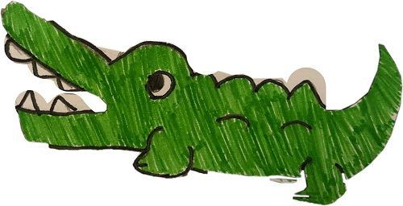
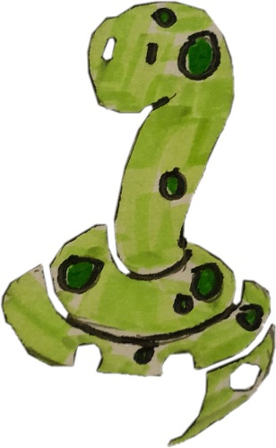
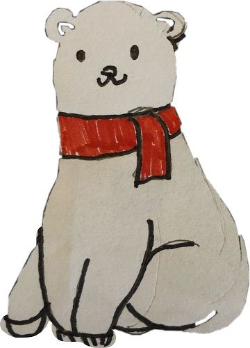
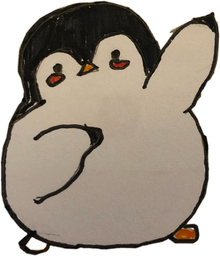
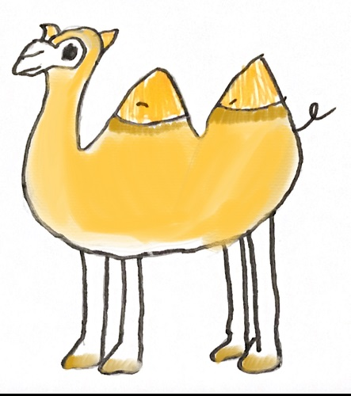
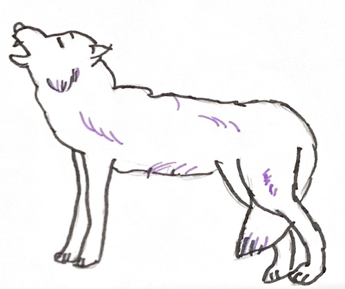
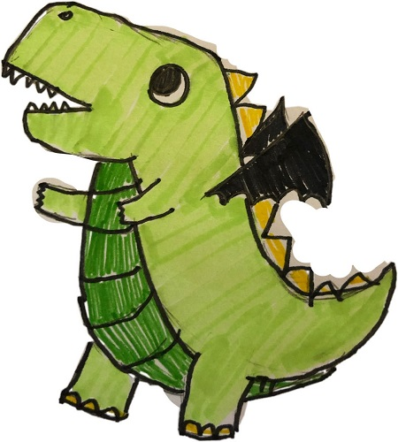
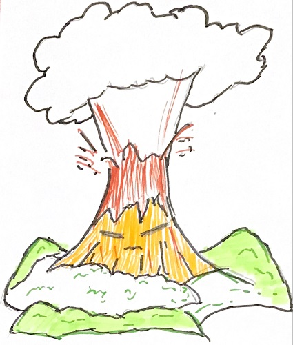

**Description:** 
Environmental NPCs are NPCs in certain regions of the game that can provide players some guidance to fight the boss.

**Design Processes:** 
All Environmental NPC designs are region-specific. First, we brainstormed an animal, a plant, and an object in each environment that could make a striking NPC. The decision was justified from the game brief; specifically that five Orbs had changed their surrounding flora and fauna. Once this initial brainstorming, we narrowed down to the 2 best options and created prototypes. We used these prototypes along with images of the environment to user test. Below, we layout this design process for each environment. 

**User Testing Method:** 
After designing, we had at least two possible NPC designs for each environment NPC and the health NPC. Testing was conducted to garner opinions on the different designs. In order to test how well our designs fit into each environment, we asked for help with the environment team. They were able to provide images of the various environments. We included these images directly. 

  We began the user tests by giving each tester some background about the game; in this primer, we explained the game was of the medieval fantasy genre, the win condition, that the player would use a combination of knights, wizards and mechs to win the game. We also integrated information from the enemy team about the types of bosses in the game; namely, the orcs, goblins and dragons the player would have to defeat with the help of NPCs. We then explained the function of an NPC. We then showed environment-specific NPC designs with the environment picture. Our questions included:  Which NPC fits best with the environment? If you encountered this NPC in the game, what type would it be?  

# Swamp NPCs
The Swamp environment had the three initial designs: Crocodiles, Snakes, Swamp water plants. 
We narrowed down to the Crocodile and Snake. This perfect combination allowed us access to the 2 key features of a swamp environment: the crocodile could reside in the waters of the swamp, and the snake could reside in the forest. 

Design Sketches:

 
Sprites: 

User Testing: 
Testers understood the dual nature of these two NPCs. 
They could see 3-4 NPCs on the Swamp Map. 
Forced to choose an NPC, they preferred the snake NPC. 
One comment on the design was that the NPCs did not look medieval.

- Dialogues when spoken to: 
"_Welcome adventure to Swamp Zone to complete this stage you will have to locate the orb of muck. The monsters here are vulnerable to air._"

# Tundra NPCs
The Tundra environment had the three initial designs: Polar Bear, Penguin and tundra grass. 
We went with the polar bear and the penguin are the NPCs present. They will guide the player in their fight against the boss of the tundra. 

Design Sketches:

Sprites:

User Testing:
Testers liked both NPCs. They could see both NPCs helping the player by giving directions, healing potion and even giving some materials to the player. 
Testers could see 2 NPCs on the map. 

- Dialogues when spoken to:
"_Welcome adventure to Tundra Zone to complete this stage you will have to locate the orb of ice. The monsters here are vulnerable to fire._"

# Desert NPCs
The Desert Environment had three initial designs: Camel, Wolf and Cactus. 
We narrowed down to a camel and wolf. This versatile combination allowed a duality; the camel could help heal or direct the player, while the wolf could provide combat/upgrades to help defeat the boss. 

Design Sketches:

Sprites:

User Testing:
Testers mentioned 'they were both good in their way', while others mentioned wolves were not typically associated with the desert. They perceived the camel to be helpful and resourceful; it could help the player make tough journeys across an unforgiving environment. 

- Dialogues when spoken to:
"_Welcome adventure to Desert Zone to complete this stage you will have to locate the orb of sand. The monsters here are vulnerable to water._"

# Volcano NPCs
The living volcano and the dinosaur will be guardians of volcanic region, these NPCs are powerful and can later give players useful items. These were the only two designs chosen for the environmental. 

Design Sketch:

Sprites:

User Testing: 
The NPCs in this region garnered the greatest interest. The personification of the volcano was very well received. Most testers only wanted one volcano in the map as a key feature. It was perceived as a wise and helpful to guide the player with hints and directions. The dinosaur had a novelty factor to it. Before beginning testing, I had explained to each tester that a Dragon was one of the major bosses of the game. So upon seeing this dinosaur, they assumed a dragon had switched sides and would help the player. This wasn't our intention, but has opened up a unique opportunity we could use. 

- Dialogues when spoken to:
"_Welcome adventure to Volcano Zone to complete this stage you will have to locate the orb of lava. The monsters here are vulnerable to earth._"
