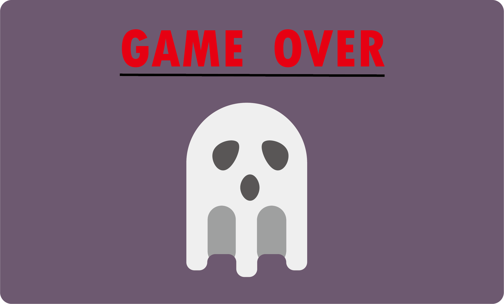
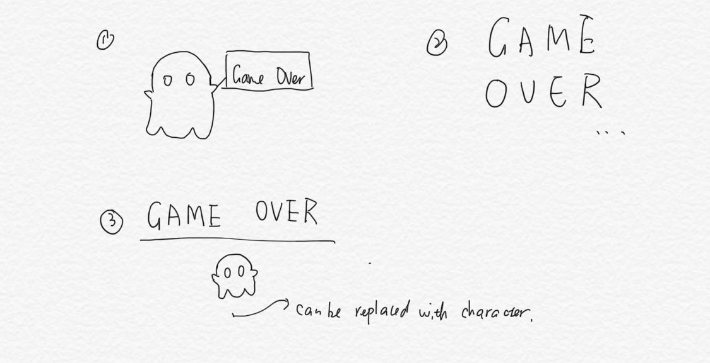
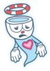
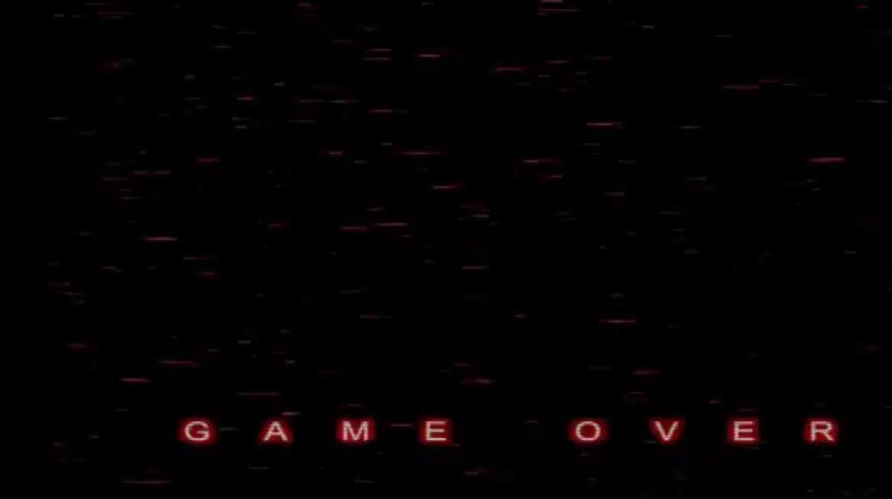
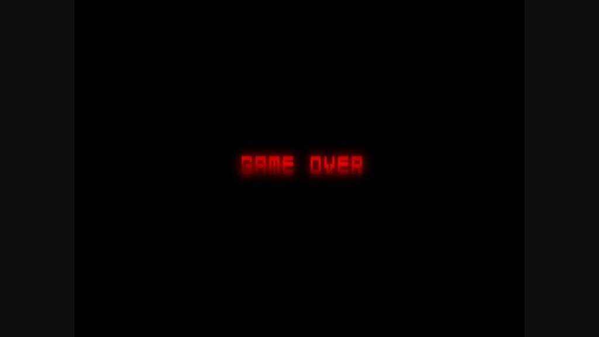
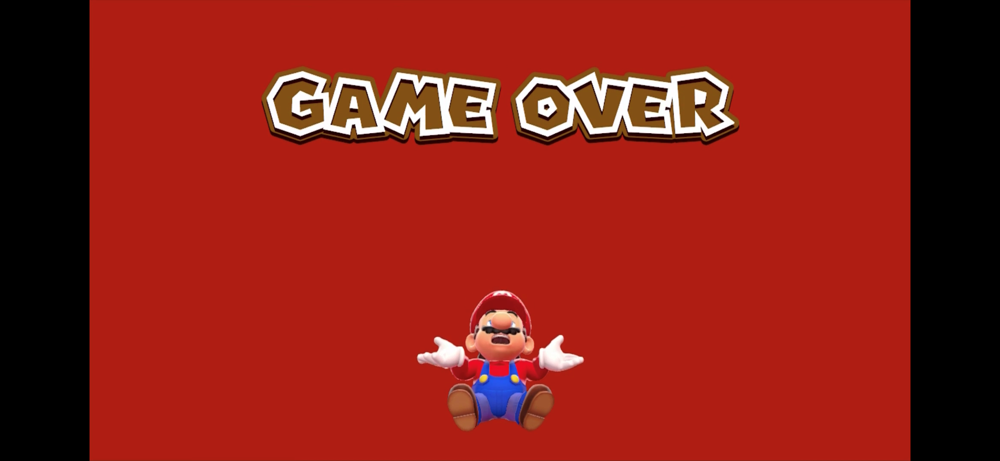
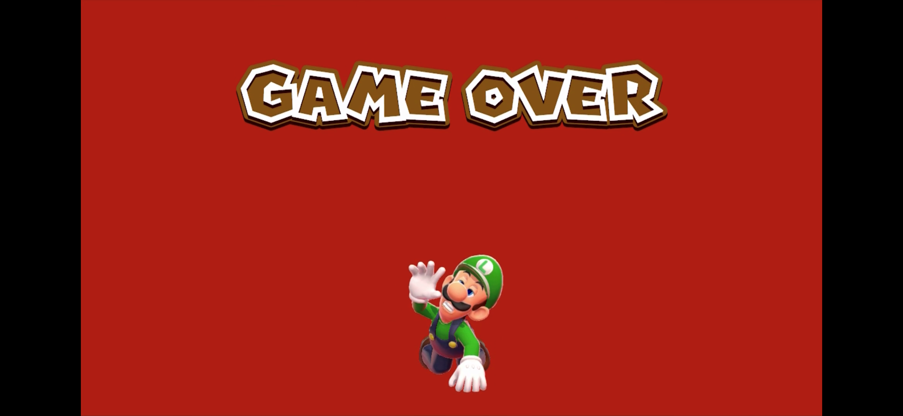
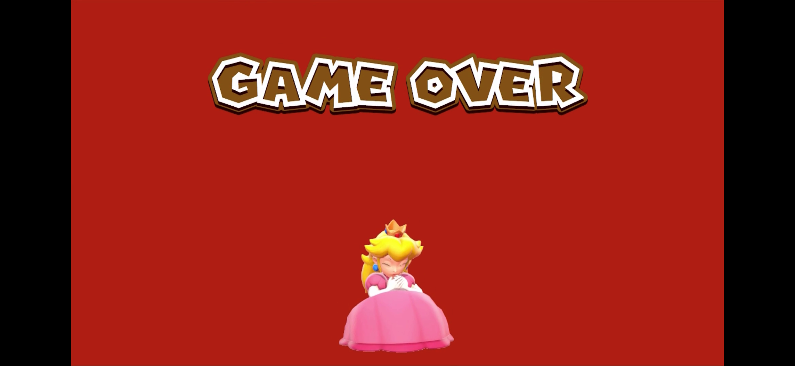
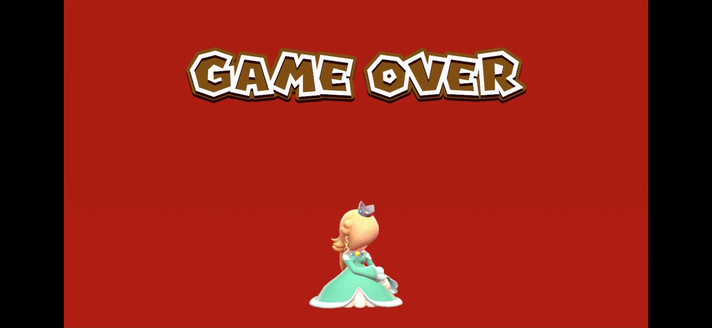

The design of Game Over Screen.
# **Illustration**

The design of game over screen is formed of the texts to indicate the fail status and a ghost (can be changed in future) at the bottom.

# **Game Over screen design progress**     
#### **28/08/2020**    
First design draft for the Game Over screen were drawn. It is an animation of the ghost of the player is floating from the player's dead body and saying "Game Over". This design is inspired by the death animation of the video game *Cuphead* (see reference 1.1).
 
#### **30/08/2020**
Two more design drafts for the game over screen were drawn. For the second design, I would say it is the most typical Game Over screen design that has been implemented in many indie games. Once the player died in the combat, the screen darkens and red words with "Game Over" will appear in the middle. Examples of Game Over screen designs were referenced from the video game *Five Nights at Freddy's* series (see reference 1.2).

The third design was inspired by the multi-player video game *Super Mario 3D World* (see reference 1.3). The screen will display a "Game Over" message at the top and the death of the player's chosen character below it. In our design, we are going to display just a head-icon of the player's chosen character instead of an animation like in *Super Mario 3D World*.

#### **31/08/2020**
User test for the Game Over screen has done on this date. The three draft designs had been shown to 5 testers to see which one of them they think can provide best player experience. The result shows that the one with the "Game Over" message at the top and the player's chosen character's head-icon displaying at the bottom received the highest votes. With no doubts, all interviewees said that the second design is too normal as compared to the rest of the two designs. Comparing design number 1 and number 3, number 3 received the highest votes because the interviewees thought that it would be more diverse and interesting instead of just showing the same ghost for all different characters. Therefore, according to the feedback we received, we decided to modify and refine design number 3 to be implemented in the game.

# **Evaluation**
At the inital user tesing, the number 1 version have also been highly voted as the animation would be engaging and obvious to players, but after discussing with the programmer, the animation would be difficult to implement because of limited skills. 

# **Contributors**
@angela454910 @RaeCRH

# **References:**    
1.1 Cuphead death scene    
    
Retrieved from: https://cuphead.fandom.com/wiki/Cuphead_(character)

1.2 Five Nights at Freddy's - game over screen    
    
    
Retrieved from: https://aminoapps.com/c/fnaf/page/blog/all-game-over-screens/3ww3_DGSBuwqrvg5a5a5vWko3xBEGxqWpw

1.3 Super Mario 3D World - Game Over (All characters)
    
    
    
    
    
Retrieved from: https://www.youtube.com/watch?v=ntHG32jcuTY