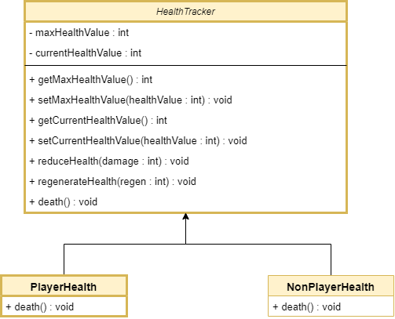
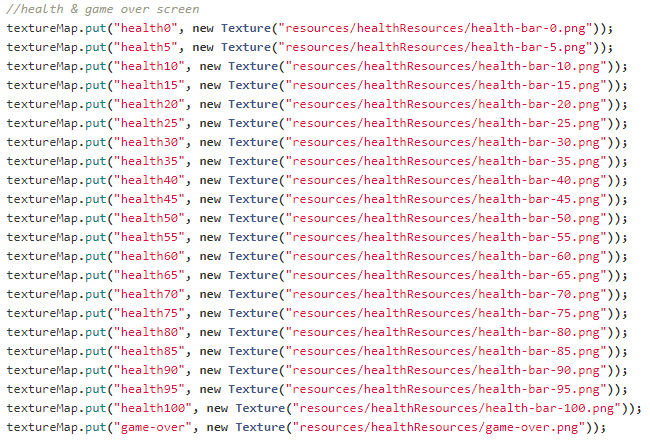

The wiki to introduce the design process of health system
# **Introduction**
Health system will keep the track of health for the player, enemies and NPCs. It will, on appropriate function calls reduce or increase the health of the players and enemies and take appropriate action when it reaches 0 (e.g. Game over screen when the player's health reaches 0). Health system will provide fail state and end the game. The player will see the graphical representation of their health value displayed on the screen and if the player hovers the mouse on the bar, the integer value will be shown with the bar.

# **Health Tracker**

# **Design Components**
- Health bar UI
    - [Health bar for player](Health bar for player)
    - [Health bar for boss](Health bar for boss)
- [Game Over Screen](Game over UI)\
**Note**: how to use the graphics - refer to the string key inside textureManager.java file under the comment "health & game over screen" as following\

# **APIs**
| Method | Description |
| ------ | ------ |
| **getMaxHealthValue** | Returns the maximumHealthValue of the character with this HealthTracker |
| **setMaxHealthValue**(int healthValue) | Sets the new maximumHealthValue |
| **getCurrentHealthValue** | Returns the currentHealthValue of the character with this HealthTracker |
| **setCurrentHealthValue**(int healthValue) | Sets the currentHealthValue to any value between 0 and the maximumHealthValue |
| **reduceHealth**(int damage) | Reduces character's currentHealthValue when damage is done |
| **regenerateHealth**(int regen) | Increases character's currentHealthValue when health is regenerated |
| **isdead** | Takes appropriate action & show the GameOver Screen |

# **Informal Play Testing for Complete game**
**Description**
Try playing the game and finish it. Mention the errors faced if any.

**Results**
- Testing on 21 October 2020.
     - On level 3(desert zone), the potions or equipment for players are unable to collect even if you have enough gp in the wallet. 
     - It doesn't carry the gp from the past collection as well. 
     - The new power is added 2 times in the boxes below.
     - The game doesn't close when pressed quit.
- Testing on 24 October 2020 - According to today's playtesting, the game is working properly the amount I played.
- Testing on 25 October 2020 - According to the playtesting.
     - I couldn't minimise the game.
     - The dragon's poison damage to the player is overpowered at level 1 making the game really difficult to finish the level 1 itself.

# **Informal Play Testing for Player**
**Description**

- Playtesting will be conducted to check the following points for Health bar of Player:
    - Hp of the player is increasing.
    - Hp of the player is decreasing.
    - Health bar is in the right corner all the time during gameplay.
    - Health bar is updating the value on damage by enemies.
    - Health bar is updating the value on the collection of potions.
    - Health bar is easily readable with the health value.

**Results**
- Testing on 18 October 2020 - According to today's playtesting, health bar was changed from left corner to the right corner. 1,2,4,5 checkpoints are ticked. 3 was updated from left to right. 6th checkpoint is not satisfactory. The values of the HP is not clear. Designers are working on it to improve.
- Testing on 21 October 2020 - According to today's playtesting, all the checkpoints are achieved except the 6th point.
- Testing on 24 October 2020 - According to today's playtesting, all the checkpoints are passing and working properly.

# **Informal Play Testing for Boss**
**Description**

- Playtesting will be conducted to check the following points for Health bar of Boss:
    - Hp of the boss is increasing.
    - Hp of the boss is decreasing.
    - Health bar is updating the value on damage by player.
    - Health bar is easily readable with the health value.

**Results**
- Testing on 24 October 2020 - According to today's playtesting, all the checkpoints are passing and working properly.