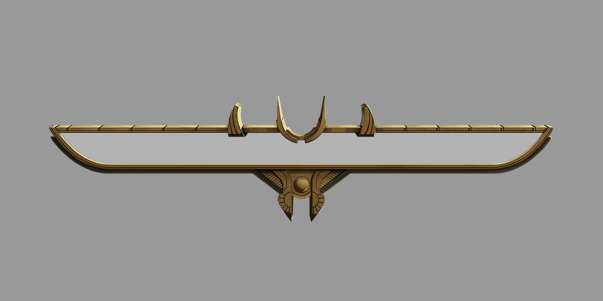

# Testing Plan
The purpose of this user testing has divided into two parts: 1. Whether the design of health bar can be recognized by users with different zones 2. Whether the design of the elements can represent each zone.
- For the first part, we have designed two versions to do a a/b testing.
- For the second part, we have designed some of questions to let the users answer and see what opinions do they have regard to the design of elements. 

Both testings are got approvel from users and conducted online.

# User Testing
The user testing is conducted via Google form, and about 10 participants have got involved in. \
Two versions provided in the user testing:
- version 1 is the health bar with the element icon at left
- version 2 is the health bar with the dragon avatar at left. 

Participants are told with the background of the game style and given images of different zones support materials. \
From the result, around 70% vote version 2 and think the dragon profile is lovely and suitable for the design of health bar, while 30% vote version 2 and think the element icon. Most of them the decoration of elements are appropriate, but because the image of volcano zone provided is more like pixel style, some of the participants think the design of element icon should keep the same design style. More testers voted for version 2 is better because the bosses' avatars are displaying beside at the left of the health bar, rather than the version 1 design though the elements are matching to the zone but cannot really depicts whose health bar it is. Also, the design for the elements between the health bars are not consistent due to the design styles whereas the dragon avatar are quite consistent to each other.

Given the user testing result, it is decided that the version 2 will be the design for bosses' health bar.

# Design Components
The health bar for four bosses in different zones.
- [Volcano zone](Volcano)
- [Tundra zone](Tundra)
- [Swamp zone](Swamp)
- [Desert zone](Desert)

# Reference

https://kris-j.com/projects/N94kb
