# **Illustration**
The health bar is formed with a heart to indicate the health, a rectangle to indicate the changes of health value and numbers to show the health value.
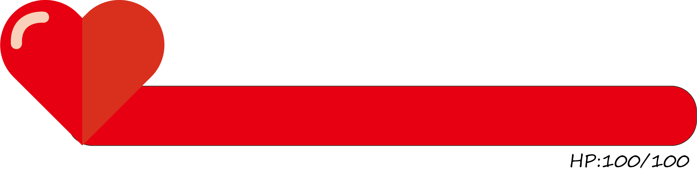
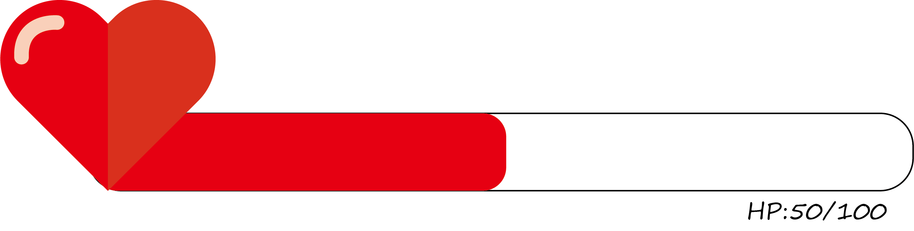
The health bar above would be located at the top-left corner of the game board or move with the players on top of the character to indicate the player's health status, and it can be decreased by attack or increased at specific cases.

# **Health status design progress**
#### **25/08/2020**   
Two initial designs came up after the team discussion from the studio. The first initial design on the left was giving the player's health status a rectangle bar. The filling of the rectangle bar will fully filled, reduce or increase when the player got full health, attacked or recharged respectively. The second design on the right is very similar to the left one, except it has an extra element, which is showing the health value.    
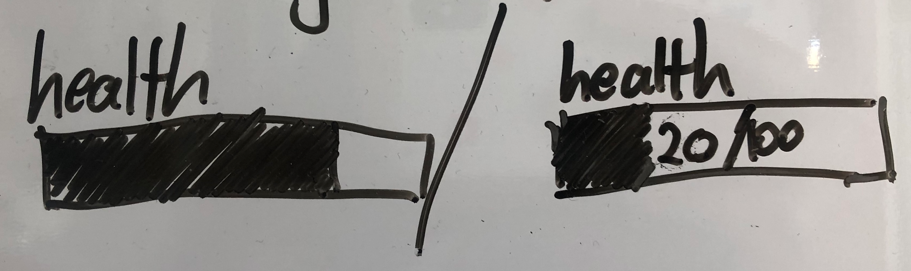     

#### **26/08/2020**    
The designers came up with the third initial design, inspired by the game *The Legend of Zelda* series (see Reference 1.1). Player can increase more hearts as the game progresses. The filling of the heart will be half or fully empty each attacked the player received, vice versa.
  

#### **28/08/2020 - Version 1.0 of initial designs.**      
There are total of 5 designs generated for the rectangle shape of the player's health status.The five designs are as follow:    

Number 1 is designed with a red health bar. The red filling presents the "blood" of the player. The filling increases or decreases when the player receives attacks or recharge respectively.     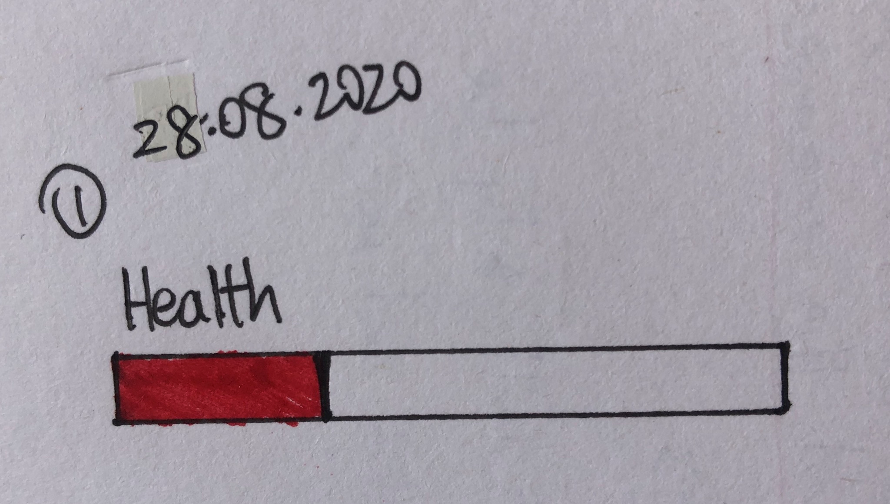    

Number 2 is designed with red health bar and a number showing in the middle of the health bar to represent the health value. The filling and the number increases or decreases when the player receives attacks or recharge respectively. 
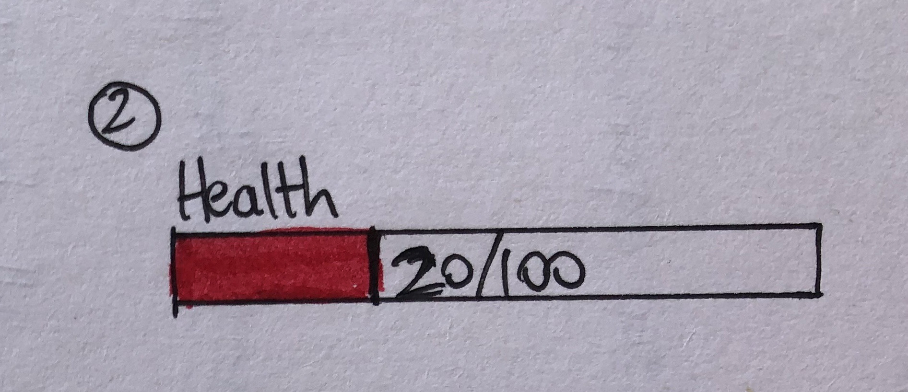    

Number 3 is designed with red health bar and a number showing in the middle of the health bar to represent the health value. However, the number will only appear when the player hovers his mouse on the health bar, the number hides away if he hovers away. The filling and the number increases or decreases when the player receives attacks or recharge respectively. 
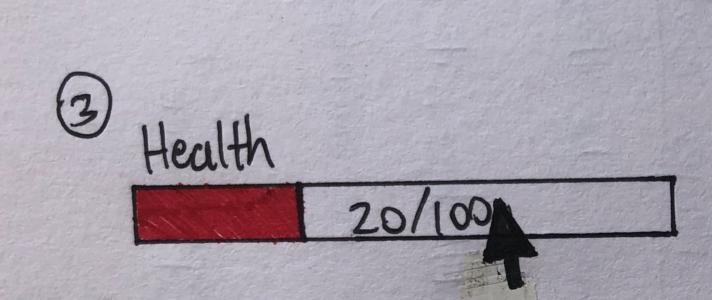    

#### **29/08/2020 - Version 1.1 of initial designs.** 
Number 4 is designed with different colours representing the health status of the player. The filling of the health bar is green when the player has 70% - 100% health, the filling turns yellow when the player has 40% - 69% of health, the filling turns red when the player has 0% - 39% of health.    
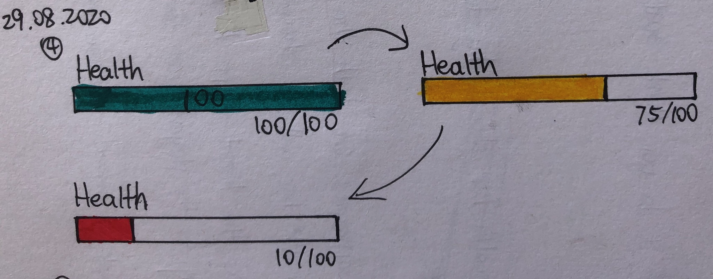    

Number 5 is a very similar design to the number 2 design.The health bar has a red filling representing the blood of the player. The filling and number increases or decreases when the player receives attacks or recharge respectively. The only difference to number 2 design is the position of the health value, which it is at the bottom right of the health bar.    
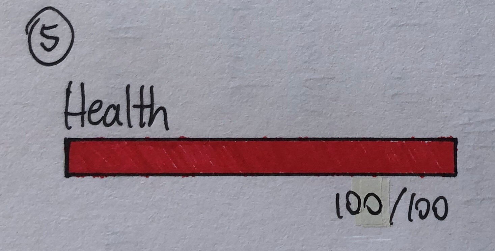

Number 6 is the heart version. The number of hearts shows the health value, and empty heart means the player has lost that health.

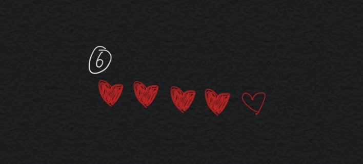

#### **30/08/2020** 
User testing was done to find out which of the 6 designs provides best player interaction and experience. The user test was done by online face-to-face interviews with 10 interviewees. The game concept was first introduced to them to provide a rough idea of how the game works. After that during the interviews, I asked them 6 questions:

1. Do you consider yourself a game-lover?
2. What genre of games do you play at most?
3. How much time do you spend on playing games?
(Show 6 designs and explained how each of them works)
4. Considering the 6 designs shown, which one of them do you think could provide better player experience. Please explain your choice.
5. Is it suitable to show health bar for all the characters in the game? Including NPC and enemies.
6. Do you consider reasonable if you design choice from question 4 is applied on all the characters in the game? Roughly explain why or why not.

The user testing is conducted via google form and zoom online.

#### **31/08/2020**
The overall design is completed and committed to the resources folder as the illustration showed above. It is designed to consist of a heart and a rectangle health bar, which can be decreased by 5% of the whole health value. All the designs are completed using adobe illutrator.

# **Evaluation**
Based on the 10 results given, five out of ten of the interviewees voted design number 4 and four out of ten of the interviewees voted number 5. Most participants choose number 4 is because "The colour changing of the health bar should be obvious enough to let a player to check his health status." However, there were also some disagreements stated such as "As the colours are already quite obvious, the number value would be redundant", and "Is either the health bar only have the colour changing animation, or there's no colour changing and the number value would be enough". One mentioned that "if the the color of environment is also changed, will the color obvious enough with the similar color." This point is neccessary for our future design and needed to have a discussion with the environment team first. Because of that, we would choose the number 5 as the final design for spirit 1, as the environment may have the similar color with the health bar, but it can be changed to number 4 for future spirit as this version is popular in users after the design of environment is completed.

As for whether to show health bars for NPCs and enemies, the interviewees said that "if there are quests such as protecting the NPCs, then it is prefer to show the health bars for them because the enemies will attack the NPCs too. As for the enemies, it is definitely to show their health bars so that I would know how much more I need to attack them." In conclusion, health bars would only needed for the other characters if only there are attacks happening.

### 04/09/2020 updated
Based on the provided images from environment team (inside #30), the map zone are divided into several zones with differnent colors of green, red and yellow, which is similar with our inital design idea of designing the health bar with changeling color of green, yellow and red. Therefore, we decide to use the number 5 version, the health bar with non-changable color.

# Game Polish
Since the reading number of health bar in the game is not readable because of the background of environment and font size, the two versions have been made to improve the user experenice.
- Version 1

The first version with the reading number inside the health bar
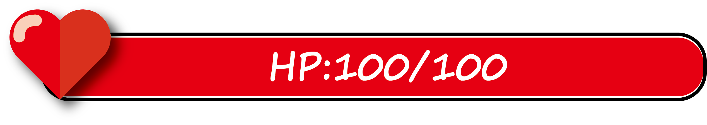

- Version 2 

The second version with the reading number still under the health bar, but there is a black background to increase the contrast.
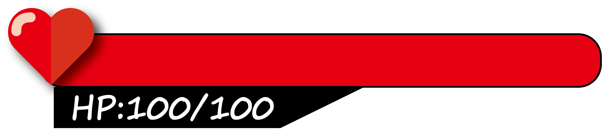

## User testing
The two versions were both put into the game, and 5 participants have got involved in the user testing (because changing and uplodaing the health bar is quite time-consuming, I only choose 5 participants). The plan is letting the users play around the game, and choosing the better version that fits the style of the game. The questionnare includes three perspective: 1. aestheitcs 2. readability 3. consistency.

From the feedback from users, the second version got 4 votes for aesthetics and readability and 3 votes for consistency. Most users thought the design of black background behind reading number makes it more readable and looks beteer.

# **Contributors**
@angela454910 @RaeCRH

# **References**
**1.1** Health bar with hearts - *The Legend of Zelda* series
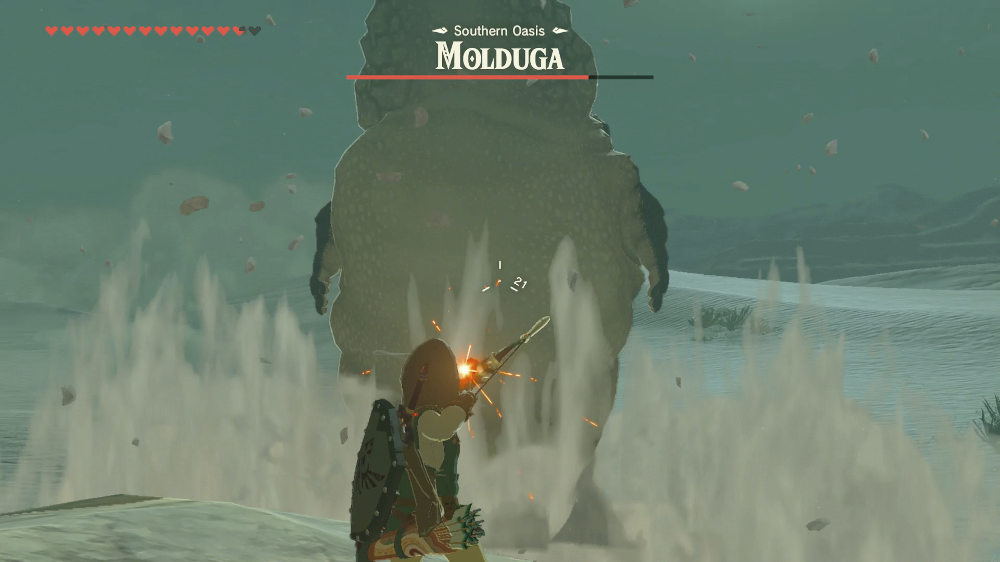    
Retrieved from: https://www.kotaku.com.au/2017/04/here-is-some-really-good-music-from-the-legend-of-zelda-breath-of-the-wild/    
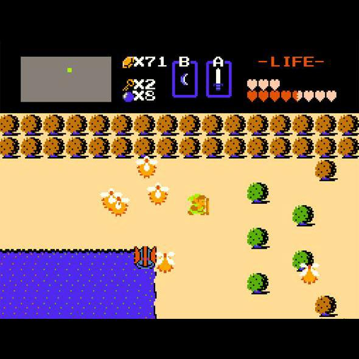    
Retrieved from: https://www.pcworld.idg.com.au/slideshow/270458/7-best-video-game-lifebars/