This page describes the design process of inventory menu from the game.

# **Design Process**   
### **09/09/2020 - Research Part 1**   
Research of the inventory menu was done this done to find out some inspiration for the inventory menu of the game. Since I do not have much experience of playing many games, I did a research on what are the various types of inventory menu/management in various games. From the research, I found out that there are 4 main types of inventory management in games: Limited Inventories, Unlimited Inventories, “Utility Belt” Inventories, Menu Based Inventories.

**Limited Inventories** - Players can only carry a limited number of items which the player have to prioritise which items are essential or important for them to manage their inventories. Players could have die in the game if they don’t carry the right items.

**Unlimited Inventories** - Players do not need to worry about what to carry for inventories. Hence, sometimes players suffer from finding that one inventories from huge mount of inventories. 

**“Utility Belt” Inventories** - Players simply press one button to switch between the items to use.

**Menu Based Inventories** - Most common form of inventory found in MMOs, RPGs, and RTS’s. A seperate menu of all the items the player has will be pulled out from pressing a button or click on an icon.

Based on the four main types of inventory management, I was planned to do some research to find out games that matches to them.

### **11/09/2020 - Research Part 2**
From the previous research I did, during these days, I managed to find some games that matches to any one of the four main types of inventory management.

**Limited Inventories - _Call of Duty Series_**   
_Call of Duty_ series would be the prime example for limited inventories (see reference 2.1). Before player starting each round of game, player is only allowed to carry 2 weapons and 2 grandes. Player has to survive in the whole round with only carrying 4 items. Through out playing, more supplies will be added by either the player picks up from the ground or retrieved from other players who have been killed.

   
(Retrieved from: https://youtu.be/c7S2__utVOE)

**Unlimited Inventories - _Dark Souls II_**   
In _Dark Souls II_, player can store unlimited number of items in an inventory box called _Bottomless Box_. Player can store any kind of items, including armor, weapons, upgrade materials, and rings etc.  
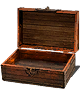   
(Retrieved from: https://darksouls.fandom.com/wiki/Bottomless_Box)

**“Utilities Belt” Inventories - Finding Big Foot, Sea of Thieves**   
In both games _Finding Big Foot_ and _Sea of Thieves_, the inventories are displayed in a ring shape. Players simply press a button to switch the item wanted to use, item will be highlighted for the current selection.

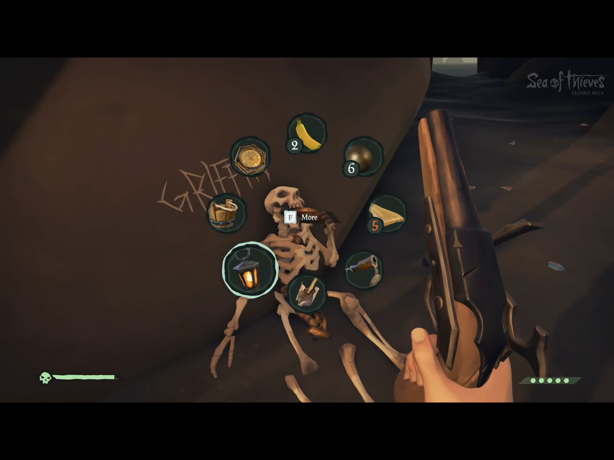    
(_Sea of Thieves_ in game inventory ring. Retrieved from: https://youtu.be/z6aL2W21tFU)

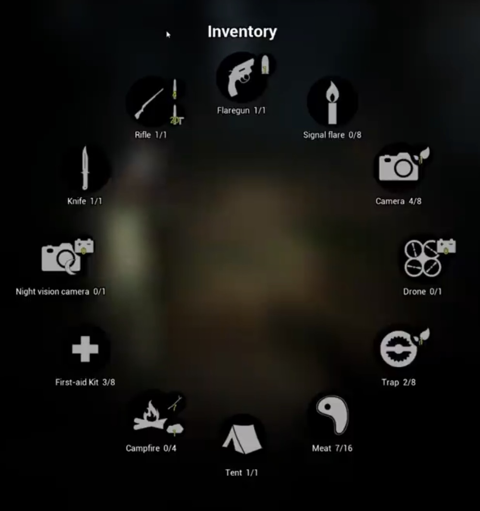   
(_Finding Big Foot_ in game inventory ring. Retrieved from: https://youtu.be/whRsOcF60OI)

**Menu Based Inventories - _Moonlighters_, _SamuTale_**   
Menu Based Inventories are almost in every MMO and RPG games. The player’s character is shown on either side of the menu, while all the items the player has will be shown on the other side.

  
(_SamuTale_. Retrieved from: https://www.indiedb.com/games/samutale/news/finished-the-new-inventory)

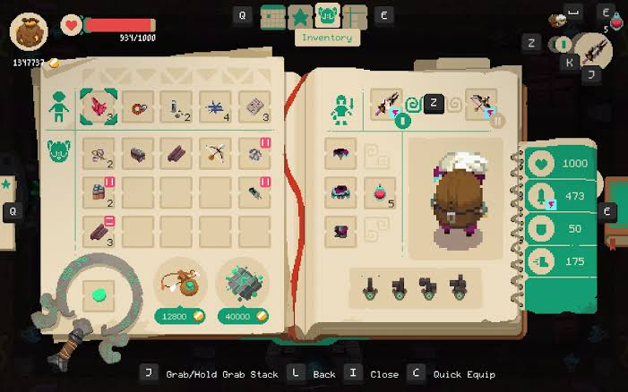   
(_Moonlighters_. Retrieved from: https://www.rockpapershotgun.com/2019/01/28/overthinking-games-how-moonlighters-inventory-combats-your-greed/)

### **15/09/2020 - First draft**   
Based on the research I have done so far, I have drawn first draft of five designs.   

Design 1:   
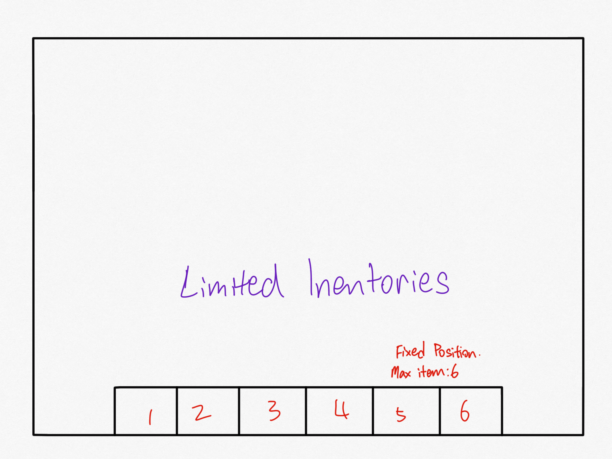   
In this design, the inventory bar is displayed at the bottom of the game screen. This is a limited inventory bar, which means as shown in the design above, player is only allowed to carry 6 items maximum, regardless weapons, armors, or upgraded materials. If the slots are full, player has to sell or drop the current items he has in the inventory bar in order to carry the new item he bought.

Design 2:   
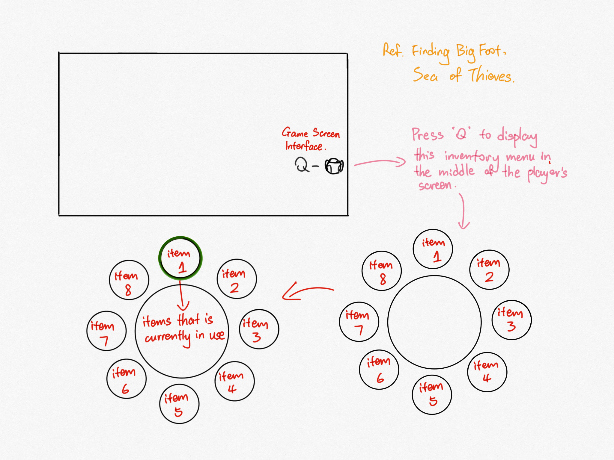   
In this design, the UI of the inventory management is designed in a ring. The items the player currently has will be display around in small circles to form a ring. If one of the items is selected by the player, the circumference of the selected item’s circle will be highlighted with another colour, will be displayed in the middle big circle at the same time. Player has to press a button from the keyboard to show the inventory management ring. Player has to sell or drop an old item for adding new item if the 8 slots of the ring are full. 

Player has to press a button from the keyboard to display the inventory ring.

Design 3:   
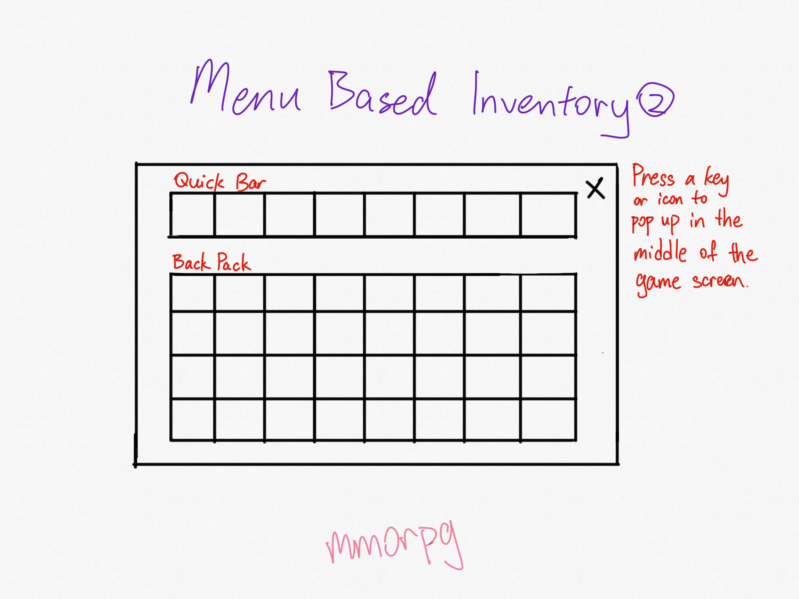   
This is a menu based inventory management design. As shown above, player can add as many items as he wants in the Backpack section. However, player can only carry a fix number of items chosen from the Backpack in the Quick Bar section. A progress bar will be shown on the below of the inventory menu. Player has to press a button from the keyboard to display a seperate menu from the game screen.

Design 4:   
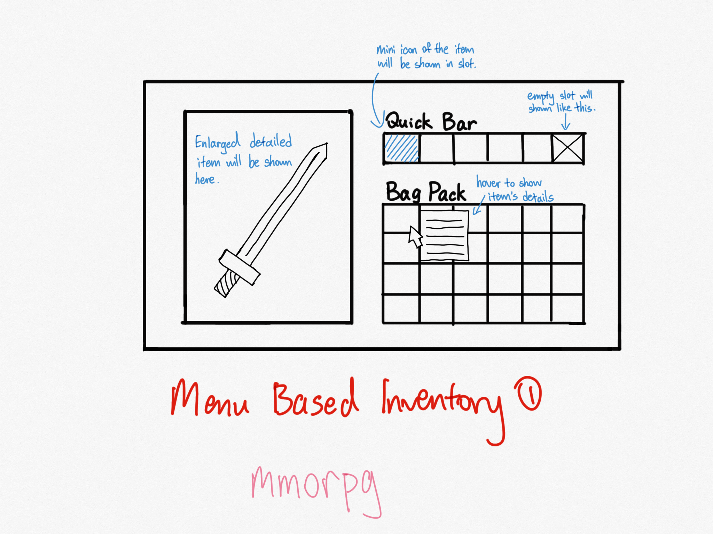   
Design 4 is very similar to design 3, except it displays the enlarged image of the item selected by the player on the left side.

Design 5:   
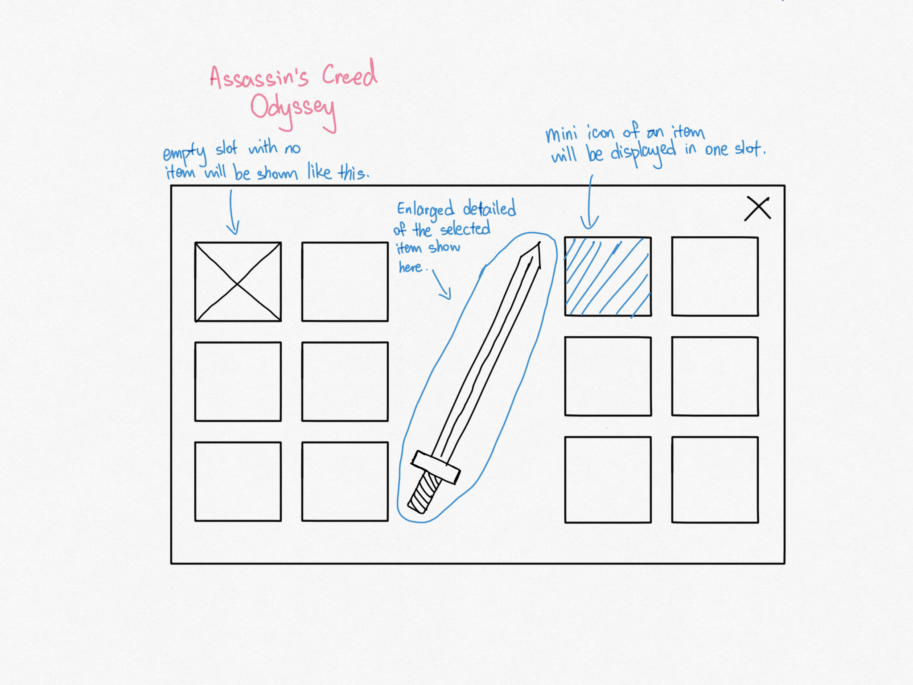    
In this inventory management design, mini icons of the items will be displayed in the slots, and the enlarged image of the selected item will be displayed in he middle of the inventory menu. Player has to press a button from the keyboard to show the inventory menu. There is no limit of items in this design.

The next plan will be doing a user testing in the following days. The user test is planned to be conduct either by face-to-fave or Zoom interview. The main purpose of the test will be finding out which of the 5 designs will be most suitable to provide the best player experience, and asking for suggestions and further improvements.

### **19/09/2020 - User Test Result**   
A/B User testing was finally done on yesterday night. The plan for the user test was to first introduce the concept of the game, and I asked the testers their experience in gaming as I want to understand the testers' background. Then, I introduced my first drafts of the five designs and explained to them each of their mechanics. At last, I asked the testers to choose one design that they think should provide the best player experience and further improvements of their chosen design.

**User Test Questions:**   
1. What's your experience in playing different types of inventory management in various games?
(Now look at the designs provided. Feel free to ask questions if doubt)
2. How is limiting the number of items to be carried can affect your experience in gaming?
3. Choose one from the five designs provided that you think can provide the best player experience. Roughly explain for your chosen design.
4. Do you think there is further improvements that can make for your chosen design.

**User Test Result Evaluation and Analysis:**   
From the user test result, Design 4 received the highest votes from the testers. All testers who chose this design agree that it will be more comfortable with the menu based inventory design with no limitation of number of items. 

The testers especially like the concept to show a bigger picture of the inventory item.    
Tester A: "I think is very useful that there is an enlarged image of the item despite the small icon shown in the item list. At least it gives a better vision of the details of the appearance of item."     
Tester B: "Even though the small icons of the items provide imagination to the player, but is just imaginations. What if the reality doesn't match to my imagination? I will be so upset with that!"   
Tester C: "The enlarged image of an item provides a better illustration of how it will look like when equipped on the player character."

The testers also rather chose the unlimited inventory management than the limited inventory management.   
Tester A: "Limiting the inventory items really will annoy me. It is not player-friendly at all, because you have to carefully think about which items to be thrown away and which items value me a lot. I rather not to think too much calculations on this."   
Tester B: "The limited inventory management brings up the difficulty level of the game. It's challenging, but for players like me who always like to keep a lot of items regarding useless or not, I prefer the unlimited inventory management."   
Tester C: "If the game allows to upgrade the size of the limited inventory bag pack, that will be nicer. "

It is concluded that the unlimited inventory management will be the final design to be implemented in the game. Since design 4 receives the highest votes, my next plan will be using its sketches as a base and add more details and some medieval elements to make it suit to our game theme.

### **19/09/2020 - Final Design/Illustration**   
As our game theme is Medieval Magic, the final illustration of the Inventory Menu is designed like a book. The book design provides a more retro style. The enlarged image of the item will be displayed on the right, and the selected item description will show under the big box. On the left side of the book, the first row where the little man is depicts the items that wears on the body, such as armor, helmet. The rows at the bottom stores everything else, including upgrade materials, weapons, and coins.

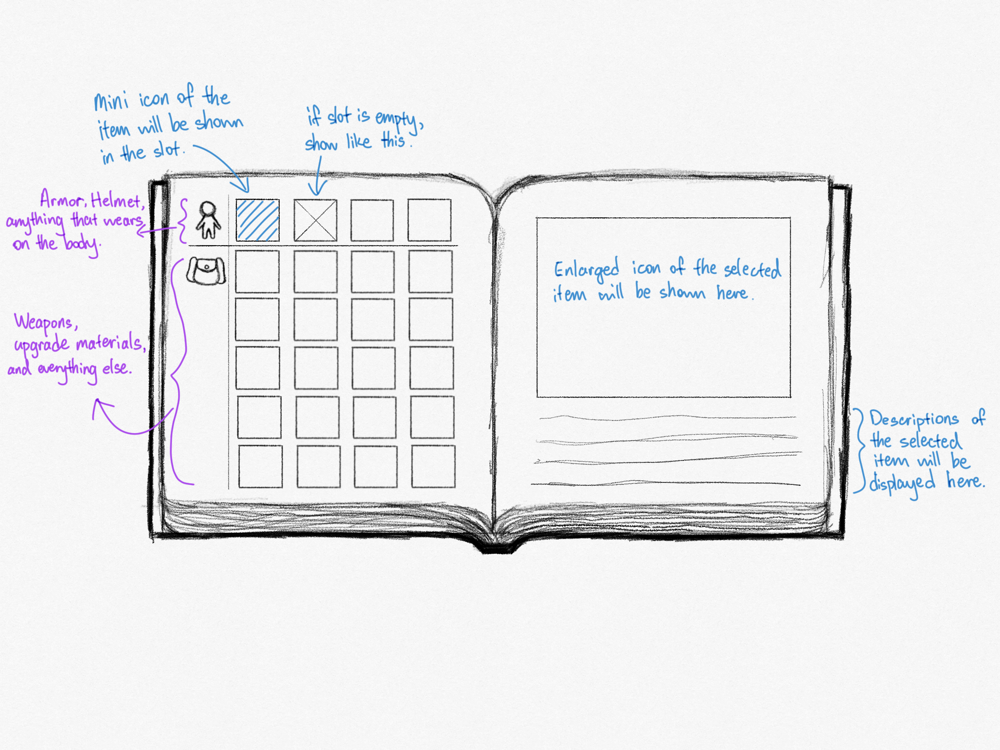

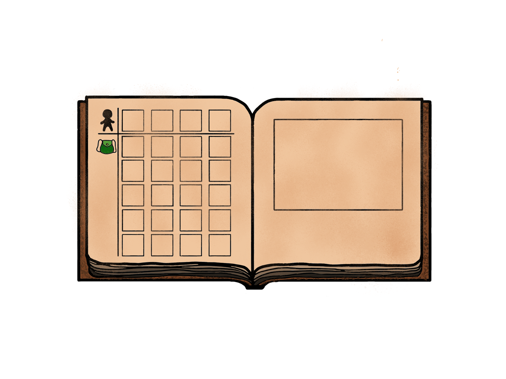

# **References**
1. Vacilastana “Inventory(Concept)” GiantBomb.com https://www.giantbomb.com/profile/vacilastana/ (Accessed Sept.09, 2020).
2. Shockstorm “Bottomless Box” Fandom.com https://darksouls.fandom.com/wiki/Bottomless_Box (Accessed Sept.10, 2020).