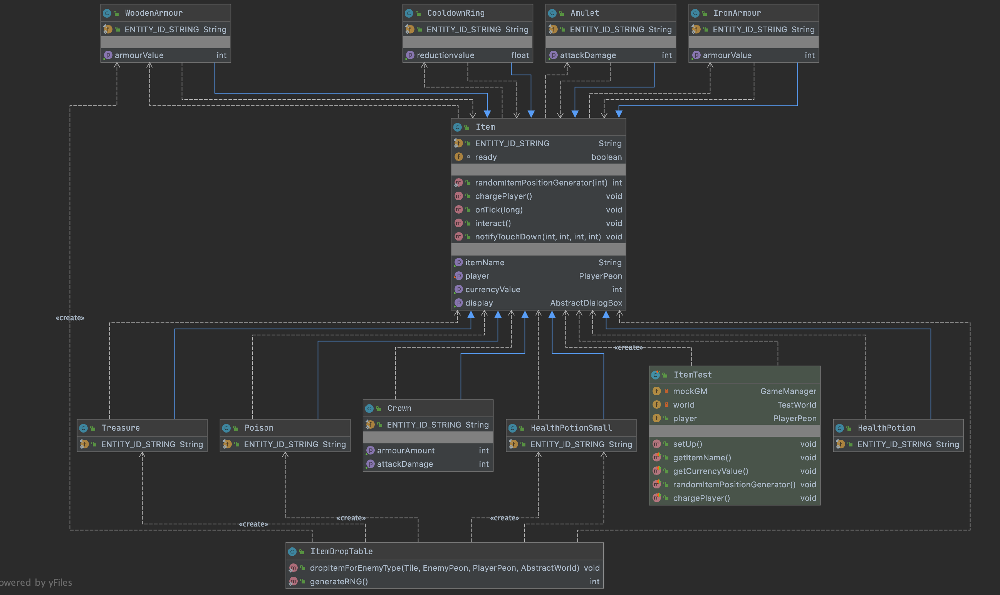

## **Description**
Items are entities scattered around the game worlds. Depending on the item, they are able to provide the player with additional health, protection from enemies or provide surprise random boost. All items are consumed on purchase. Most items must be bought using gold currency. 

## **Classes**


### **Item** 
Each type of item is a subclass of the Item class. Each item has a name, a gold value and the player is also passed to the constructor. 

#### **Public Methods**

Returns the item's name as a string. 
```java 
 public String getItemName() 
```

Returns the amount of money needed to buy the item. 
```java 
  public int getCurrencyValue()
```

Generates a random number within the boundaries of -max to +max
```java
public static int randomItemPositionGenerator (int max)
```

Returns the AbstractDialogBox used to display the item
```java  
public AbstractDialogBox getDisplay()
```

Sets the player attribute for the item. 
```java
public void setPlayer(PlayerPeon player) 
```

Charges the player according to the item and amount of damage dealt. 
```java 
public void chargePlayer()
```

Simulates time passing on the Item. 
```java
public void onTick(long i)
```

Displays the AbstractDialogBox for the item 
```java
public void interact()
``` 

Checks if a click was made near an item. 
```java
public void notifyTouchDown(int screenX, int screenY, int pointer, int button) 
``` 

### **Subclasses**

- **Health Potion:** Constructs a health potion item that adds to the player's health when bought. 

- **Iron Armour:** Constructs an iron armour item that protects player from incoming fireballs. 

- **Amulet:** Constructs an amulet item that increase player's damage value.

- **Crown:** Constructs a crown which increases both the player's damage and armour.

- **Cooldown Ring:** Constructs a cooldown ring item Reduces the cool down of the player's skill. 

- **Poison:** Constructs a mystery vial which has a high chance of damaging the player with poison with a small chance to heal the player and increase their damage and armour.
 
- **Treasure:** Constructs a treasure box which can be opened for free. It adds a random amount of gold between 50-100 to the player's currency 

### **UML Diagram**


## **Future Sprints**
- Further explorations for items could include adding debuff items that damages the player's health to make the game more interesting. 
- A potion belt system where player's can store potions they buy on their waist and use them by pressing a key. 
- A class of Pandora's Box items could be implemented. These could range from extremely powerful items that may spawn in a world, or powerful trickery that kills the player that are very rare, and for some games may not even spawn in the entire game. This would add a great element of novelty for users who have played the game a few times already. 
- A 'convert to gold' option for every item, if players wish to gain money by picking up items, they can convert the item to gold iinstead of buying it. The fact that some items such as spell cooldown reduction buffs and armor have limits will also make this feature more feasible because it will still at least give players a purpose to pickup cooldown reduction buffs and armor even if players already possess these items.
## **Testing** 
### Unit Testing 
Unit testing has been completed on the parent Item Class in ItemTest. 


### User Testing 
**Motivations**
A major point of discussion was how the player should interact with items. In sprint 2, all items had to be clicked. Once clicked, a dialog box would show containing item price, information and two buttons - ‘Buy’/’Open’ and ‘Close’. Due to the fast pace nature of the game, the team decided to explore alternative options to interact with items in Sprint 3. 

We decided to use a user test to compare two interaction options: keeping the same click-click interaction as per Sprint 2 or interacting with an item via a key, and then using clicks in the dialog box. 

**Test details**
- Our tests were conducted over Zoom with five participants between ages 19 - 21. 
- All participants were given the goal of collecting as many items as possible. 
- Although this was not the main objective of Polyhedron, this measure forced all users to concentrate solely on interacting with items. 
- Before testing, all users were informed they would be completing four rounds on the Swamp level. Two rounds using click-click item interaction and the remaining two rounds using the proposed key-click interaction method. 
- This may have introduced some bias into testing since users’ own perceptions about the interaction methods may have affected how they played the game. 
- Another bias was that all users were of the same demographic and had only some experience with video games.

I had two observation points (their game screen and window) to collect data on: 
- How many items users interacted with 
- Their reactions in interacting with items during gameplay 
- Problems encountered during game play. 

**Results**
- Click-click interaction resulted in more items used in both of the two iterations.
- In stressful situations such as being chased by Goblins or near a moving Dragon, both methods were clunky and led to frustration. One tester suggested that items should be made pick-up to avoid spending time on clicks/keystrokes. 
- The major downfall of the click-click method was that it made item interaction overlap with firing. In one instance, a user was trying to kill a goblin, and accidentally clicked on an item; he had to quickly close the box while the goblin attacked the mech. 
- Problems encountered were mainly due to faulty interaction with items i.e. the player had to be very close to the item to interact with it.
- The testers had also been informed about the auto-hide functionality of the Dialog Box that opens when interacting with items; that is, the dialog box will disappear after 15 or so seconds even if no button is clicked. However, no tester used the feature because the box obstructed their view. 

**Conclusion**
Future sprints could explore changing all items to pick up on purchase. This decision would depend on the decision of creating an inventory. If an inventory is implemented, items have to be bought to be stored and used on demand. It is like that an inventory system would require clicks to use/change items; so if one implemented in the game, click-click interaction would be the best option for a smooth user experience. For now, the click-click method has been retained. 

Unconventional ways of interacting with items could be explored. A key-key interaction model may also be useful in which one key has to be pressed twice to view and buy the item, and another key can be used to close/ignore it. 

One change made due to testing was the removal of the auto-hide functionality of the dialog box since it was not used at all. Additionally, the interaction bounds (how close a player has to be to the item to interact) has been increased to avoid the problem detailed above. 

