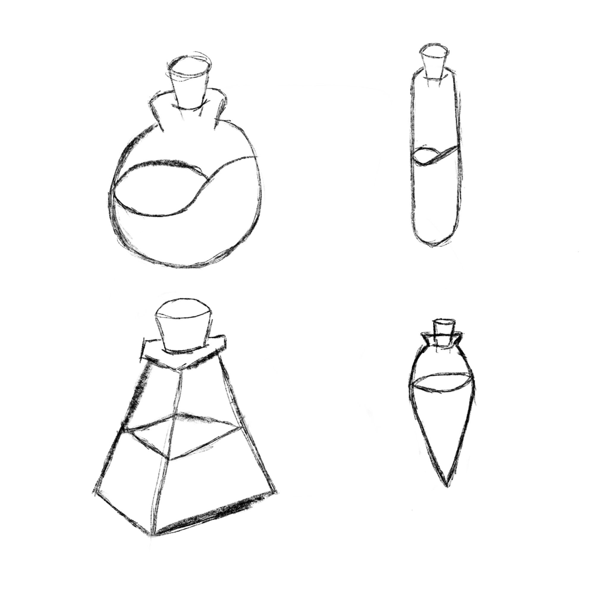
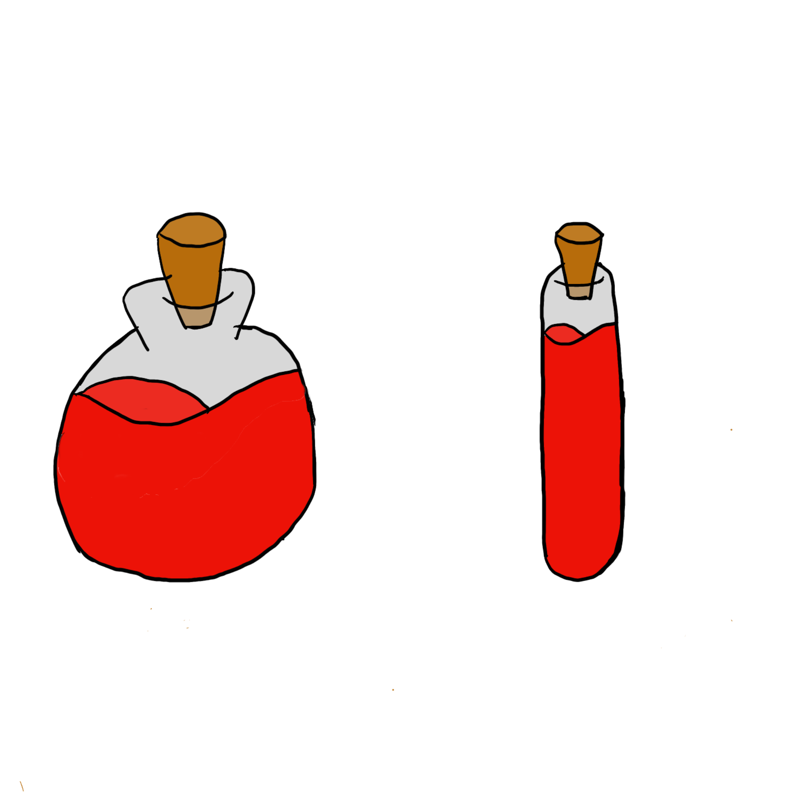
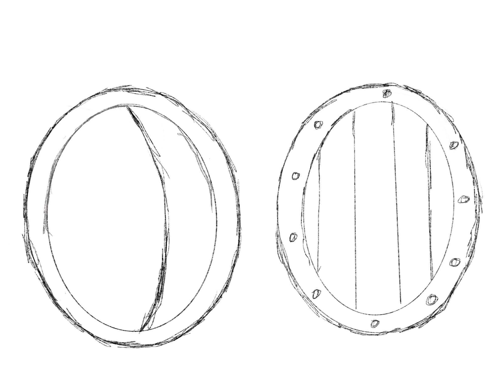
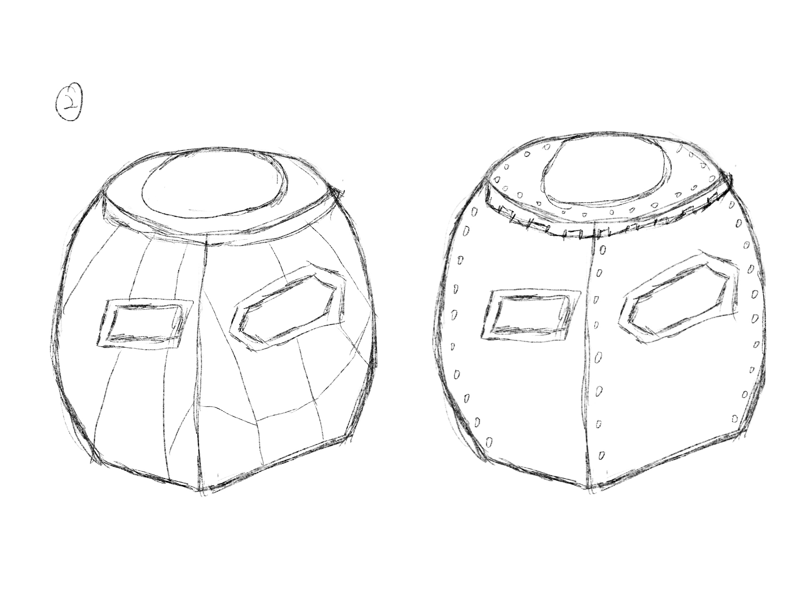
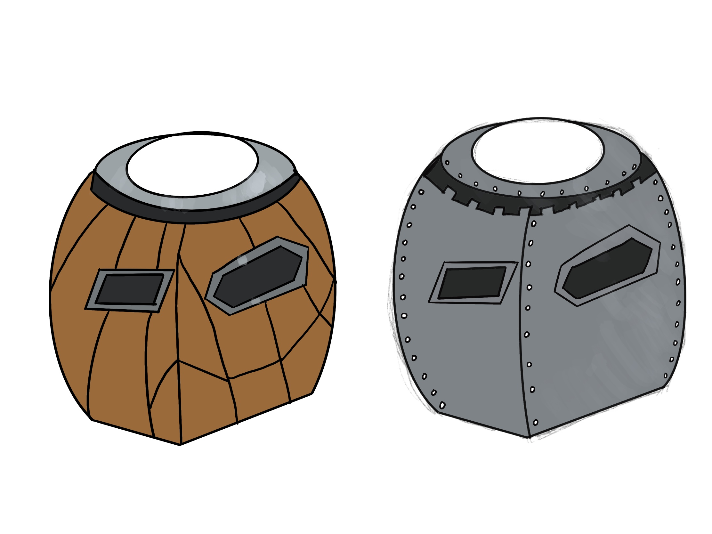
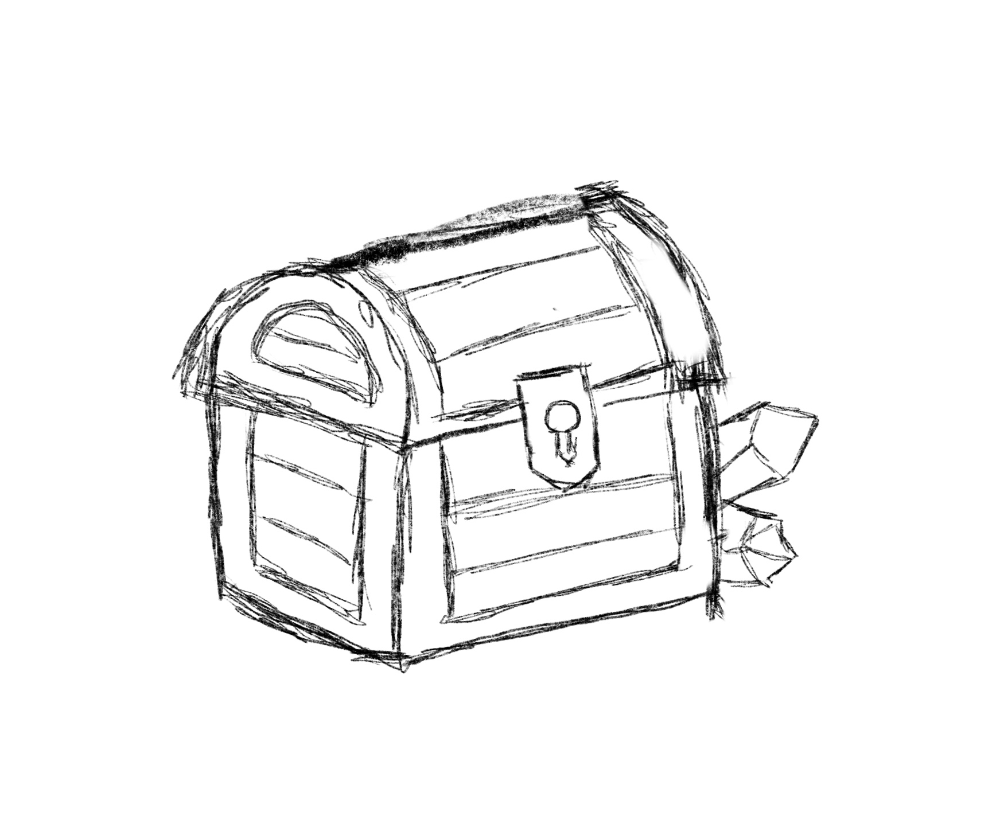
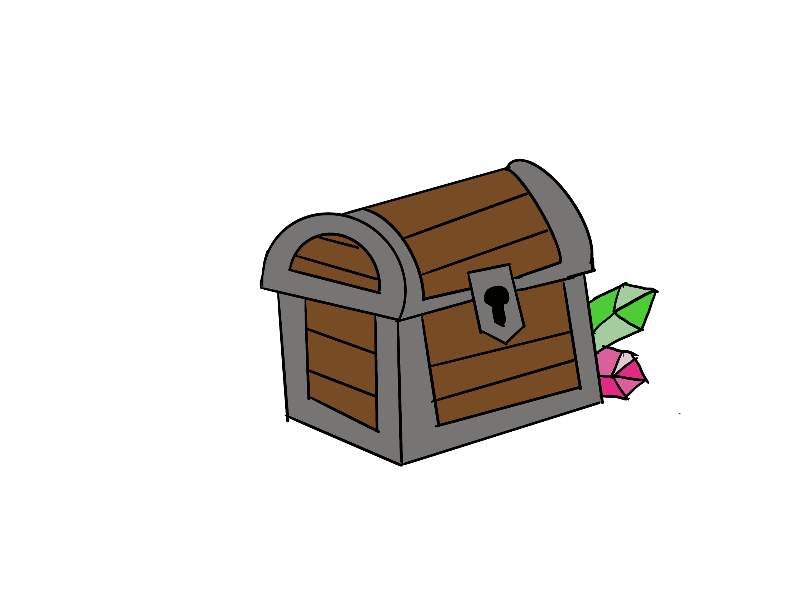

This page describes the design process of inventory items.
# Testing plan
After each sketch has been completed, a user tesing will be conducted to test the acceptance of the design concept. The participants who will be invited for tesing are mainly the students studying at UQ and have experience in playing mutiple games. They will be given the sketches or graphics and asked several questions based on the design.
- First, they will be given the background the game and the art style of the game. 
- Then, they will be provided with the graphics and some introduction of how these items are used for. 
- Finally, there will be several questions for them to answer and sometimes some interviews will be followed after quentionnaire.
The main aim for the user testing is to test whether the item can be recognized by users of their functionalities through graphics, and whether they are suitable in the background of medieval.
# Design Process
## Potion design
### Sketches
There are six inital designs for user testing.
Each line of two items are represent big value(left) and small value(right) potion seperately.

#### Questions
1. Which do you think will be the small value potion?
2. Which do you think will be the big value potion?
3. Why are you choose these two items? 

After the **a/b testing**, the second line of two items got higher votes then other two lines. From the feedback from users, the first two items are too cute and only popular with girls, they may not suitable for our game in the background of medieval. The third two items are more like magic potions than blood potions even they hava not been applied colors.
### Visualization

#### Information
- Potion-small-value: The potion used for increasing health value in small percentage, can recharge 30 health.
- Potion-big-value:  The potion used for increasing health value in huge percentage, can recharge 50 health.

## Armour design
The graphics locate in the inventory would be the main materials for making armour.
### Sketches

#### Questions
1. Can you recognize which one in the following is the armour item?
2. If these item are located in the inventory bar, can you recoginize the functionality and use them?

The above picture is used for **think aloud** user testing. Only a few users can recognize the sketches as the armour for the mech, some of users can recognize it after I introduced that these graphics only show the materials used for making armour, but most of users cannot recognize it when only locating in the inventory bar.

#### Updated

After the previous user testing, I have updated the new sketches for armour design, and use this one compared with the previous one in a **a/b testing**. I also show them the design for the mech in the game as the background introduction before the questionnaire. Most participants voted for the new design.
### Visualization

#### Information
- Armour-wood: The armour for mech, making of wood.
- Armour-iron: The armour for mech, making of iron.
## Treasure Box
As discuess with the economy team, a shop interface and interaction would be too complicated for this game, so they decided randomly put the item on the map for players to purchase.
My idea is to put the treasure box on the map instead of item itself, and when players interact with a treasure box, there will be a pop-up window to ask them for purchasing the item.
#### Sketches

#### Visualization

#### Information
- Treasure-box: Maybe there are something useful for you after opening it.
# Evaluation
From the researches we can found most items in the medieval game would have the element of wood or iron, which need to be applied into our design. Based on the feedback from user testing, the users prefer the design is more simple and clear for its functionality and similar with their previous game experience rather than something that is well-designed but needed to guess the functionality. The background provided before the testing is very useful for them to recognize what are these graphics used for. 
However, using sketches for testing is the easiest way but cannot be able to test the aesthetics and the consistency with other elements in the game. Therefore, for further spirint, I will try to do some tests for overall aesthetics and consistency with other designs. 
# Reference
https://www.gettyimages.com.au/illustrations/potion?family=creative&mediatype=illustration&phrase=potion&sort=mostpopular

