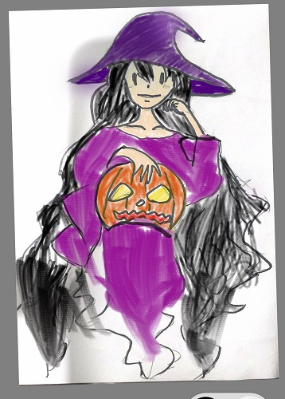
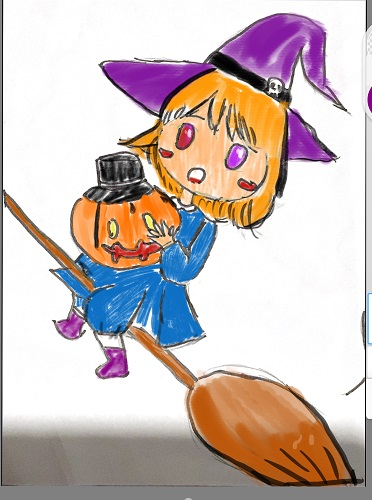
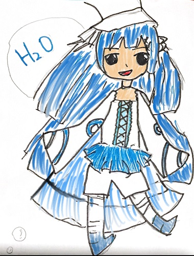

Merchant NPCs will sell players items including weapons, armors, spells, consumables and miscellaneous items.

# The Purple Witch
The Purple Witch is a powerful spellcaster, she sells magic abilities, trinkets, alchemist stones. All her items are imbued with magic and are very costly. Her items are most suitable for players with more wizards than knights on their team.

# The Small Witch
The Small Witch is the young apprentice of the Purple Witch, she specializes in consumable items such as potions, elixirs, antidote etc. Her items are suitable for every player since health potions and attack boost elixirs are extremely helpful to the player.

# The Water Girl
The Water Girl is akin to the blacksmith of the game, she specializes and sells melee weapons, armors, and mechs. Her wares are of the finest quality and are suitable for all players who mainly have knights on their team.

