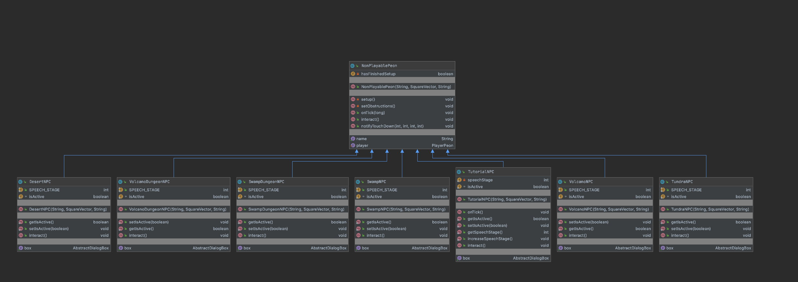

NPCs are non-playable characters that players can interact with in the game to initiate tutorials, complete quests and purchase in-game items from. Players can talk to NPCs by  clicking on them.

- [Tutorial NPC](Tutorial-NPC)
- [Environmental NPC](Environmental-NPC)
- [Merchant NPC](Merchant-NPC)

# API:

**Interfaces**

- Interactable

| Method| Description|
| ------ | ------ |
| interact()|Any interactive entity (e.g. an NPC, dropped item, door etc) should implement this method in order to execute a side-effect of the interaction. When interacting with an NPC, the player is passed as a parameter for the NPC to gather quest information, level, health etc. This allows for creating many different types of NPCs, such as healers, traders, level-restricted access NPCs etc.|

**Managers**

- NonPlayablePeonManager

| Method| Description|
| ------ | ------ |
| NonPlayablePeonManager(AbstractWorld world, PlayerPeon player, List<NonPlayablePeon> npcs)| Constructor for NPC manager, with parameter world, player, NPCs and spawns all NPCs.|
| spawnAll()| Iteratively initialise and spawn each NPC in the spawn map.|
| spawnOne(NonPlayablePeon npc)| Spawns an individual NPC with a height of 1.|
| spawnOne(NonPlayablePeon npc, int height)| Spawns an individual NPC with a height.|
| getAllNpcs()| Returns a list of all NPCs|

**Classes**

- NonPlayablePeon

| Method| Description|
| ------ | ------ |
| NonPlayablePeon(String name, SquareVector position)| Constructor for NPC, with parameter name, position.|
| setup()| Initializes NPCs, set their names, speed and adds TouchDownListener in order to detect inputs provided by user.|
| setObstructions()| Obstruct the base (feet) of an NPC. This stops the player from trampling NPCs. This is run after the world has been added to the GameManager, otherwise a NullPointerException would be thrown.|
| onTick(long i)| Wait for GameManager to have a world before adding obstructive tiles above.|
| interact()| Calls interact() function|
| getName()| Returns name of NPC|
| notifyTouchDown(int screenX, int screenY, int pointer, int button)| Detects user mouse input, if user clicks on NPC, player character will interact() with the current NPC.|

- TutorialNPC

| Method| Description|
| ------ | ------ |
| TutorialNPC(String name, SquareVector position)| Constructor for TutorialNPC, with parameter name and position.|
| interact()| Interacts with NPC to initiate conversation in a dialogue menu.|

# UML Diagram: 
