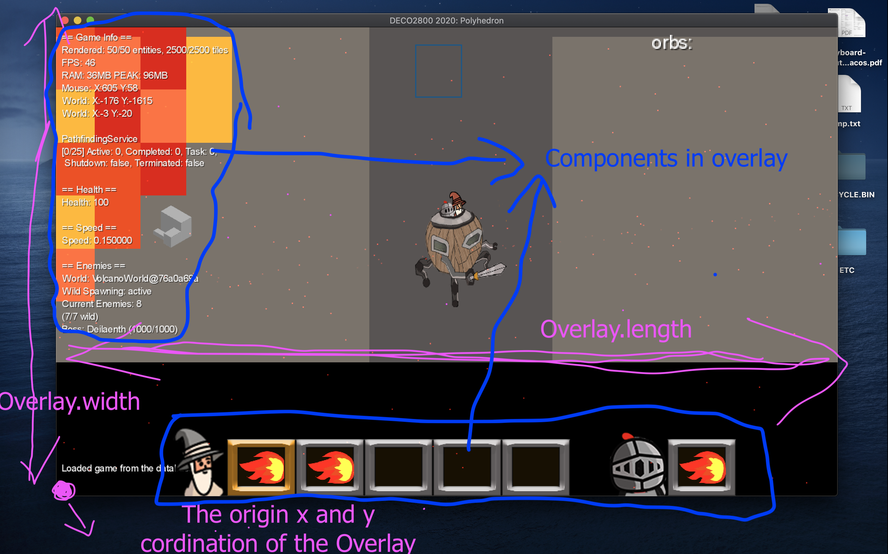

The OverlayRenderer system is created in order to manage all the UI stuffs (that stick on the screen and follow the player such as health bar, hotbar, debug info, some notifications ...) in each small component.

## Old approach
Ex: Create a new notifcation box
1. Create new `NotificationBox` implements `Renderer`
2. Create that `NotificationBox` in the `GameScreen`
3. Create the `SpriteBatch` for the notification and call the render inside the `GameScreen`

Cons: Let imagine if we have to create 10 notification boxes, we will add add lot to the game screen and mess it up. 

## New approach
Ex: Create a new notifcation box
1. Create new `NotificationBoxComponent` extends `OverlayComponent`
2. Add the `NotificationBoxComponent` to the `OverlayRenderer` component list
3. Done

Pros: We just only need to declare the `OverlayRenderer` in the `GameScreen` one times for a list of component. If we want to add a new component (ex: health bar), we just need to create the component then add it into the component list of the `OverlayRenderer`. The `OverlayRenderer` will loop through its component list then call the `render()` method in each component to render them. We could keep the `GameScreen` tidier by arranging the UI stuffs inside a class.

**More example: take a look at HotbarComponent**

## OverlayRenderer

- In the `OverlayRenderer`, we will able to get all of the properties of the overlay in order to adjust the position of our component inside the overlay.

- In each component, the component will able to access to the parent overlay to retrieve needed information for rendering position

## Class diagram
Update later

# Documentation by @jayhuynh239
