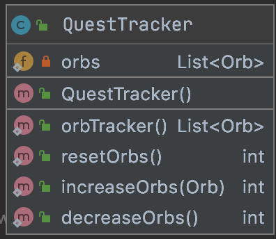
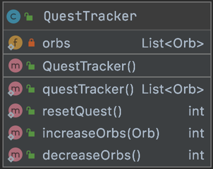
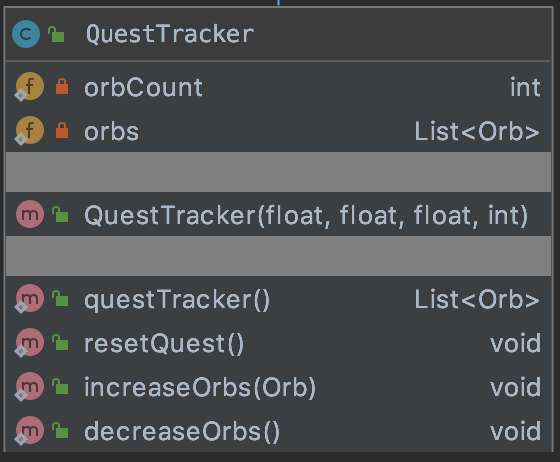
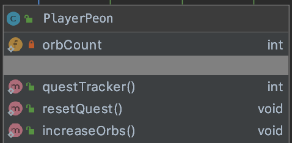

# Description

This document will contain relevant information on how the quest tracker counter function works. 


# entities/Agent/QuestTracker.java

<div align='center'>

<b>Version 2.2</b> 
 - Edited naming conventions to allow the original name to be used to store different misc quest if needed<br>



<b>Version 2.1</b>
- Removed extends PlayerPeon as it does not use any functions from the parent class
- Removed orb count variable as it can be replaced with orbs.size() to ensure the correct data is returned
- Added return values for each method to be used for testing



<b>Version 2.0</b>
- Moved to own class




<b>Version 1.0</b>
- Intial Design of Questtracker


</div>

# API

| Method | Description | Return |
| ------ | ------ |------ |
| <b>orbTracker()</b> |Call this function to get the status of the quest | **List\<Orb\>** |
| <b>resetOrbs()</b> | Call this function to reduce the number of orbs to 0 | **int** |
| <b>increaseOrbs()</b> | Call this function to increase the number of orbs collected by 1 and push new orb into list| **int** |
| <b>decreaseOrbs()</b> | Call this function to decrease the number of orbs by 1 and remove latest orb | **int** |

# Usage

Example use of <b>questTracker()</b>: 
It gets the orbs list stored in QuestTracker using the questTracker function and from there puts it in a loop to get the orb texture image to be displayed.

```java
// get quest progress
        // get quest progress
        List<Orb> orbs = QuestTracker.orbTracker();
        //draws the orb
        batch.begin();
        for (int i = 0; i < orbs.size(); i++) {
            Texture img = GameManager.get().getManager(TextureManager.class).getTexture(orbs.get(i).getTexture());
            Sprite sprite = new Sprite(img);
            batch.draw(sprite,  overlayRenderer.getX() + overlayRenderer.getWidth() - 225 + (i * 55),
                    overlayRenderer.getY() + overlayRenderer.getHeight() - 55, 50, 50);

        }
        if (font == null) {
            font = new BitmapFont();
            font.getData().setScale(2f);
        }
        font.draw(batch, "orbs: ", overlayRenderer.getX() + overlayRenderer.getWidth() - 300,
                overlayRenderer.getY() + overlayRenderer.getHeight() - 20);
        batch.end();
``` 
Example of <b>resetQuest()</b>: 
Usually used on the on death function in the PlayerPeon class when a player dies but can also be attached to an eventListener to run it on certain events such as exit game.

``` java
quitButton.addListener(new ClickListener() {
			@Override
			public void clicked(InputEvent event, float x, float y) {
				// Resume the game before quit to home screen
				GameManager.resume();
				// Reset quest tracker
				QuestTracker.resetQuest();
				// Remove enemies
				GameManager.get().removeManager(GameManager.get().getManager(EnemyManager.class));
				// Dispose the screen
				dispose();
				// Set main menu screen
				game.setMainMenuScreen();
			}
		});
``` 

Example of <b>increaseOrb()</b>:
Attached to orb interaction, for example when player collects an orb, the increase orb function would be run to store the orb object into an array of orbs.

``` java
/**
	 * Check if the player's position is same as the orb's position
	 * Removes orb, add to tracker and jump to next world
	 */
	protected void checkObtainedOrb() {
		if (orbEntity != null) {
			if (playerEntity.getPosition().equals(orbEntity.getPosition())) {
				QuestTracker.increaseOrbs(orbEntity);
				this.removeEntity(playerEntity);
				this.removeEntity(orbEntity);
				GameManager.get().setNextWorld();
			}
		}
	}
``` 

# Test Folder: entities/QuestTrackerTest.java

Tester directory for the quest tracker functions.
This will contain all the tests to ascertain that functions are running correctly.
It first checks the orbs list is empty before adding anything inside, next check if it adds correctly and stops when full. Thirdly, makes sure it stores the right orb and contains the required information of each orb. Fourthly, would check for decreasing orbs and lastly the resetting of orbs.

``` java
/**
     * Test orb functions
     */
    @Test
    public void testOrbFunctions() {
        QuestTracker q = new QuestTracker();
        assertEquals(QuestTracker.orbTracker().size(),0);
        Tile t = new Tile("stone-1", 1, 1);
        Orb o = new Orb(t, "orb_1" );
        //Testing increase orb function
        assertEquals(QuestTracker.increaseOrbs(o),1);
        assertEquals(QuestTracker.increaseOrbs(o),2);
        assertEquals(QuestTracker.increaseOrbs(o),3);
        assertEquals(QuestTracker.increaseOrbs(o),4);
        //Testing to see if value will go over 4
        assertEquals(QuestTracker.increaseOrbs(o),4);
        //Testing the orb storing
        assertEquals(QuestTracker.orbTracker().size(),4);
        assertEquals(QuestTracker.orbTracker().get(0).getTexture(),"orb_1");
        //Testing decrease orb function
        assertEquals(QuestTracker.decreaseOrbs(),3);
        //Testing reset orb function
        assertEquals(QuestTracker.resetOrbs(),0);
    }
``` 

# NOTES

* 7/9/20 - Wiki to be updated, the counter will be changed from int to array to store orb names
* 12/9/20 - Wiki updated to reflect the change of orb storing to the array as well as moving it into a separate class
* 15/9/20 - Wiki updated with usage examples
* 17/9/20 - Wiki updated with test examples

### Programmer: @yukaiku
### Documentation by @yukaiku

