# Description

This document will contain relevant information on how the UI of the quest tracker is displayed.

# renderers/components/QuestTrackerComponent.java

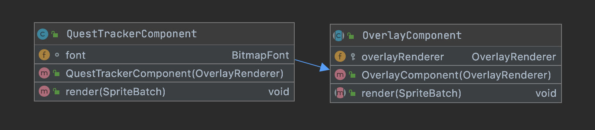
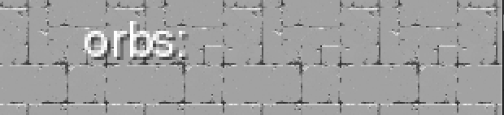
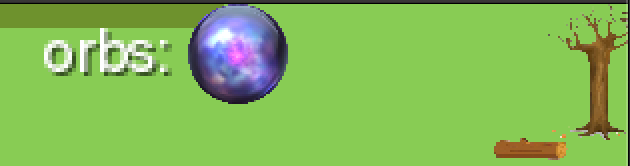

# Usage: 

Add it into renderers/OverlayRenderer.java to apply the component into the HUD
``` java
/**
     * In order to render a component we have to add it to
     * the component list. If we want to remove a component out of
     * the overlay, we just need to remove it out of the component list
     */
    public OverlayRenderer() {
        this.components = new ArrayList<>();
        this.components.add(new DebugComponent(this));
        this.components.add(new HotbarComponent(this));
        this.components.add(new QuestTrackerComponent(this));
        this.components.add(new GuidelineComponent(this));
    }
``` 

# User Testing:
Powerpoint slides were used for this round of user testing.
The users were introduced to the game and were asked a few sets of questions and some interactable tasks before playing through the game and answering some final questions.
The main purpose of this user test was to find out areas of improvement for the design style and placement of the quest tracker and any other information from there. This user test is conducted at the same time as the user test for the [transition screens](World-Transition-Screen-Designs) and [menu screens](Victory, Defeat, and Pause Menu Design) on the storyline pages. Each test was run on zoom and took around 30~45mins where users were allowed to play with the game by taking control through zoom.

Slides used for user testing:
https://drive.google.com/file/d/1Ex-TacmctazvUY_4QvXXGsqjSj_Q3dAJ/view?usp=sharing

<h3>User 1:</h3>

<b>Background of user 1</b>:
- Current University student with a diploma in Business IT and has experience doing designs and user testing 
- Plays game occasionally such as DOTA or Maplestory

<b>Feedback</b>:
- When asked about what he thought of quest tracker, the first thing that came into his mind was a Quest Display similar to Maplestory. Something that pops up when a button is clicked. 

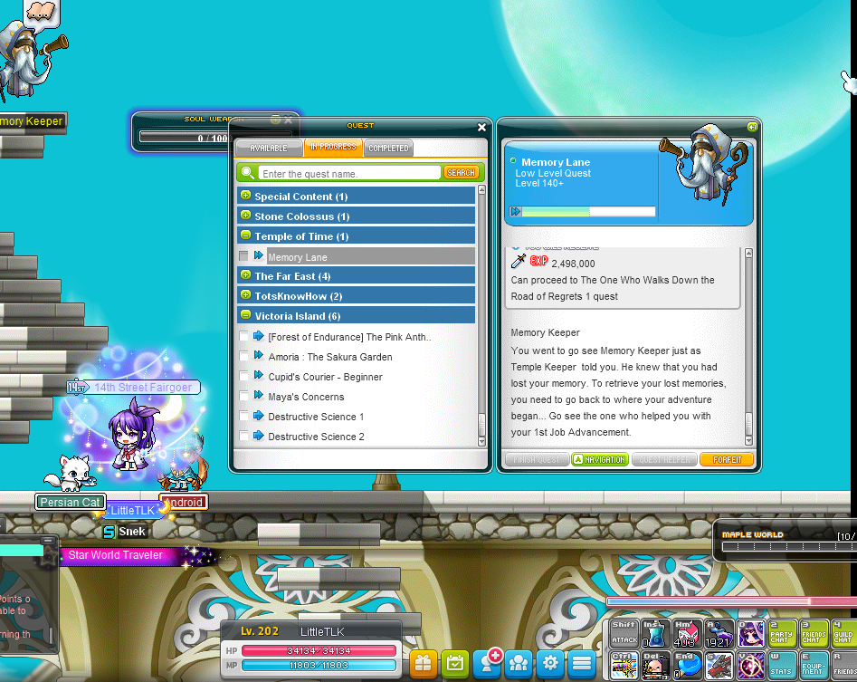
ref: https://forums.maplestory.nexon.net/discussion/24470/please-adjust-pink-bean-prequest-for-beginner

- As he mentioned Maplestory I further asked him about the mini-quest bar that floats around the HUD and he pointed out that it was a good idea to have that too for the main quests or favorite quest. Later on, I asked him to place the quest tracker on any part of the screen and he placed it on the top left.

<h3>User 2:</h3>

<b>Background of user 2</b>:
- Current University student has about 5 years of experience in design, UI/UX, and user testing
- Has extensive knowledge of different genres of games.

<b>Feedback</b>:
- When asked about what he thought of quest tracker, he thought of it as a key item collection as he was told the objective was to collect orbs. He later elaborated on the possibility to include different quest and have a HUD display on it on top of a quest pop up. 
- When I gave him the option to interact with the screen and placed the Quest tracker he chose to place it at the side and made it a slide in and out content to view when needed.

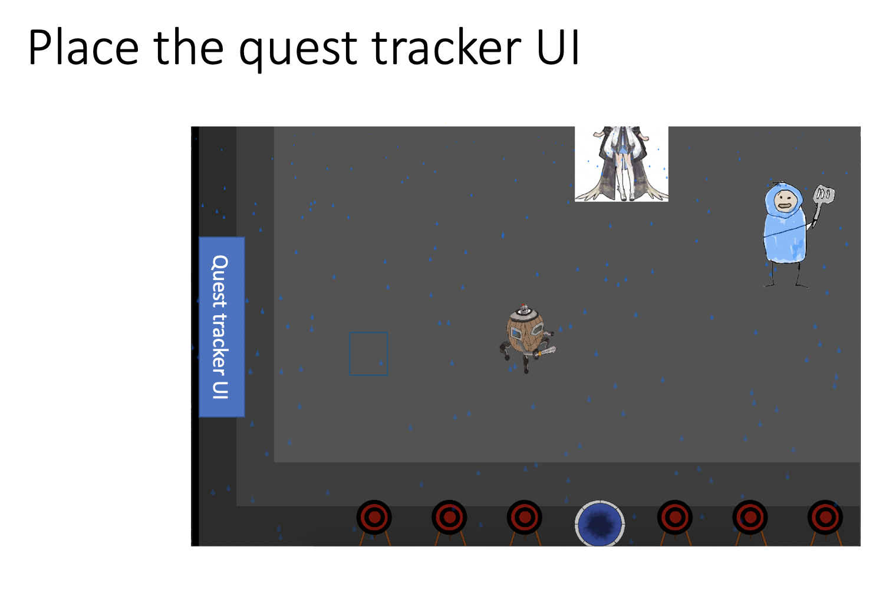

- I later referenced some inspirations from before to him and he agreed that was his idea of quest tracker when mentioned. 

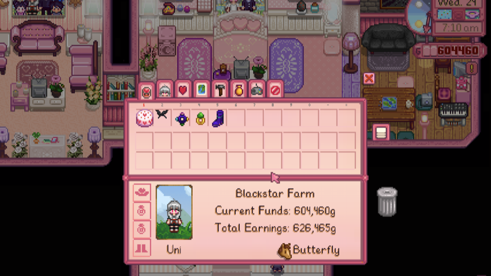
ref: https://community.playstarbound.com/threads/the-pink-interface.129360/

<h3>User 3:</h3>

<b>Background of user 3</b>:
- Working full time as a marketing executive 
- Has about 6 years of experience and 2 years of practice while working with designs and UI / UX testing.

<b>Feedback</b>:
- When asked about what she thought of quest tracker, she thought of it as something that you can keep track of.
- When I gave her the option to interact with the screen and placed the Quest tracker he chose to place it at the top of the screen in the middle.
- After playing through the game she decided it was best to put it up on the top left of the screen. 

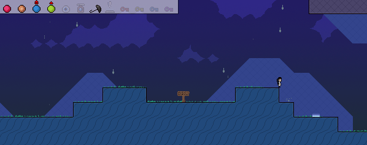

ref : https://www.mobygames.com/game/windows/knytt-stories/screenshots/gameShotId,253774/?fbclid=IwAR37bbPCGC3K9lduHQZ2O88CRyfMvSAxA0zqJ97-FqZ5aerBBQyDktYBhyY


<h3>Conclusion:</h3>
The users seem to have an idea that the quest tracker is something to be displayed on the HUD and generally likes to be placed on the top of the screen. Also, it seems that there is also room for improvement for quest tracker, going forward if there is a quest NPC, more quest can be added into the quest tracker and a HUD along with a popup can be implemented for it.

# Old iterations of Questtracker: 
<div align="center">

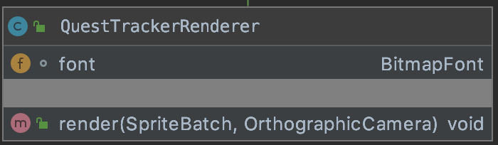

</div>

Overrides the render function in GameScreen and displays a Questtracker UI on the top right of the screen and will update as orbs are collected.

<h3>GameScreen.java:</h3>
- Added questtracker in the `render()` method.

<h3>Example usage:</h3>

QuestTrackerRendere class can be used in the render of GameScreen.java and attached with other render classes in one big spritebatch before rendering. 

``` java
spriteBatch.setProjectionMatrix(cameraDebug.combined);
		if(tutorial){
			guideline.render(spriteBatch,cameraDebug);
		}
		questTrackerRenderer.render(spriteBatch, cameraDebug);
``` 
# UI development:

<b>1/9/20</b> - Used a generic orb image to display the quest progress 
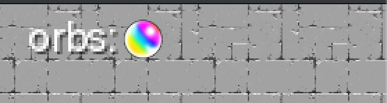

<b>12/9/20</b> - After the orb images were uploaded and interaction of the orb was added into the game, the UI for orb in quest tracker was updated to reflect the orb that had been just picked up 


# Design

<h3>Design 1 Orb container</h3>
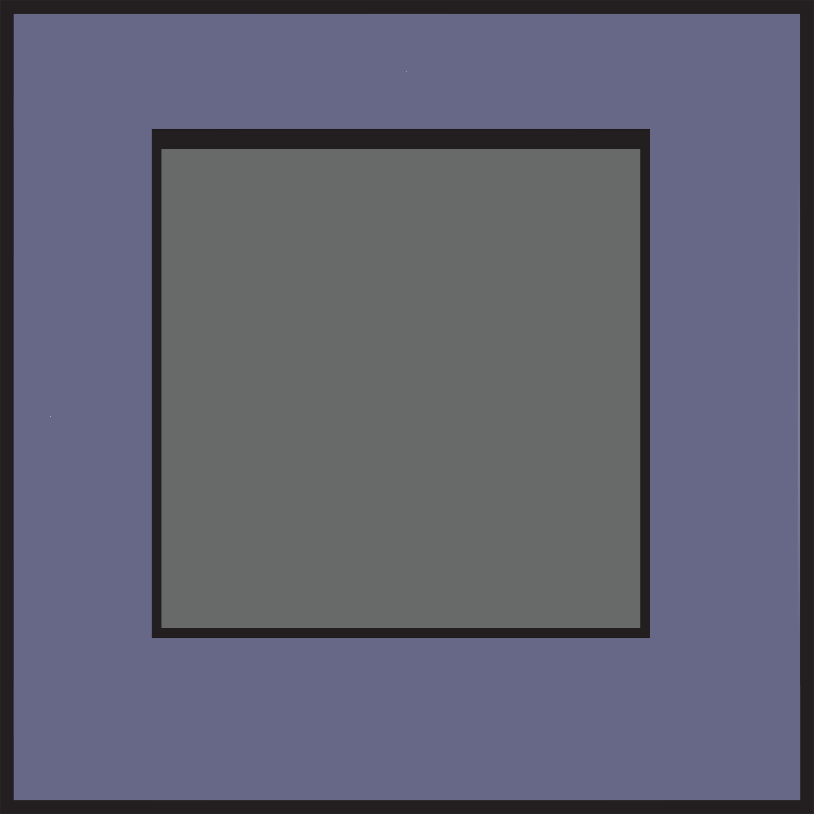

Each orb will be placed inside of one of these orb containers similar to the way the skills are stored and displayed.

<b>Feedback:</b>

<b>User 1</b>

- When asked about their opinion of the orb bar it was denoted that the similarity between it and the skillbar should be closer however remain different as their purpose is different.

<b>User 2</b>

- The user stated that the object looked rather bland and too basic and should have some effects on it to make it look a bit more interesting and realistic.

<b>User 3</b>

- The user preferred each orb to have its own square orb container rather than it made bigger and multiple orbs be inside of one larger orb container

<h3>Design 2 Orb Container</h3>

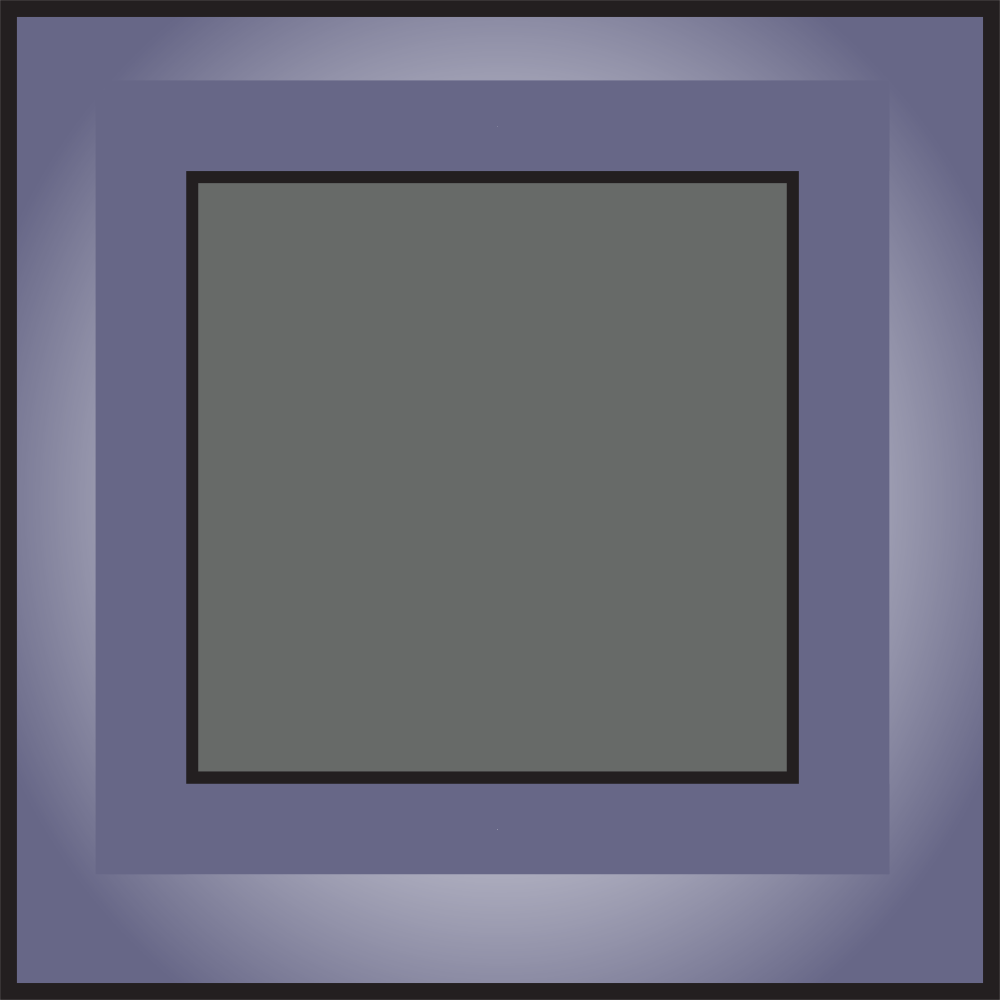

<b>Modification</b>

- A more 3D effect has been added to the orb container to make it look more similar but different from the skill bar

<h3>Design 1 Orb bar</h3>
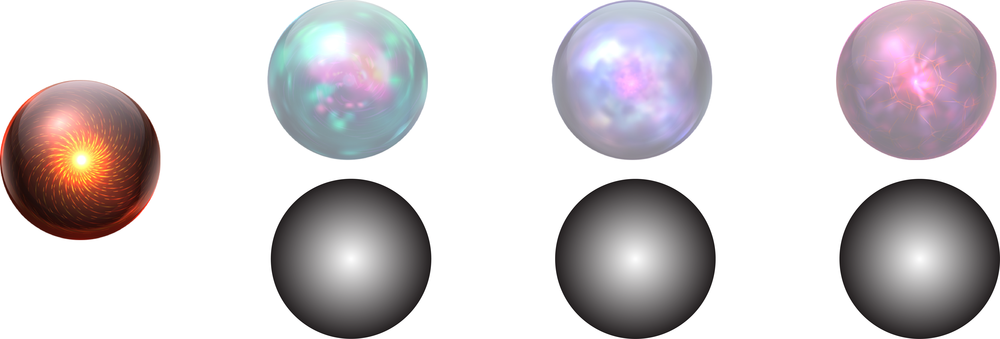

Each orb when not collected will be made to be faded or a gradient orb.

<b>Feedback:</b>

<b>User 1</b>

- Preferred the gradient orb over the faded option as it was harder to see and notice.  Also found the gradient orb to be more interesting and pleasing.

<b>User 2</b>

- The user stated that each of the gradient orbs should be a little different and not all of them to be the same. This user did not prefer either of the options.

<b>User 3</b>

- The user preferred the gradient orbs but found that since they are collected each level there should be some way of denoting the progression the player is making. 

<h3>Design 2 Orb Bar</h3>
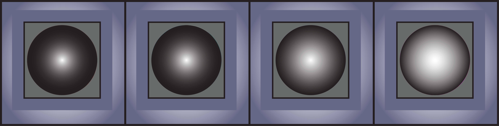
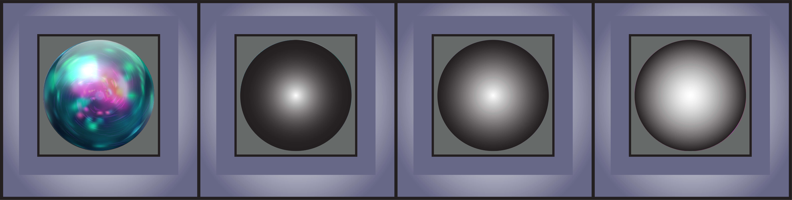

<b>Modification</b>

- The gradient orbs were kept however the degree of lightness in them increases as the orbs progress from left to right. This was to represent the game progression aesthetically as well as making each orb more individualised. They then get replaced by the a "real" orb when it is collected.


# NOTES

* 7/9/20 - Wiki to be updated, the UI will be updated to show relevant orbs to the one dropped by the boss.
* 12/9/20 - Wiki to Updated to reflect the orb collected.
* 15/9/20 - Added User testing section to the wiki. Feedback to be added and update to the orb tracker will be in place based off feedback
* 15/9/20 - Added Some examples for where the render is used.
* 15/9/20 - Added History of Orb UI
* 18/9/20 - User testing was conducted, more to be added soon before have a final conclusion based on the feedback

### Designer: @jng94
### Programmer: @yukaiku
### Written by: @yukaiku, @jng94
