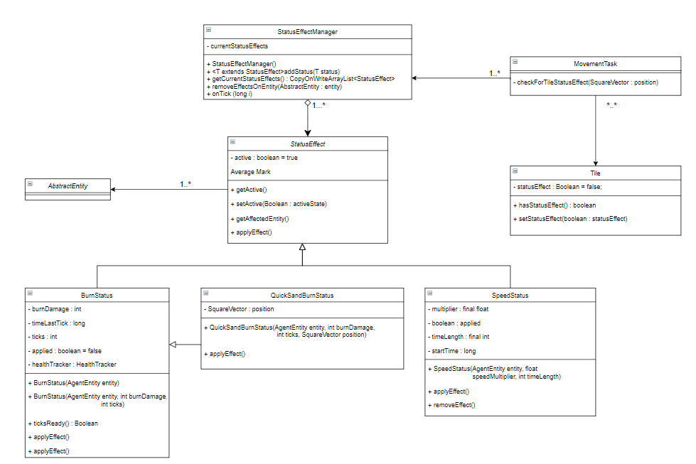

# Wiki last updated 19/09 - End of Sprint 2

## Description 
Status Effects are attributes applied to given objects within a game. These can be health, speed or damage buffs or the simply the reverse. Status effects can add an extra of difficulty to the game as it forces players to play smarter, avoiding damaging tiles & slowing tiles that could result in them losing. In its current implementation, there current exists health & speed reducing status effects as well as speed buffs.

## tasks/status/StatusEffect.java
- This class is the abstract foundation class for status effects in Polyhedron - It is abstract such that any implementation can be applied to any given entity & modify their stats accordingly as each status effect when initialised stores the respective entity its being applied to. Currently it deals & cleans up statuses via `applyEffect()` & `removeEffect()`

## tasks/status
#### / BurnStatus.java
- A status effect that applies a damage over time (DOT) update to the respective entities health. This implementation applies damage whilst checking time intervals of the system each tick & updating health accordingly. This status effect can be customised to apply specific (higher or lower) damage as well as desired duration of the effect via given parameters in its constructor.
#### / SpeedStatus.java, 
- A status effect that modifies the respective entity's speed by a multiplier. This implementation is capable of slowing multipliers (0 < multiplier < 1) & speed multipliers (multiplier > 1) via the given speed multiplier parameter in its constructor.
#### / QuicksandStatus.java, 
- A status effect that is an extension of BurnStatus status effect but also taking a position in its constructor - this position is compared to the entities current position so it can be removed immediately rather than lasting for the total duration. It's implementation uses a combination of itself & speed status to generate a slowing & damaging combo effect when respective entities walk on tiles with the QuickSand type & removes the status immediately upon the entity stepping off the tile.

## managers/StatusEffectManager.java
The status effect manager is one of the game's managers that stores a list of status effects instances. These status effects are added through `addStatus(StatusEffect effect)` which is currently only called by `checkForTileStatus()` in the `MovementTask` - To check if the next tile will deal status effects to a specific entity. 

## Status Effects Class Diagram // UML:

## Improvements:
- While base status effects have been added to the game with modifiers on health & speed, further status effects could be introduced via item consumption, orb buffs & special attacks from both the player & bosses that result in damage buffs during combat.
- Visualisers & UI to be introduced for active status effects would be a great addition to notify the player they are affect and other entities are effected by status effects as such.

## Testing:
Currently there exists complete code coverage for each of the StatusEffect subclasses with each test class checking successful & unsuccessful applications of the status effect over initial, secondary & mulitple time frames. Thus whilst the current implementation is fully covered in the test suite, further testing would involve features that are likely to be fully implemented in sprint 3. These would include status effects for:

- Potion-like items that give specific buffs depending on their type.
- Powerup buffs/status effects upon collecting each orb to assist the player in defeating future bosses.
- The use of special attacks on other entities invoking status effects on those that were attacked.
# Documentation by @ArthurM99115 (Arthur Mitchell)