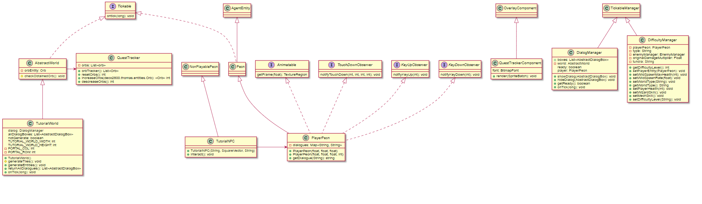

**Introduction**

The storyline will consist of the dialogue, tutorial and quest. 

**Dialogue**

Each npc/monster/boss will have dialogue that either helps with the theme of the game or provides useful information to the player. This will include the instructions in the tutorial.

- [Dialogue Design](dialogue)
- [Dialogue Implementation ](dialogue implementation)

**Quest**

The quest will be the win condition of the game which is to collect all the orbs. This will include a quest tracker to show the user their progress in the game. This will appear in the top right hand corner of the game. This will be in the form of miniature orb icons for each orb they have collected.

- [Quest Tracker Counter](quest-tracker-counter)
- [Quest Tracker UI](quest-tracker-ui)

**Tutorial**

The tutorial will be a guide to play/complete the game. This will be an option to be selected at the main menu of the game. The player will see a dialogue box with instructions on moving to a "flag" with the key binds required to do so. A dummy monster will appear and a dialogue box with instructions on attack key binds and commands to kill the dummy monster. After killing the monster a fake orb will appear with instructions to pick/interact with it. Then the player will be sent to a single player game as if they had clicked the single player option first in the menu.

- [Tutorial World](tutorial-world)
- [Tutorial World Design](tutorial-world-design)

**Transition**

The transitions are the screens and that player will see when transitioning during gameplay. It will contain functions to render it into the game screen as well as the designs and how it came about. 

- [Pause Menu and Victory/ GameOver Screens](Pause-Menu-and-Victory-GameOver-Screens)
- [Victory, Defeat, and Pause Menu Designs](Victory, Defeat, and Pause Menu Designs)
- [World Transition Screens](World Transition Screens)
- [World Transition Screens Designs](World Transition Screen Designs)
- [Character Selection Design](Character Selection Design)

**Difficulty Curve**

The difficulty curve of the game, the player health, enemies health, spawn and spawn rate will be modified based on the current stage of the game

- [Difficulty Curve](Difficulty Curve)
- [Difficulty Curve Playtest](Difficulty Curve Playtest)

**Design Components**

- Dialogue box UI
- [Quest Tracker UI](quest-tracker-ui)
- [Tutorial World Design](tutorial-world-design)
- [Victory, Defeat, and Pause Menu Design](Victory, Defeat, and Pause Menu Design)
- [World Transition Screens Design](World Transition Screen Designs)
- [Character Selection Design](Character Selection Design)

**Coding Components**

- [Quest Tracker Counter](quest-tracker-counter)
- Dialogue box visibility
- [Tutorial World](tutorial-world)
- [World Transition Screens](World Transition Screens)
- [Pause Menu and Victory/ GameOver Screens](Pause-Menu-and-Victory-GameOver-Screens)
- [Difficulty Curve](Difficulty Curve)

**Puzzles**

Each Zone will have a puzzle for the user to complete which will provide them with an advantage of some kind such as an item or gold.

- [Puzzles](puzzles)

**Setting Screen**

The setting screen is where the player can change the volume of the game audio or change the screen size of the game.
- [Setting Screen](settingscreen)