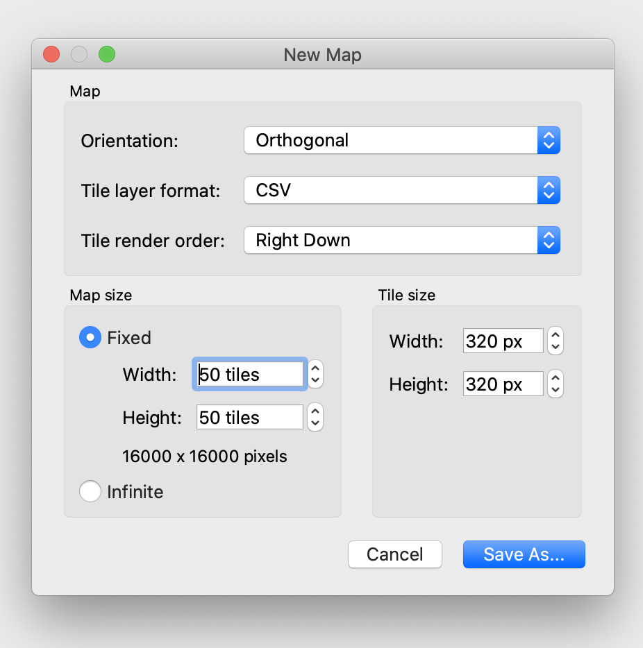
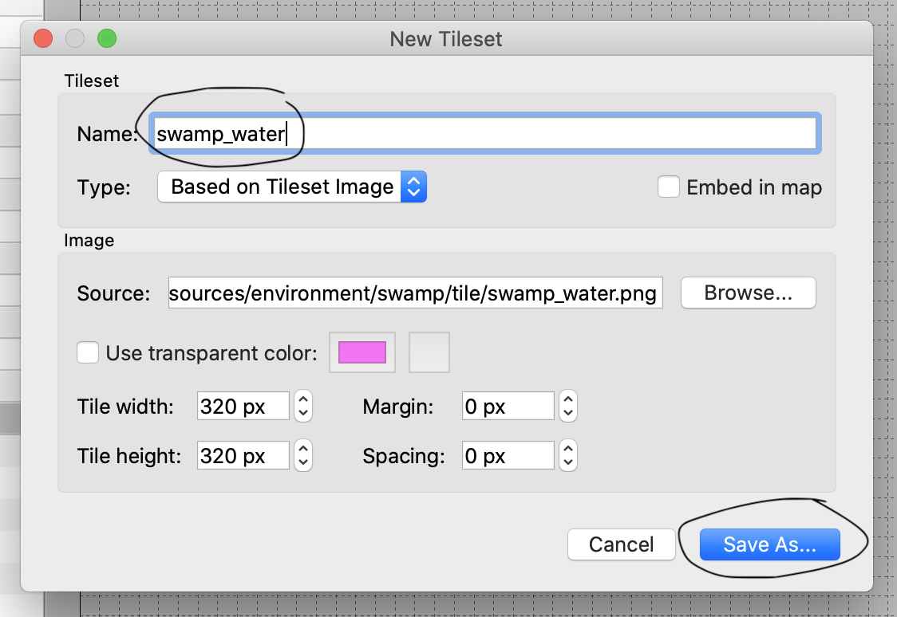
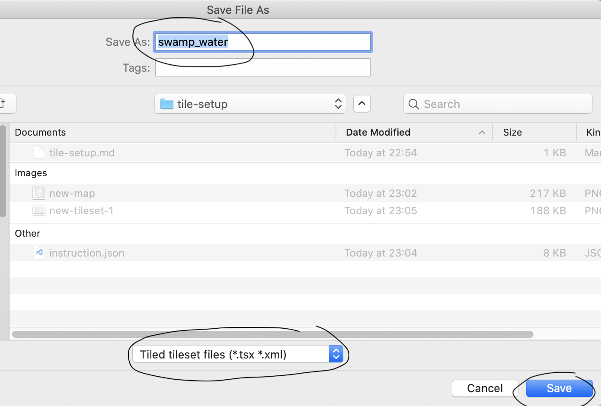
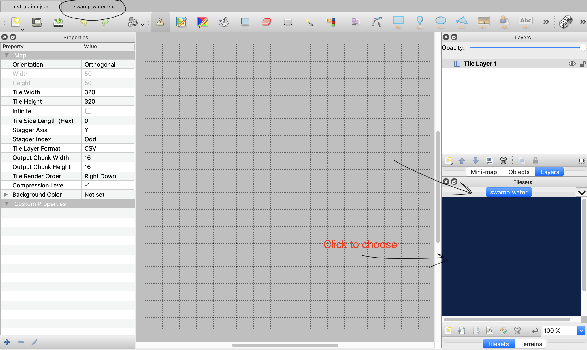

## Old Approach: Hard-coding the texture of each tile with the png images located in the "resources" directory.
- The following is the part of the definition of the _generateTiles_ method in _TestWorld_ class that deals with generating and setting textures for all 2500 tiles.
```java
Random random = new Random();
for (int q = -WORLD_WIDTH; q < WORLD_WIDTH; q++) {
	for (int r = -WORLD_HEIGHT; r < WORLD_HEIGHT; r++) {
		int elevation = random.nextInt(3);
		String type = "grass_";
		type += elevation;
		tiles.add(new Tile(type, q, r));
	}
}
```
- This approach is ineffective as we have to access each and every tile to set their textures. To achieve, complicated map designs, this approach may take up to 2500 lines of code to set up each single tile.

## New and Improved Approach: Draw the tile map with a tool -> Generate a JSON file -> Load the JSON file as the game map
### Step-by-step Instruction:
1. Prepare your tile texture png images
  - Resize all textures to **320x320**.
  - Put your textures in `resources/environment/...` (Recommended).
  - Register all textures into the `TextureManager` class. Give them names and **remember the names**.

2. Install [Tiled](https://www.mapeditor.org/)
  
3. Create a tile map using Tiled with the textures that you have:
  - Create a new tiled map
    - `File => New => New map`.
    - Map size: `Width = 50, Height = 50`. 
    - Tile size: `Width = 320px, Height = 320px`. (DO NOT change these)


  - Create new tile sets.
    - `File => New => New tileset`.
    - Image: browse and choose the texture for your tileset. **Remember to save the tilesets with the sames name that you specified in the `TextureManager` class.** Click "Save as...". **DO NOT** tick the "Embed in map" box.

    - Make sure that the file name is the same as the name you registered for the texture in `TextureManager` class and the file type is set to **.tsx**. Click "Save". A new .tsx file, which is the texture itself, will be created in the same directory and automatically opened in Tiled.

    - Start drawing!

  
  - Save the tiled map to a JSON file: `File => Save as` and choose `JSON`.


4. Convert the Tiled's JSON file to game's JSON file.
  - Converter script located at `resources/environment/converter.py`. You can copy it to the directory where you are working
  - The converter script takes two args: JSON file you just create with Tiled and JSON file to run the game (You can create this and give it any name). Run this command in your terminal: `python converter.py Swamp-Zone.json swamp-game-map.json`

5. Load the generated JSON file into the game.
  - Move the game JSON file (`swamp-game-map.json` in this case) to the `resources` directory in the project.
  - Make sure the class of your World has the the following:
    - A `String` attribute that saves the path to the JSON file.
    ```java
    public static final String SAVE_LOCATION_AND_FILE_NAME = "resources/swamp-game-map.json";
    ```
    - Constructors that call the `loadWorld` method of `DatabaseManager` to load the JSON file into the game
	```java
	public SwampWorld() {
		this(AbstractWorld.DEFAULT_WIDTH, AbstractWorld.DEFAULT_HEIGHT);
	}

	public SwampWorld(int width, int height) {
		DatabaseManager.loadWorld(this, SAVE_LOCATION_AND_FILE_NAME);
		this.generateTiles();
		this.generateTileMap();
		this.generateTileIndices();
	}
	```
  - Go to the `GameScreen` class. Find `Input.keys.F6` and specify the output file for the game.
	```java
	if (keycode == Input.Keys.F6) { // F3
	        // Save the world to the DB
		DatabaseManager.saveWorld(world, "env_team_output.json");
	}
	```
# Thank you @nathan-nguyen for all your time and effort to make this work seamlessly
# Documentation by @nathan-nguyen and @hayden-huynh