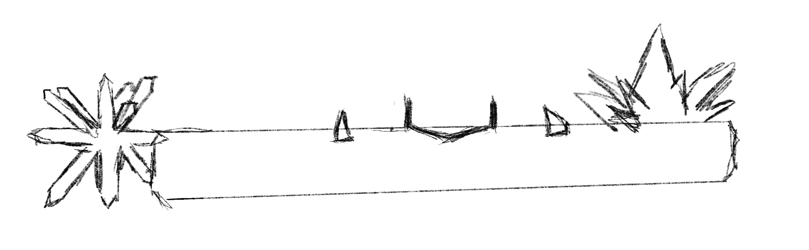
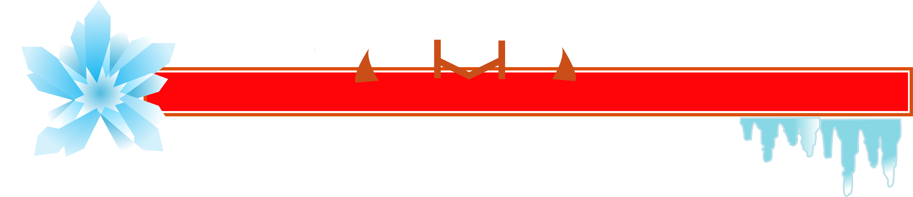
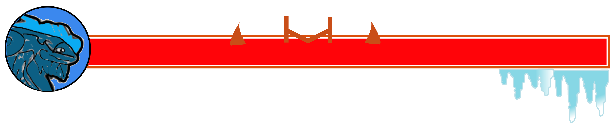
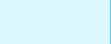
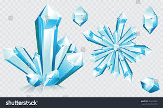
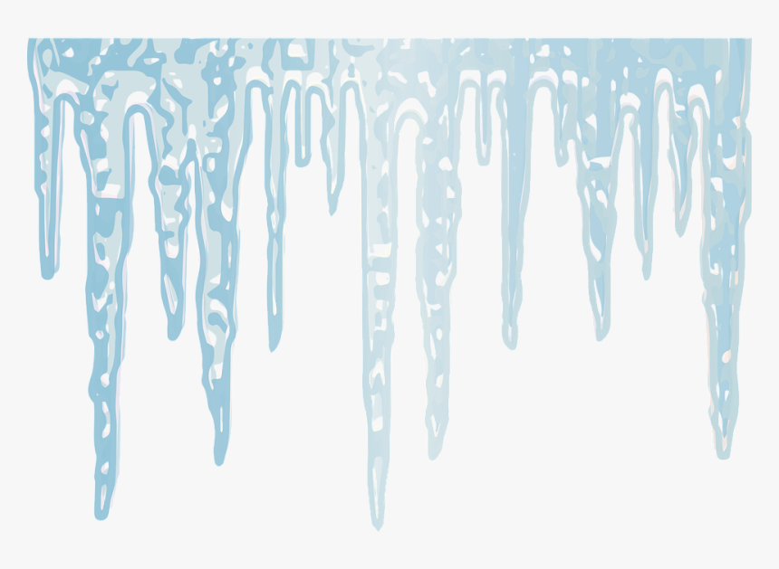

# **Initial Sketch**

The idea of designing the health bar for boss in tundra is to include the basic rectangle, which indicates the health status, a snowflake located at the left of the health bar to represent the tundra zone and some elements of ice to decorate.
# **Visualization**
## Version 1

There are some changes from the initial sketches, instead of adding ice shard around the main health bar, icicles are used to represent the ice elements and placed under the rectangle.
The gradient color is used for ice elements from cold blue to white to make it similar with the ice in real world.

## Version 2

The design idea comes similar with the volcano zone, I use the profile of the boss in this zone to locate at the left of health bar, and it includes some of the elements of ice as well.

## Color platte
71A6D1 
B6DFF6 

DCF7FE 
60C4EB 

# **Reference**

https://www.shutterstock.com/zh/image-vector/collection-blue-ice-crystals-crystal-snowflake-554410363

https://www.creativefabrica.com/product/ice-shard/

https://www.kindpng.com/imgv/wTibxw_graphic-icicle-icicles-cold-winter-ice-frozen-icicle/