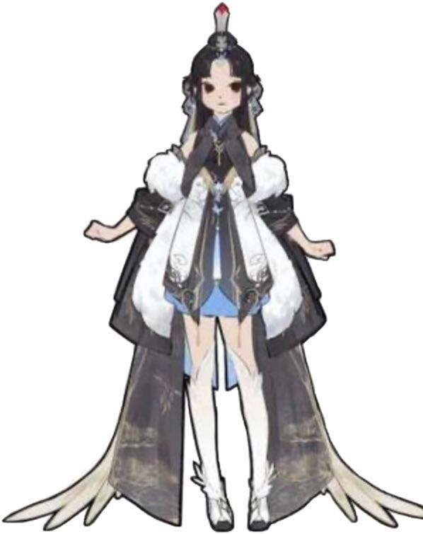

The tutorial NPC will provide players on how to play the game and give player quests to complete throughout the game, she will guide you in your journey to take back the stole orbs from the Elder Dragons.

Tutorial NPC design sketch:

- When greeted upon first contact: "_Greetings my students, you both must save the world of Decodia by defeating the elder dragons and collecting the orbs they have stolen. These orbs contain the great power of the elements and without them the world is out of balance. You will have to use your combined powers of steel and magic to prevail against the looming terrors._"

- When asked about movement: "_To move your mech press W for up, S for down, A for left, D for right, please move to the checkpoint marked with a flag to proceed._"

- When asked how to defeat enemies: "_An enemy is in front of you, get closer and click (attack key) to kill the monster_"

- When asked how to interact with others: "_There is an orb in front of you, pick it up by interacting with it. Complete (Automated)_"

- Upon completing the tutorial: "_Congratulations on completing the tutorial, would you like to move to the next stage or redo the tutorial?_"