# Description

This document consists of the design process of the victory screen, defeat screen, and pause menu. 
* The victory screen appears when the player successfully collects all four orbs. 
* The defeat screen is displayed when the player dies during the game.
* Pause menu allows players to pause or exit to main menu.

# Victory Screen

**Version 1.0** (_08.09.2020_)
* In the planning stage, a brief sketch was drawn to set the basic style of the victory screen.
* The initial plan was to design an emblem for Kingdom of Decodia and insert it onto a flag. Flag often represents a territory or castle in medieval times. In this case, it may mean that the player has won over the enemies and have saved the land of Decodia.

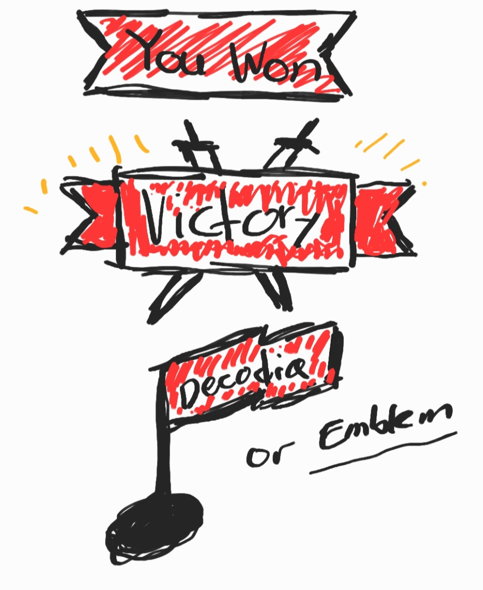

**Version 2.0** (_09.09.2020_)
* The selection of colour for the flag is red. It was found that the colours can take on various meaning in flags. Red symbolises courage, power, and bloodshed. Which sounds perfect for the victory screen.
* The selection of colour for the text is gold (yellow-brown). Gold also symbolises courage but looking it as a precious metal it symbolises wealth, grandeur, and prosperity. Which is again a perfect selection for this design.
* Instead of plainly having a word "Victory", an additional line "You Saved the World!" has been added below to give a brief context of what happened.

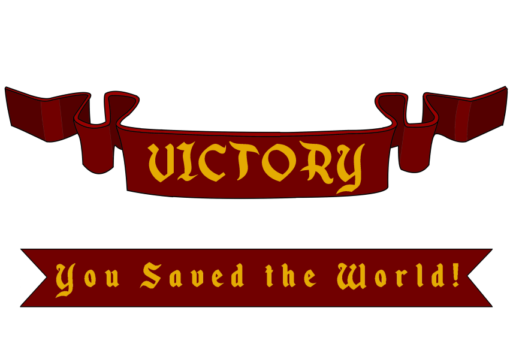

**User Testing** (_10.09.2020_)

Questions
* First of all, what do you think of this design?
* What do you think of the colour choices? Does it go well with this flag style design?
* The design looks kind of empty, like its missing something. What do you suggest to improve upon this design?

Results
* Through user testing, participants have identically answered that it looks great and classy. That it certainly feels like a victory screen they would like to see at the end of the game. They have complimented that the colour choices are excellent. Also said that if they were a designer, they would make the exact same colour choices. Moreover, they mentioned how the combination of the red flag and gold texts go well together. A participant suggested to implement more to it since it looks too empty at the top.

**Version 2.1** (_12.09.2020_)
* While thinking about the suggestions derived from user testing, the four orb designs were brought to mind. These four orbs which is the ultimate winning condition of the game were heavily considered to be added to this design. It was assumed that this will enrich the design furthermore. 
* The plan was to add all five orbs to the design. However, there were only four orb designs present because the fifth one was not required for the game. So unfortunately, only four orbs were included in the victory screen.
* _Credits to Environment Feature Team for the four orb designs_

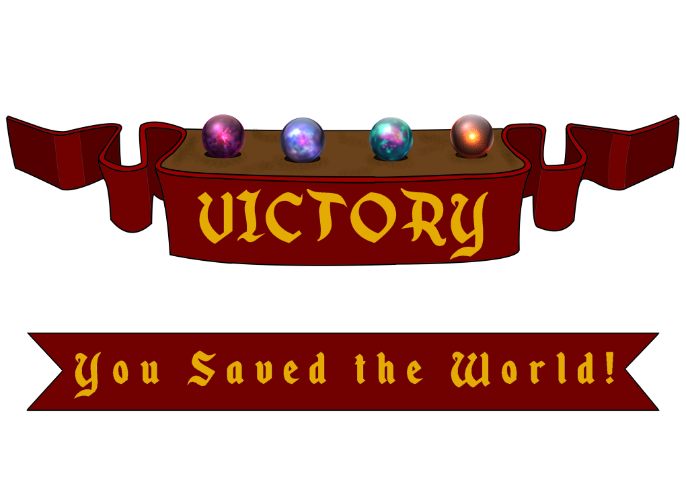

**Inspiration**
* The design of the victory screen was inspired by:

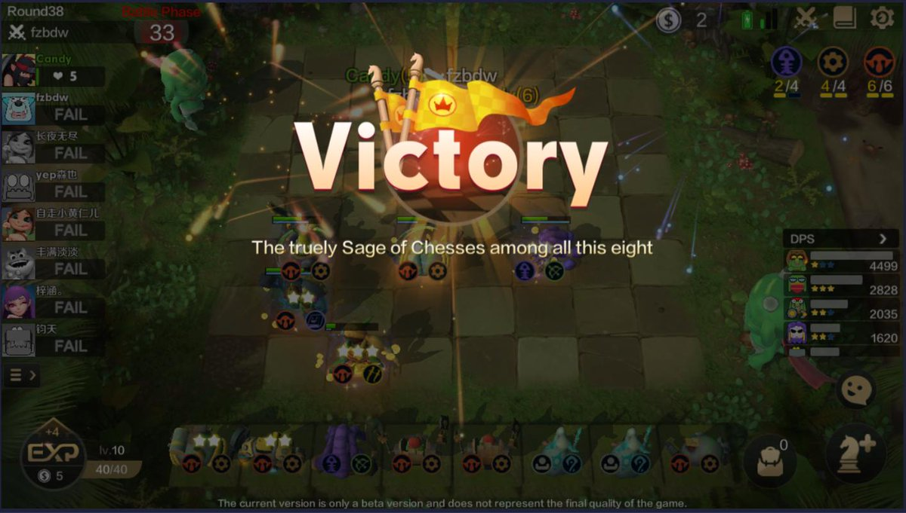
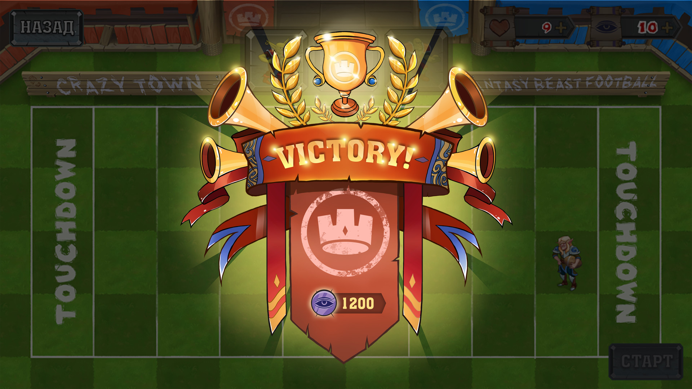

# Defeat Screen

* _It was found that the Health Feature Team has already designed the game over screen, but this issue is solved. Continued as planned._

**Version 1.0** (_08.09.2020_)
* In the planning stage, a brief sketch was drawn to set the basic style of the defeat screen.
* The defeat screen had to comprise similar design style as the victory screen. The aim was to contradict the victory screen's colour tone, background etc. So, the use of flag had to continue here as well.

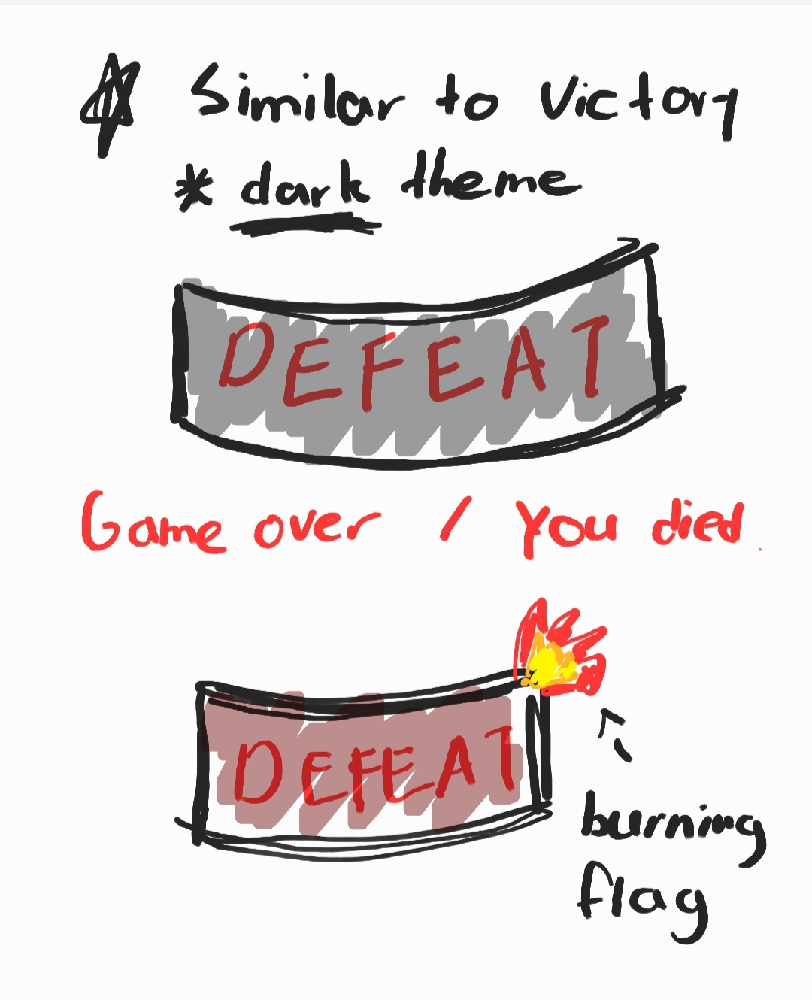

**Version 2.0** (_09.09.2020_)
* This is the first design created by following the sketch.
* This design involves the same design principles as the victory screen, but darkened. Furthermore, instead of having a normal flag like in victory screen, it has a damaged flag. Which could potentially mean loss or death contradicting the perfect and luxurious condition flag designed for victory.
* The colour choice for the text "Defeat" is red since this appears following the player's death. Then grey for the overall flag colour to make the text clearly visible as well as making it dark theme.

**User Testing** (_10.09.2020_)

Questions
* Does this resemble the victory screen design?
* What do you think of the colour choices? Do you think it contradicts the victory design enough?
* Do you think the damaged flag effect a good choice in order to differ from the victory design?

Results
* One user said the defeat design does resemble the victory design. That it both uses a flag but differently. It definitely has a darker tone, but the combination of the two colours used is not really pleasing. The ripped flag design seems very appropriate. A damaged flag is what they usually see when an army loses in battle (in movies).
* Another suggested to use the same red colour for the flag but darker. The colour grey is alright but dark red could potentially enhance the current design. After colouring the flag with dark red, change the text colour to something else that can be visible.
* Add some more elements in the background or else. Looks too empty and the flag itself might be too little.

**Version 3.0** (_11.09.2020_)
* Listening to user feedback, major colour changes have been made. The flag colour has been replaced with dark red. Text colour replaced by black. The damaged flag effect is not touched since there were no complains.
* The flag alone seemed too lonely compared to the victory screen as one user said. So a black smoke effect has been added in the background. This is expected to fill up the emptiness.

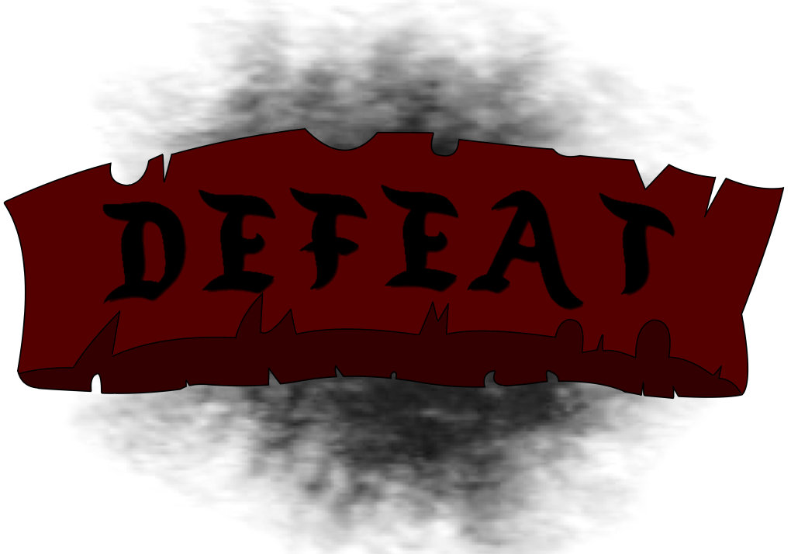

**Inspiration**
* The design of the defeat/game-over screen was inspired by:

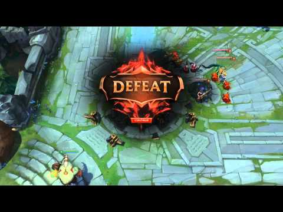
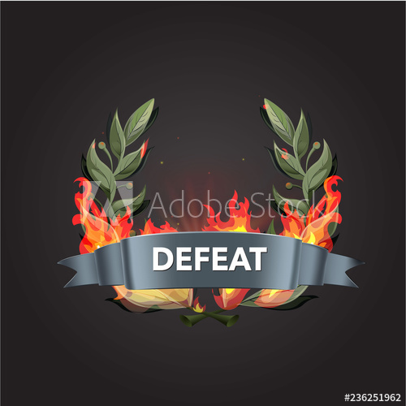

# Pause Menu
* _An empty pause menu modal is designed. Buttons such as 'return to main menu' and 'resume' is added separately by code._

**Version 1.0** (_07.09.2020_)
* There were a broad selection of pause menu designs that it could integrate from. Narrowing it down a little, there are two major type of designs for the pause menu. One being vertical and the other being horizontal. It is obvious to say that the most commonly used style is vertical. Users will feel more comfortable around designs they see daily. Therefore, vertical style has been chosen. Also, considering the fact that the pause menu won't involve many buttons or features any soon made this decision easier to make.

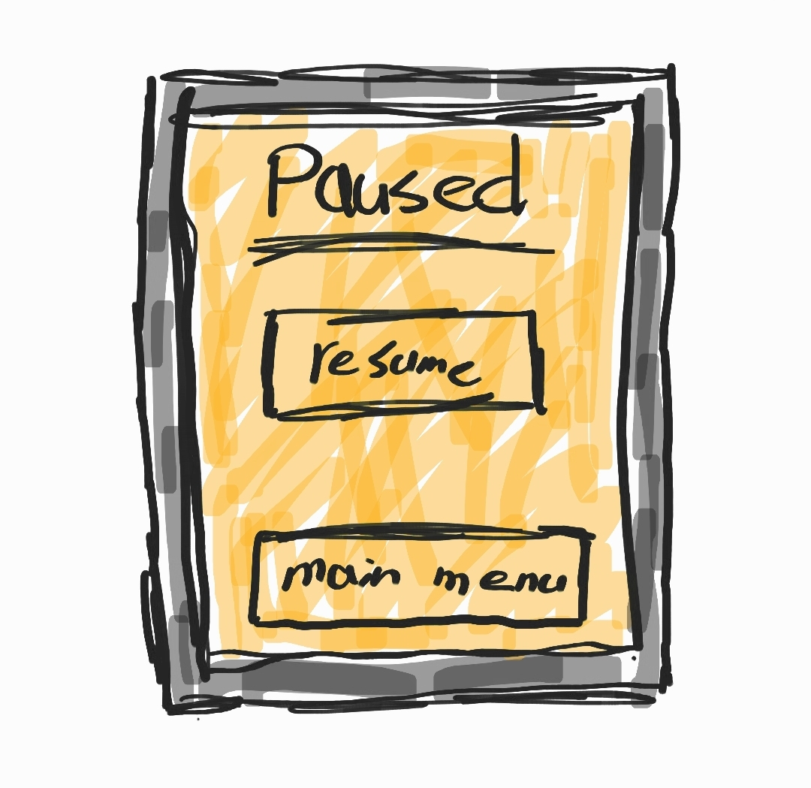

**Version 2.0** (_09.09.2020_)
* Two designs were created with totally different art style.

**First design:**_page_
* This integrates its design from the guideline shown in [Tutorial World Design](Tutorial World Design).
* It reminds of the word 'quest' which is very applicable to the game theme. 

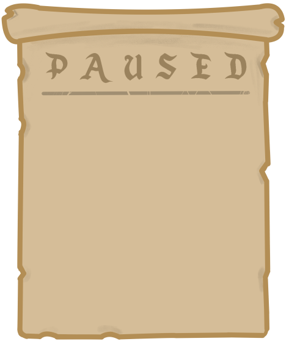

**Second design:**_board_ 
* This design differs to the first one. This is a wooden board which is present indoor in medieval times.

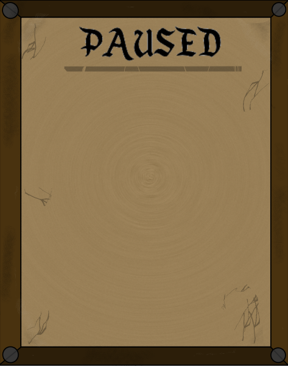

**User Testing** (_11.09.2020_)
* User testing has been conducted with multiple participants to see which design is more preferred and applicable to the overall game design.

Questions
* Which of the following designs fits the theme of medieval/fantasy?
* Which colour tone do you prefer? Bright or dark?

Results
* The boxy design of the board is more preferable as a pause menu. But, the decaying paper design doesn't look that bad either. Likes the darker version of the pause menu.
* The board design doesn't look it resembles the other design products. It looks quite realistic compared to them. Maybe because of the effects applied to it. The paper design on the other hand, seems more natural to the overall game design shown. But both still adds up to the medieval theme. 

**SELECTION**
* "Page" Design Selected

**Inspiration**
* The design of the pause menu was inspired by:

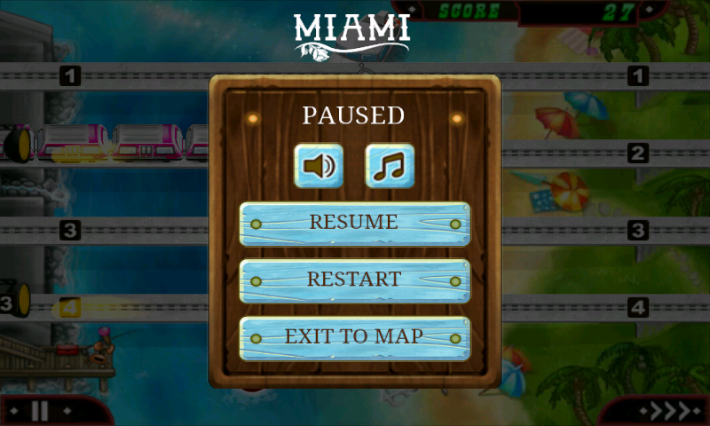
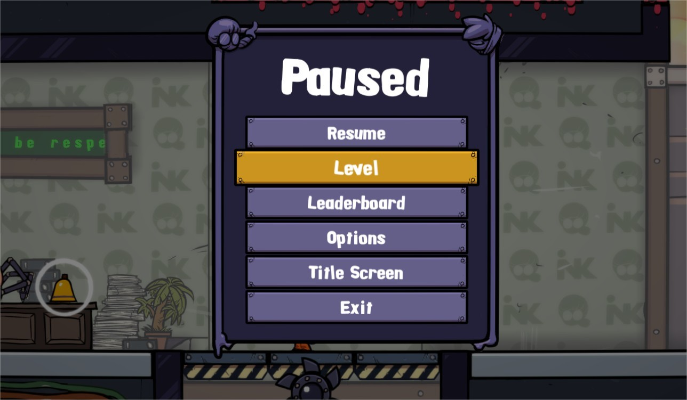

# User Testing Round 2:
Powerpoint slides were used for this round of user testing.
The users were introduced to the game and were asked a few sets of questions and some interactable tasks before playing through the game and answering some final questions.
The main purpose of this user test was to find out areas of improvement for the design style and smoothness of the transition from the start to the end of the game and any other information from there. This user test is conducted at the same time as the user test for the [Quest Tracker UI](quest tracker UI) and menu screens on the storyline pages.

Slides used for user testing:
https://drive.google.com/file/d/1Ex-TacmctazvUY_4QvXXGsqjSj_Q3dAJ/view?usp=sharing

<h3>User 1:</h3>

<b>Background of user 1</b>:
- Current University student with a diploma in Business IT and has experience doing designs and user testing 
- Plays game occasionally such as DOTA or Maplestory

<b>Feedback</b>:
- Asked about the defeat screen asking if a try again button could be added after the defeat of the player to immediately start the game again and try again. 

<h3>User 2:</h3>

<b>Background of user 1</b>:
* Current University student has about 5 years of experience in design, UI/UX, and user testing
* Has extensive knowledge of different genres of games.

<b>Feedback</b>:
- When asked about what he thought of the menu screen he added that some the visuals had the feeling of a medieval vibe but it was not consistent with the overall of the game designs, as the current tiles used to display the world was pixelated but could be due to it being under development. Also lastly mention how the designs were similar to Newgrounds games from the 2000s. 

<h3>User 3:</h3>

<b>Background of user 3</b>:
* Working full time as a marketing executive
* Has about 6 years of experience and 2 years of practice while working with designs and UI / UX testing.

<b>Feedback</b>:
- Designs were well done and had the right vibe to it. 
- Inquired if a restart button could be put in place after death to allow quicker replay. 

<h3>Conclusion</h3>
- Overall the menus delivered the right feeling of medieval for users but some consistency could be added into it. 
- An additional try again button can also be added to allow players to instantly get back into the game, possible restart and replay from the last save could be added into it as well. 

# References
* Bedareva. A (2018), VICTORY SCREEN. Image retrieved from: https://www.artstation.com/artwork/VeWAP
* Auto Chess Mobile (2019), Post your VICTORY SCREEN for AUTO CHESS MOBILE. Image retrieved from: https://twitter.com/autochess2/status/1123034551716999169
* GameLandVN (2015), LOL PBE 2/26/2015 Update: End of Game Victory/Defeat New Animation. Image retrieved from: https://www.youtube.com/watch?v=EvYI33hqWYA
* risha.bee (n/a), Game UI elements. Image retrieved from: https://stock.adobe.com/au/images/game-ui-elements-defeat-screen-enveloped-by-fire-whith-an-bay-leaf-icons-for-game-ui-banner-app-interface-slots-game-development-playing-cards-and-roulette-vector-illustration/236251962
* BWC seams (2017), How to create a “Game Option/Pause Screen” in Swing? Image retrieved from: https://stackoverflow.com/questions/45777039/how-to-create-a-game-option-pause-screen-in-swing
* Splasher (2017), splasher. Image retrieved from: https://store.steampowered.com/news/posts/?appids=446840&appgroupname=Splasher&enddate=1491489058

### Designer: @jisungkim.k
### Programmer: @quan281999
### Documentation by: @jisungkim.k
### User Tester Documentation: @yukaiku