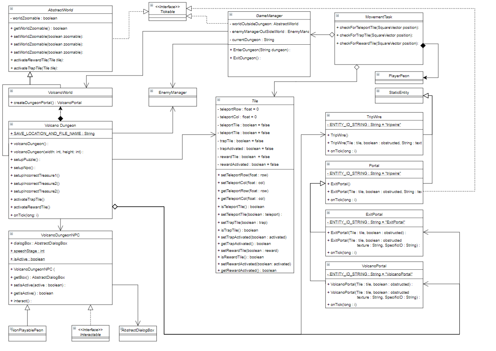
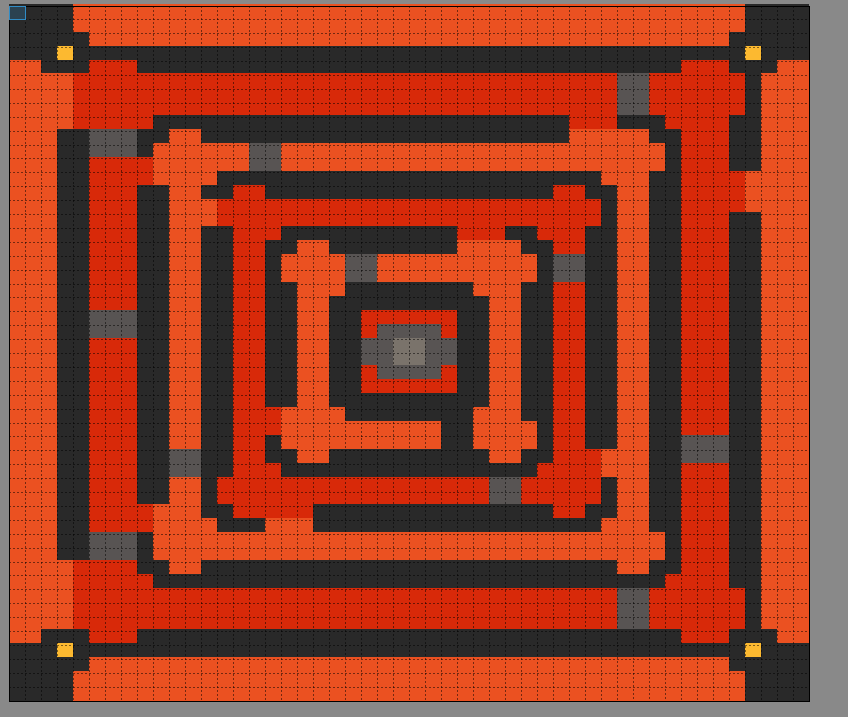

# Wiki last updated 9/10 - End of Sprint 3

## Description 

The Volcano Lava maze is one of the game's bonus accessible from the Volcano Zone ruins. Upon entering the portal to the Dungeon, the player is greeted by an NPC which hints the direction of the exit & a possible reward within. It is a 50 x 50 plane containing default & damaging tiles through a range of 8 varying textures tiles with primary entities of the Lava maze dungeon including a guide NPC, trip wires (disguised as portals), a loot chest & an exit portal.

## worlds/dungeons/VolcanoDungeon.java
- This class is the foundation class for the Volcano Dungeon (bonus world) in Polyhedron - being a subclass implementation of `AbstractWorld` it stores instances of player entities (`AgentEntity`), static entities (`StaticEntity`), tiles (`Tile`) with instance variables for world width's, heights as well as getter, setter & generator methods for such corresponding class variables. Once the JSON world save file is processed by the `DatabaseManager`, the `VolcanoWorld` class constructs all of the static entities to be placed on the tileset and calls `setupPuzzle()` which setups up both TripWire instances for rewards and traps including a return to start portal, an enemy spawner & TreasureChest spawner. An exit portal, dialogueManager & npcManager are also setup in the constructor of `VolcanoDungeon`.

## entities/enviroment
#### / TripWire.java,
-  Non-obstructing static entity sub classes that remove themselves after contact with the player. This TripWire entities can then trigger a trap or a reward depending on the boolean attributes of the tile with which the TripWire is placed upon. 

#### /volcano/VolcanoPortalJava.java
- The volcano portal class is a static entity within the Volcano Zone & dungeon that can be used to transport the player to & from the dungeon as well as around the current world itself. It extends from the Portal class with variance in texture & ID. To transport players to this subclass of portal is used by the `MovementTask` class & thus to see [Dungeon Teleportation] (https://gitlab.com/uqdeco2800/2020-studio-2/2020-studio2-henry/-/wikis/Environment)

## Volcano Dungeon (LavaMaze) Class Diagram // UML:

## Volcano Dungeon Tileset

## Improvements: 
While the majority of the Volcano zone dungeon has been implemented, there remains several key elements that could be improved upon. Firstly, as the volcano is the last zone of the game, it would be desirable to make the maze as hard as possible. While zooming in & out of the players perspective was locked for the maze in this sprint, the minimap still remains, making it fairly easy to navigate through the maze. Thus, after discussions with the Minimap team this sprint, it is likely that the minimap will be disabled or set to discovery mode (tiles are revealed as the player traverses them) for dungeons & especially the lava-maze so it can be the hardest dungeon. Furthermore, lava tile textures could be setup to update every few seconds to a randomised lava texture .This would add aesthetic appeal to the lava maze & thus improve the players experience whilst they traverse the maze. Further improvements could also be tweaking the design of the maze & the traps - however this requires more user testing & thus will be conducted whilst polishing in sprint 4.

## Testing:
While some basic tests have been written to dungeon. Furthermore other basic tests for include ensuring the tripwire entities work accordingly by.
- Resetting the players position after stepping on the first treasure trap. 
- Spawning a bunch of enemies after stepping on the second treasure trap.
- Spawning a loot box upon reaching the reward tile.
- Initiating a skill choice after reaching the end of the dungeon. 

There remains plenty of potential testing, especially in User testing where timed maze test runs could be sampled across a group of clients/users. This would be extremely beneficial as it would highlight:
- Whether the length of the maze is too much.
- Whether maze complexity needs tweaking.
- Whether maze textures need polishing.
- Whether more health/armour upgrades should be available in the dungeon.

# Documentation by @ArthurM99115 (Arthur Mitchell)