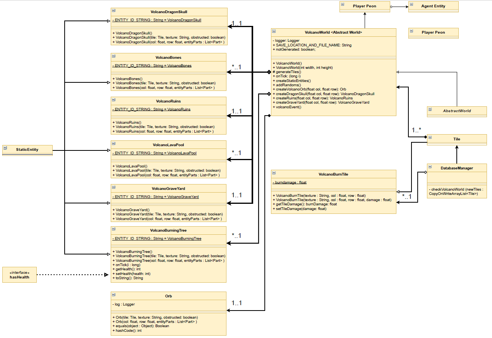
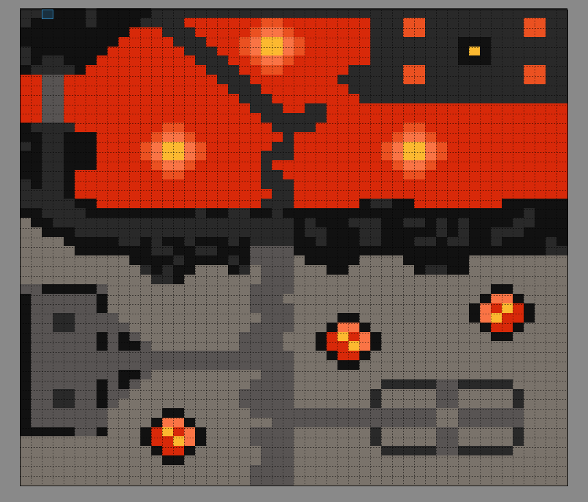

# Wiki last updated 19/09 - End of Sprint 3

## Description 

The Volcano Zone represents one of the four environmental zone's in Polyhedron. It is a 50 x 50 plane containing default & damaging tiles through a range of 8 varying textures tiles. The Zone's orb is located deep within the volcano where one of the four bosses expected to be implemented awaits. Additionally, the zone also features static entities such as bones & dragon skulls both of which will contribute towards future side-quest opportunities that take advantage of locations such as the Graveyard & Ruins areas. It is expected with further implementation of the teleportation mechanism's that all worlds will be initialised upon the launching/loading of a new game.

## worlds/VolcanoWorld.java
- This class is the foundation class for the Volcano Zone in Polyhedron - being a subclass implementation of `AbstractWorld` it stores instances of player entities (`AgentEntity`), static entities (`StaticEntity`), tiles (`Tile`) with instance variables for world width's, heights as well as getter, setter & generator methods for such corresponding class variables. Once the JSON world save file is processed by the `DatabaseManager`, the `VolcanoWorld` class constructs all of the static entities to be placed on the tileset via the createStaticEntities method - this consequently calls private helper methods which individually add the entities listed below.

## entities/
#### / VolcanoBones.java,
-  Non-obstructing static entities that would be ideal collectables for future side-quest/trading/crafting opportunities in the game.
#### / VolcanoBurningTree.java, 
- Obstructing static entities that are intended to integrate the Volcano Zone's burn tile & thus as agent entities collide with the burning tree, those respective entities take damage & consequent updates to their healthbar.
#### / VolcanoDragonSkull.java, 
- A single non-obstructing static entity that would be ideal collectables for future side-quest/trading/crafting opportunities in the game.
#### / VolcanoGraveYard.java,
- A static entity that encompasses a 13 x 7 area on the Volcano Zone map.  In terms of design, the area offers obstructing boundary fences & boulders that will likely be replaced with tombstones which can broken down for materials.
#### / VolcanoLavaPool.java, 
- A static entity that controls 12 squares in each of its instances around the map. Upon implementation of the weather event, the LavaPools will invoke a dynamic (agent) entity likely to be named LavaFlow that will expand out from the coordinates of each LavaPool in the Volcano Zone.
#### / VolcanoRuins.java
- A static entity that encompasses a 10 x 15 area on the Volcano Zone map.  In terms of design, the area offers inner pillars with spots for collectable items as well as locations where specific types of enemies can spawn. A possible idea for a future sprint would be a dungeon, mini-world that can be accessed via these ruins & consequently plays a part in side-quests or general exploring for items in Polyhedron.

All of the above classes extend the `StaticEntity` class and represent the entities that are placed in the Volcano Zone. While these entities do not differ greatly from StaticEntity at present, the have been constructed for implementation of the outlined ideas above ready for next sprint.

## worlds/VolcanoBurnTile.java
- `VolcanoBurnTile` is a subclass of `Tile`. This Tile class replaces the default tile on Volcano Zone to a tile which, with future integration of the health bar system, will damage the player upon collision. It currently replaces regular tiles in the Volcano Zone via a private helper method within `DatabaseManager` which, before setting the tiles for the world, replaces all tiles with a texture numbers greater than 4 (Lava tile textures are Volcano_5 to Volcano_8) to `VolcanoBurnTile` Tile's. 

## Volcano Zone Class Diagram // UML:

## Improvements (These still have not been implemented at the end of sprint 2 as they are more polishing/gold plating features that will likely be done in sprint 4 or 3 if time permits):
- Now that Burning tiles have been implemented, it would be recommended that in the next sprint (Sprint 3) that the health bar updates upon collision between any agent entities such as the player peon & burn tiles that have been implemented into the world. This could potentially be achieved by checking the next tile in the movement task class which could consequently trigger a method call upon the tile being a burn tile. This can also be applied to the burning tree static entity which would deal consequent damage to agent entities upon collision (While it still has health).
- Polish Volcano Zone textures for static entities as ones provided in the previous sprint (Sprint 1) are incorrectly sized for some textued & lack cohesive capabilities in terms of combining textures to construct a static entity.
- Add side-quest/trading functionality for the static entities such as Bones Dragon Skull.
- Decide on desired enemies for the zone, setting their health, position & range of motion.

## Testing:
Since code coverage covers most of the methods implemented in VolcanoWorld, future testing could cover special items & interactions that will occur in the world once the inventory system is fully implemented. Further tests could also involve:
- The testing of NPC's trading.
- Opening chests in the world.
- Using items such as shields within the world once they spawn.

## Volcano Zone Tileset:

# Documentation by @ArthurM99115 (Arthur Mitchell)