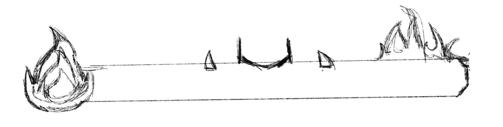
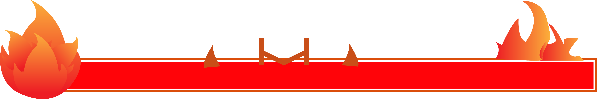
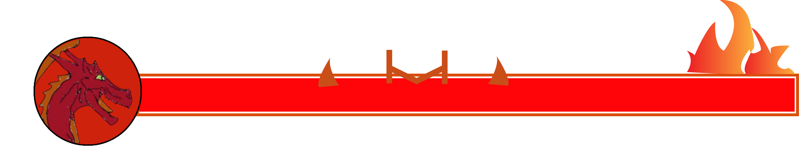
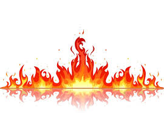
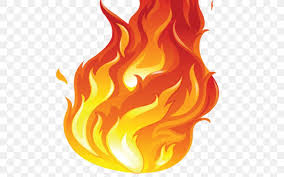

# **Initial sketch**

The idea of designing the health bar for boss in volcano is to include the basic rectangle, which indicates the health status, a fire ball located at the left of the health bar to represent the volcano zone and some elements of fire to decorate.

# **Visualization**
## Version 1

The gradient color is used for fire elements from Maximum Red to orange to make it similar with the fire in real world.

## Version 2

In oder to make it consisitent with other zones, I also design the version 2 of health bar as the swamp zone may confuse users because of the icon at the left of the health bar. This version uses the profile of boss and put it at the left of the health bar instead of elements icon.

The both two versions will be tested in the user testing and see which one would be suitable for our design.

## Color platte
Maximum Red - DA1F05 
Orange - FE650D 

# **Reference**

https://www.freelogovectors.net/flame-fire-2/

https://favpng.com/png_view/flame-vector-graphics-clip-art-flame-fire-png/bSjQNL6H
