# Description

The transition screen will appear when the player collects an orb and is proceeding to the next world.

# Transition Screen Design

**Version 1.0** (_14.09.2020_)
* The initial thought was to have the same design as the guideline (tutorial world design) to keep it simple and reduce workload.
* Alternatively, a simple rectanglular design with different colours representing each environment.
* The content written on the transition screen can be found in [Dialogue](dialogue).

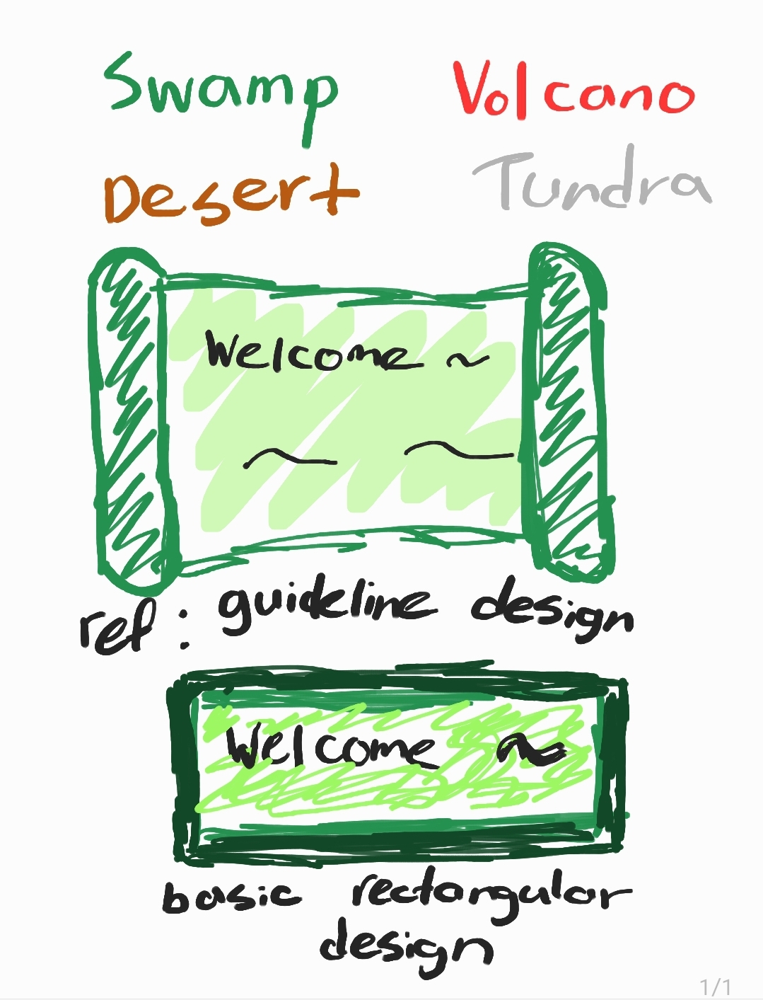

**User Testing** (_14.09.2020_)

Questions
* One design aims for simplicity and the other aims to be more stylish. Simplicity or stylish?
* (_shows the content_) With this length of content, which design do you think is more applicable?
* Finally, which of the following designs would be more applicable to appear as a transition screen?

Results
* A user said that he expects transition screens to appear for a short amount of time and mentioned how users just skip these kind of pop ups. So an enormous effort put into the stylish design won't enlighten the game experience. Suggested to aim to clearly deliver the context than overall design. Also, looking at the size of context, the user was 100% sided with the simple design.
* After a user observed the other designs for this game, he recommended to follow the overall game's trail of simplicity. 

**Version 2.0** (_16.09.2020_)
* Following the suggestions, the simple rectangular design has been utilised for the transition screens.
* To further enlighten the design, little improvements were made without hugely affecting the rectangle base.
* Each transition screens are exclusive for each environment. Use of colour brown, green, white, and red for desert, swamp, tundra, and volcano respectively.

* **Transitioning to Desert Zone**

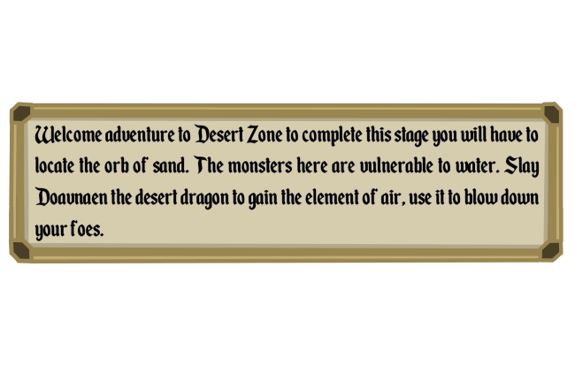

* **Transitioning to Swamp Zone**

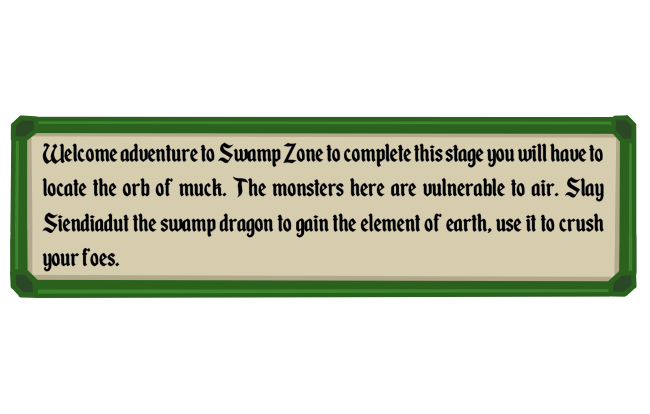

* **Transitioning to Tundra Zone**

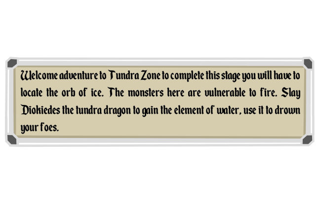

* **Transitioning to Volcano Zone**

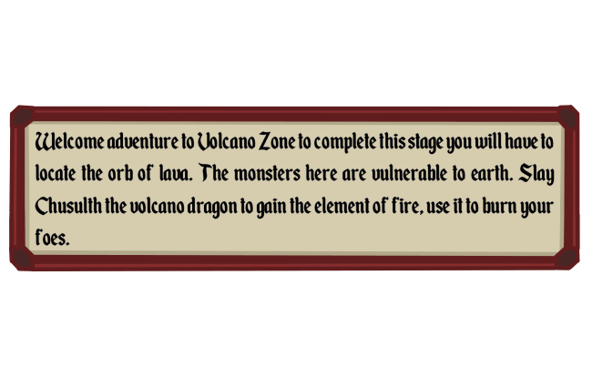

**User Testing** (_22.10.2020_)

Users found the text difficult to read, especially the dragon names. Characters such as 'k' was seen like a 'h' which was a visible issue. Furthermore, there was a feedback on how the text looks so packed in the box. They advised to make the box bigger to fit larger size text, hoping to make it more readable.

Extra medieval style fonts were shown to users. 

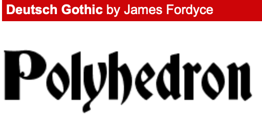
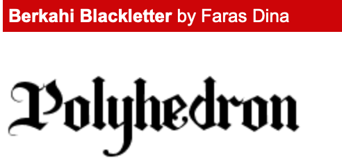

However, they found the current one most subtle and applicable to the game theme.

Additionally, users complimented how the use of different colours matching each environment is great. However, they advised to follow the same step for the center colouring as well, instead of uniting with brown(old paper like colour).

**Version 2.5** (_23.10.2020_)

The transition screen design is polished. Regarding previous user testing results, the words were somewhat difficult to read. So, the design is now increased in size, and word and line spacing is also modified. Additionally, colour corrections were made to further enlighten the design.

* **Transitioning to Desert Zone**

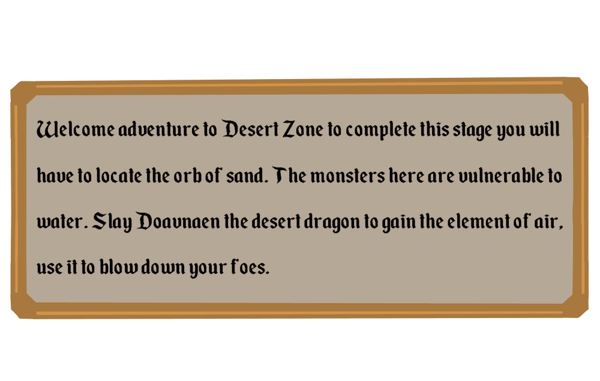

* **Transitioning to Swamp Zone**

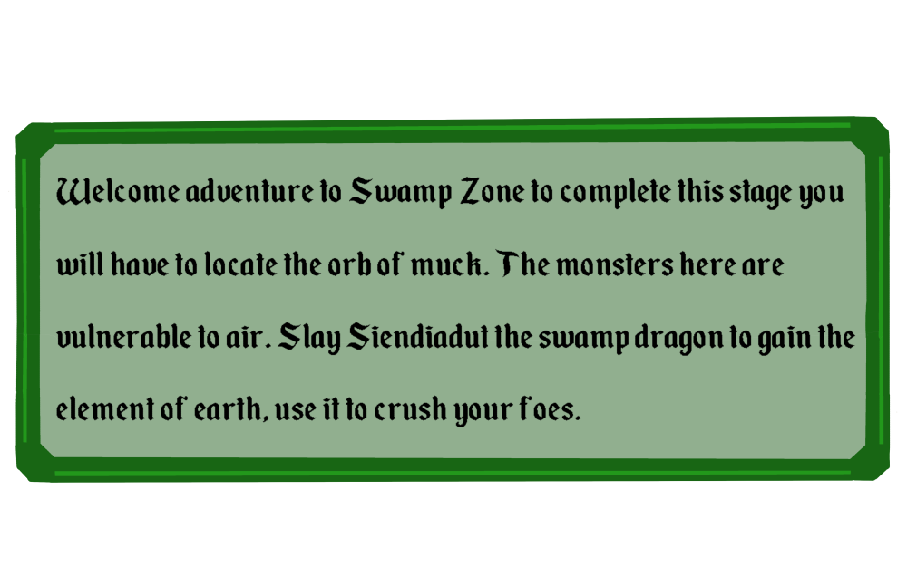

* **Transitioning to Tundra Zone**

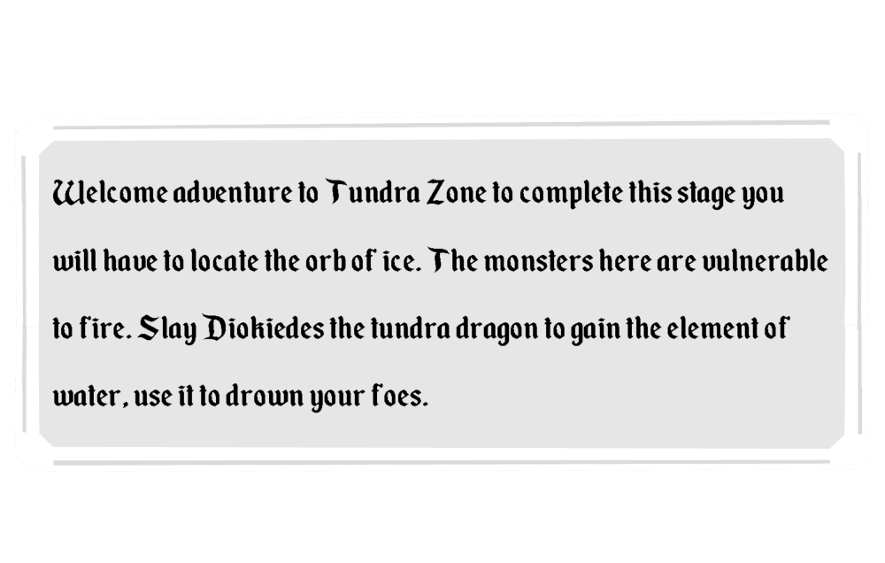

* **Transitioning to Volcano Zone**

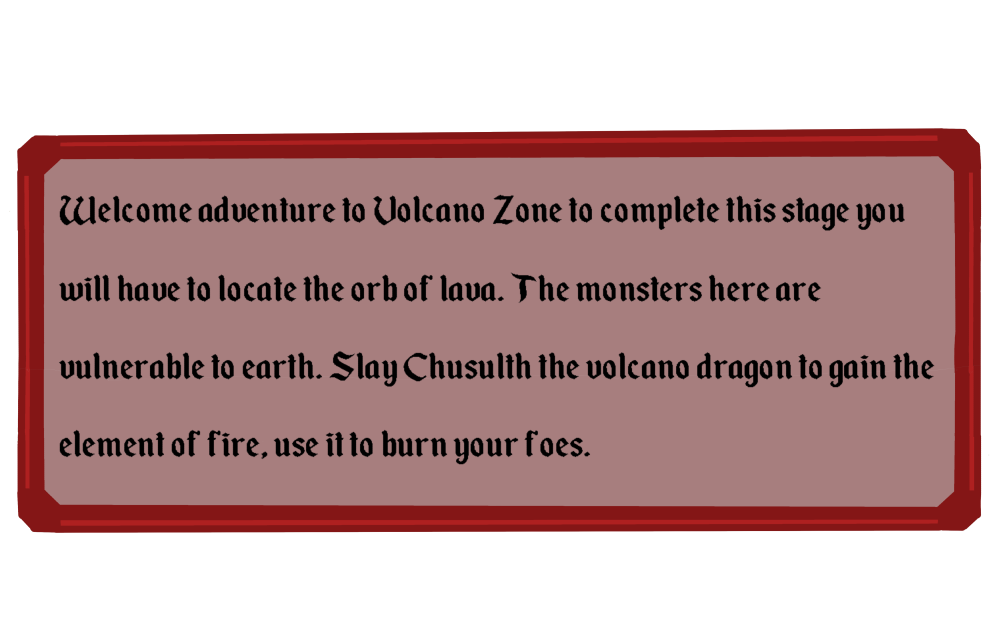

**Inspiration**
* The following examples inspired the transition boxes:

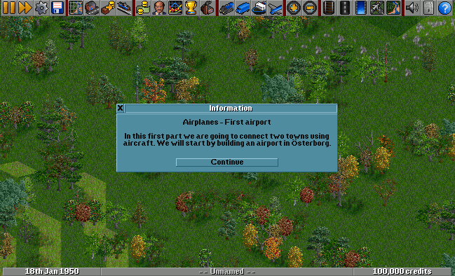
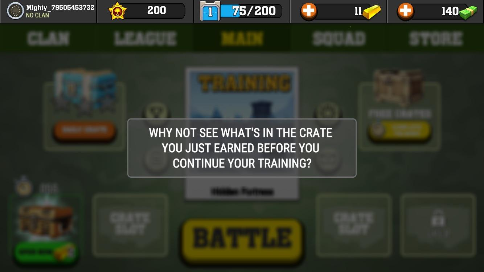
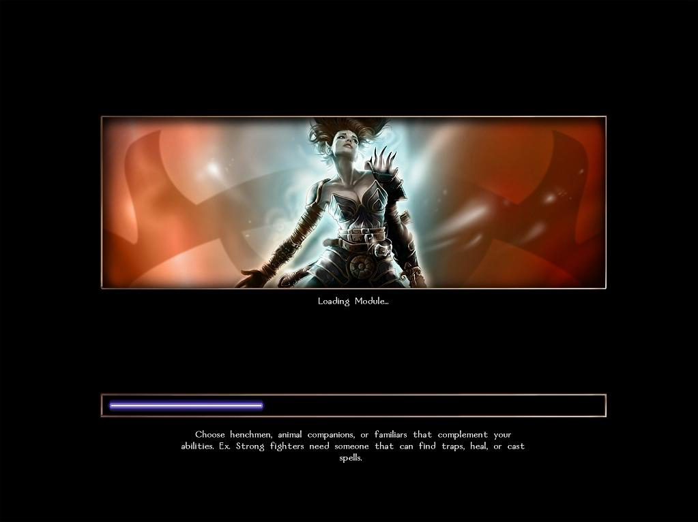

# User Testing Round 2:
Powerpoint slides were used for this round of user testing.
The users were introduced to the game and were asked a few sets of questions and some interactable tasks before playing through the game and answering some final questions.
The main purpose of this user test was to find out areas of improvement for the design style and smoothness of the transition from worlds and any other information from there. This user test is conducted at the same time as the user test for the [Quest Tracker UI](quest tracker UI) and [Menu Screens](Victory, Defeat, and Pause Menu Design) on the storyline pages.

Slides used for user testing:
https://drive.google.com/file/d/1Ex-TacmctazvUY_4QvXXGsqjSj_Q3dAJ/view?usp=sharing

<h3>User 1:</h3>

<b>Background of user 1</b>:
- Current University student with a diploma in Business IT and has experience doing designs and user testing 
- Plays game occasionally such as DOTA or Maplestory

<b>Feedback</b>:
- When asked about what he thought of the transition screen he added that some animation could be added when transitioning like fading to black before and after the screen rather than an "in-your-face" pop up.

<h3>User 2:</h3>

<b>Background of user 2</b>:
* Current University student has about 5 years of experience in design, UI/UX, and user testing
* Has extensive knowledge of different genres of games.

<b>Feedback</b>:
- When asked about what he thought of the transition screen he added that some the visuals had the feeling of a medieval vibe but it was not consistent with the overall of the game designs, as the current tiles used to display the world was pixelated but could be due to it being under development. Also lastly mention how the designs were similar to Newgrounds games from the 2000s. 
- He also added that the tutorial transition screen could be updated as the player would not know how to proceed from there, suggestion was to make it the same as the other worlds and the controls be moved out of that screen.
- A suggestion he made was the Stardew valley popup where at the start after entering the world a popup box would appear like so and display the instructions, and the player can close it with either a button or hotkey. An example would be an F9 key similar to the! key in the top right of the image where players can press or hit that key to open up the controls anytime in the game. 
- This can be further incorporated into the quest bar too later on in the game.
- ref: {{https://community.playstarbound.com/threads/the-pink-interface.129360/}}
- 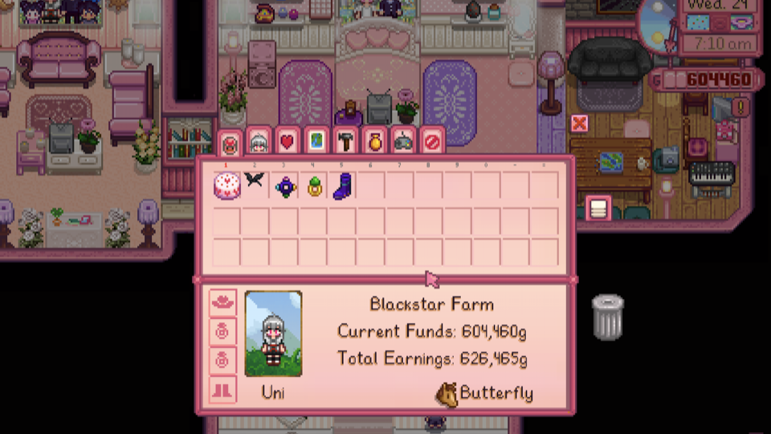

<h3>User 3:</h3>

<b>Background of user 3</b>:
* Working full time as a marketing executive
* Has about 6 years of experience and 2 years of practice while working with designs and UI / UX testing.

<b>Feedback</b>:
- Transition screen was well designed but, as I was playing I got killed accidentally by the cactuses and damaged by random tiles, could have added a warning sign or something before approaching it or added into the transition screen before playing the game.

<h3>Conclusion</h3>
- Overall certain aspects of the transition design were designed in a way that had the medieval feel but more can still be done to ensure consistency with the rest of the world.
- Animation could be added when polishing up the game
- More information about the new world can be included also as the game progresses. 

**References**
* OpenTTD (2014), In-game tutorial. Image retrieved from: https://wiki.openttd.org/In-game_tutorial
* r/assholedesign (2017), I downloaded a game and during the tutorial I can't skip the crate opening. This is how to get me to uninstall. Image retrieved from: https://www.reddit.com/r/assholedesign/comments/6nb88w/i_downloaded_a_game_and_during_the_tutorial_i/
* Stack (2014), What to show while a game is loading? Image retrieved from: https://ux.stackexchange.com/questions/65382/what-to-show-while-a-game-is-loading/66589

### Designer: @jisungkim.k
### Programmer: @quan281999
### Documentation by: @jisungkim.k
### User Tester Documentation: @yukaiku