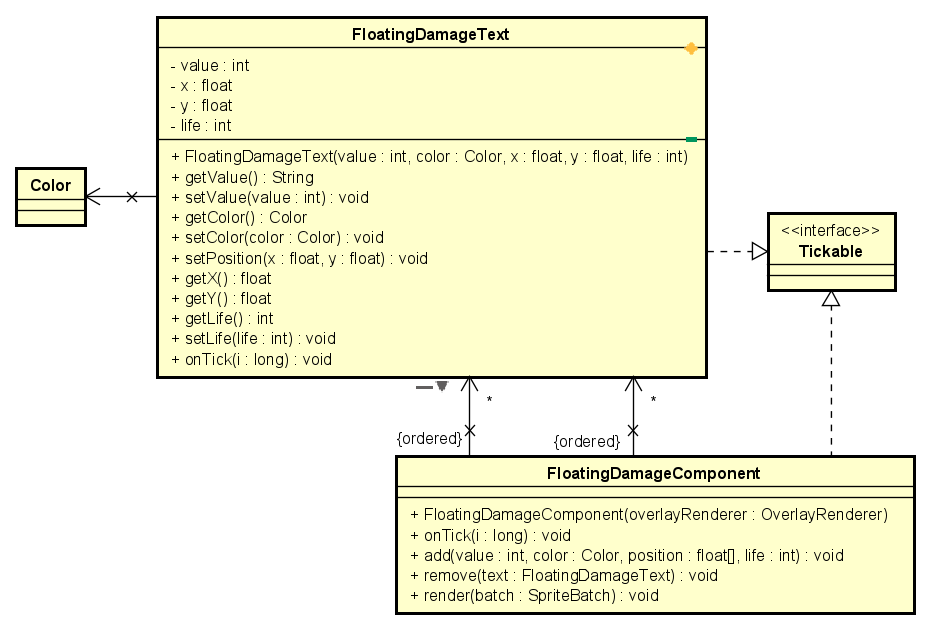

# ***Floating Damage Component***
The floating damage component is used to render text above the heads of peons when they take damage, providing feedback to the player about how much damage they are taking / receiving.

This is implemented as a OverlayComponent, which maintains a list of FloatingDamageText instances which store the state of individual damage text.

### UML Diagram of FloatingDamageComponent
