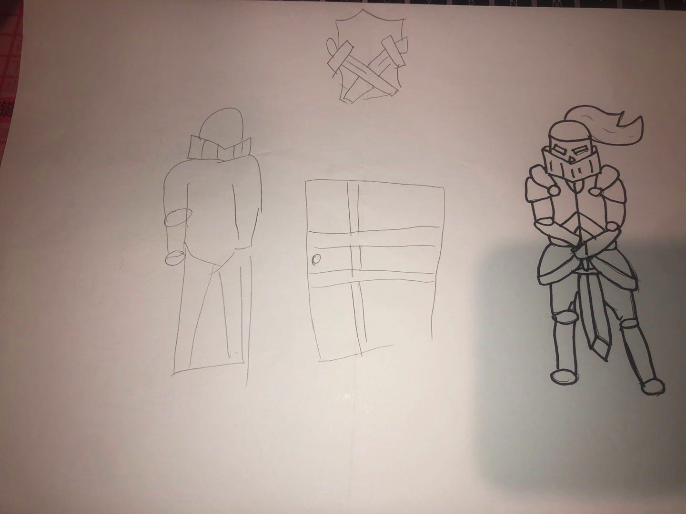
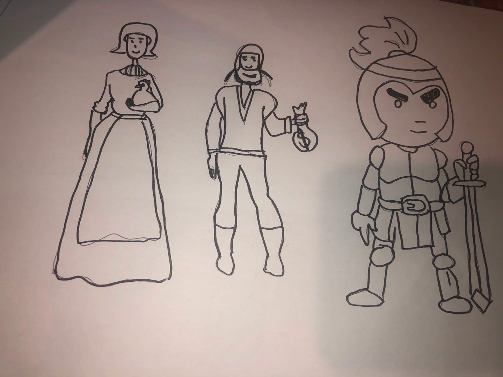
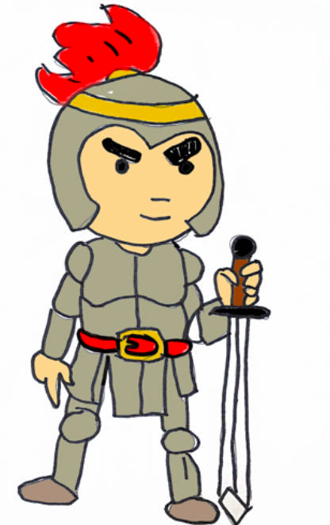
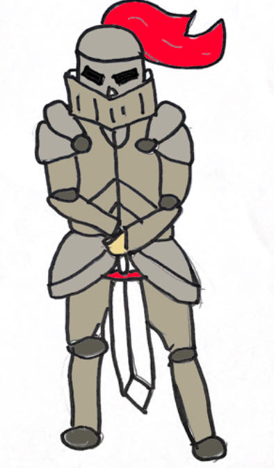
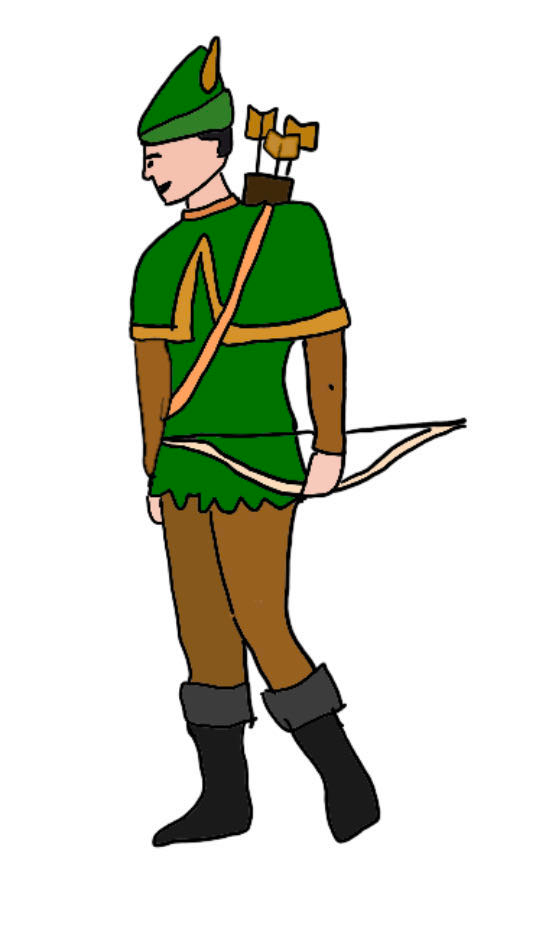
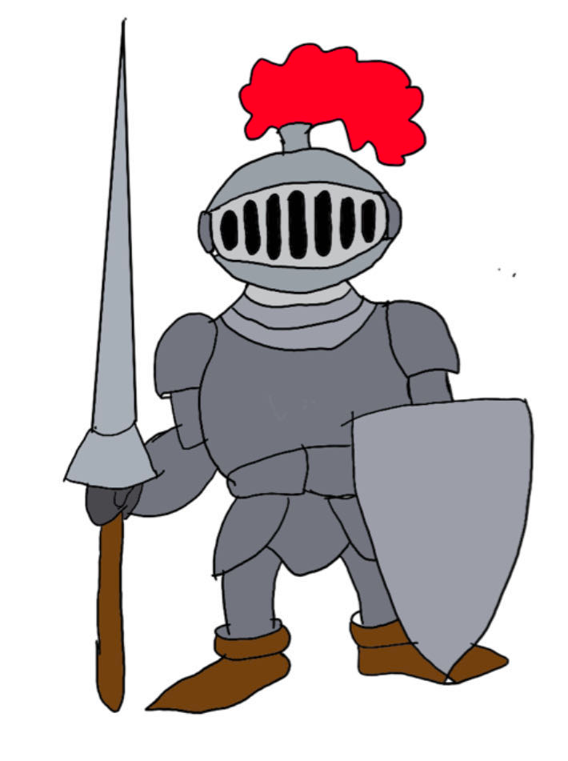

# **Description:** 
Environmental NPCs are NPCs in certain regions of the game that can provide players some guidance to fight the boss.

# **Design Processes:** 
.   

# **user test**
After design completed, a user testing will be conducted to test the acceptance of the design concept. The participants who will be invited for testing are students outside our studio, and they will be given the pictures and asked few questions based on the design.

User testing was done to find out which of the NPC designs provides best player interaction and experience. And the user test was done by online chatting with 5 interviews. First, we introduce the game concept to them to explain how the game works. And then, we ask some question to them:   
1,Do you play video game？   
2,How do the games you play most often to show the NPC？   
3,Here are each environment’s NPC, do you have any advice?
   

