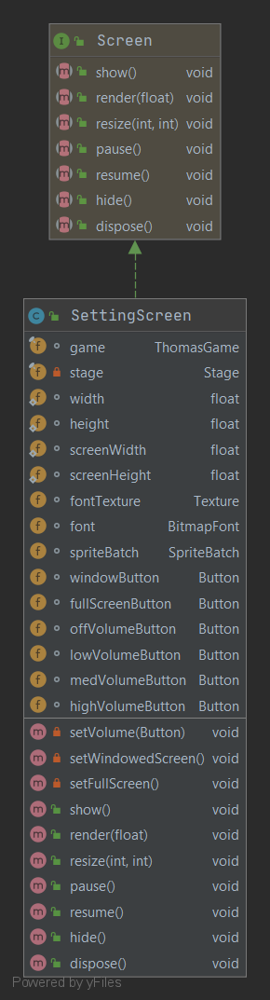
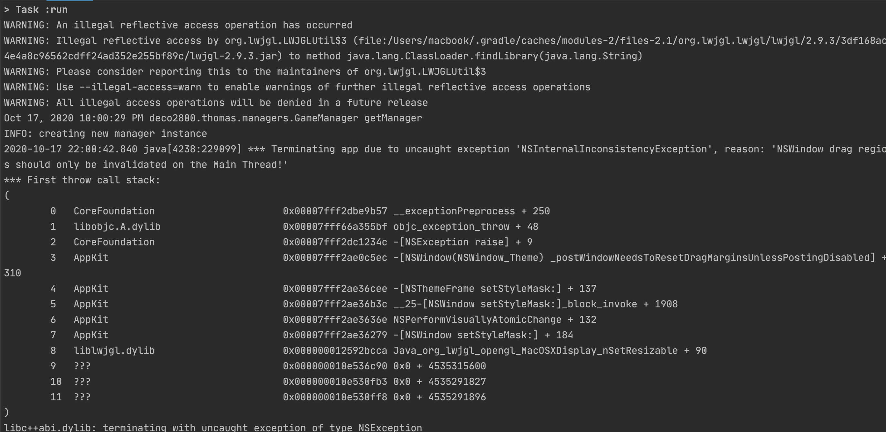

# screens/CharactersScreen.java
* This class implements `Screen`.
* The `render()` renders the background and all the buttons inside the screen.
* There are 2 main sections of the screen:
  * **Screen size**:
    * `windowButton`: The player clicks this button if he/she wants to set the game to windowed mode.
    * `setWindowedScreen()`: This function is called when the player clicks `windowButton`. It will set the screen to windowed mode using `Gdx.graphics.setWindowedMode()`.
    * `fullScreenButton`: The player clicks this button if he/she wants to set the game to full-screen mode.
    * `setFullScreen()`: This function is called when the player clicks `windowButton`. It will set the screen to windowed mode using `Gdx.graphics.setFullscreenMode()`.
  * **Audio Volume**:
    * `offVolumeButton`: The player clicks this button if he/she wants to turn off the sound of the game.
    * `lowVolumeButton`: The player clicks this button if he/she wants to set the volume to low (30% volume).
    * `medVolumeButton`: The player clicks this button if he/she wants to set the volume to medium (60% volume).
    * `highVolumedowButton`: The player clicks this button if he/she wants to set the volume to maximum (100% volume).
    * `setVolume()`: This function sets the volume of the game audio depends on the button that the player clicks.
# UML Diagram

# Bug
On MacOS, when the player switches to Windowed Mode, the game suddenly crashes. I run the game on Window and Ubuntu, everything runs smoothly. Seems like the bug only occurs on MacOS.

On the internet, I have found some users reporting the same error lately.
* https://github.com/dscalzi/HeliosLauncher/issues/70
* https://github.com/MultiMC/MultiMC5/issues/3173  

They got this error while playing Minecraft, which is written in Java. Seems like the crash is caused by OpenJDK and the lack of compatibility with macOS. One of the suggestions to solve this problem is using the older Java version (8.241). Therefore, my solution to this is to disable the button on macOS. The users still can switch to windowed mode on other operating systems but not macOS.
