# Description

The exclusively created tiles, objects, and guideline for Tutorial World. This document consists of design process of these products.

# Tile

* These are the three stone tiles with different tones that has been implemented in the tutorial world. 
* There were two options initially: wood or stone. For the final decision, the stone floor was selected due to its stronger resemblance to the medieval training rooms.

**Inspiration**
* The choice of tile type and colour was inspired by:

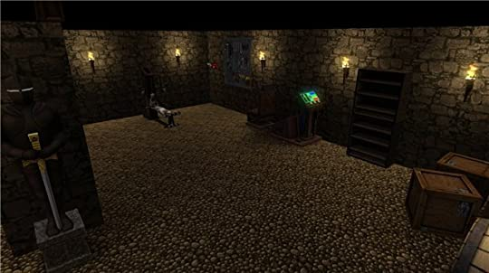

# Object

#### Barrel

**Version 1.0** (_24.08.2020_)
* The barrel has been sketched in the planning stage. It consists of basic principles of a wooden barrel.
* The barrel is a simple decoration object which belongs to the tutorial world.

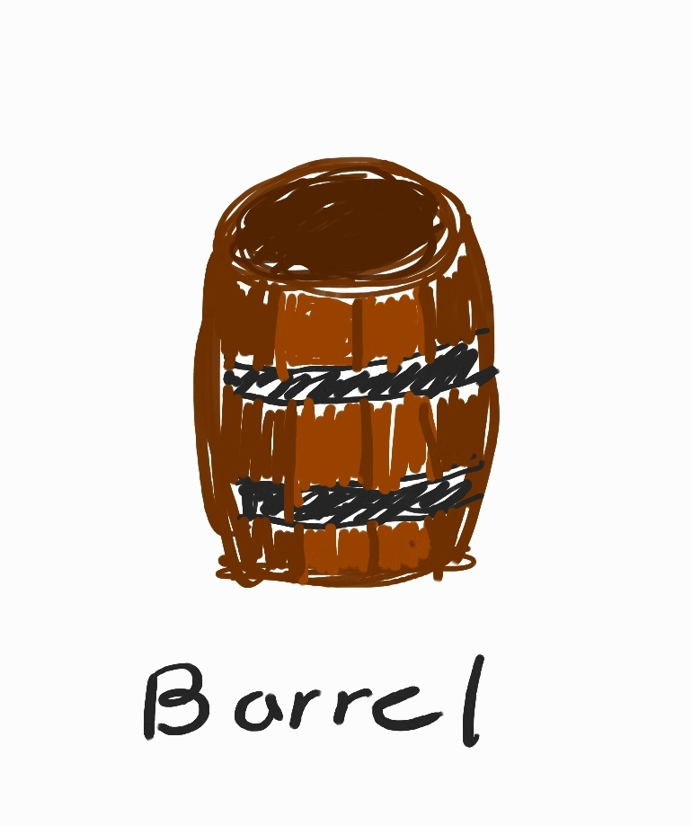

**Version 2.0** (_26.08.2020_)
* This is the very first design of the wooden barrel implemented in Sprint 1. 

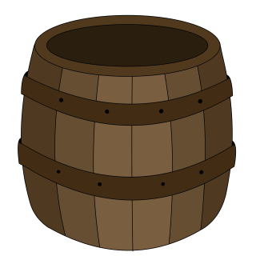

**Version 3.0** (_14.09.2020_)
* This is a new design of the barrel created in the middle of Sprint 2 after finding out the previous model did not resemble the overall game design.

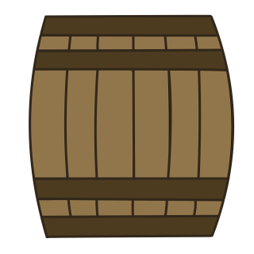

#### Portal

**Version 1.0** (_24.08.2020_)
* The portal has been sketched in the planning stage.
* The portal is an object which teleports player to the main game after completing the tutorial.

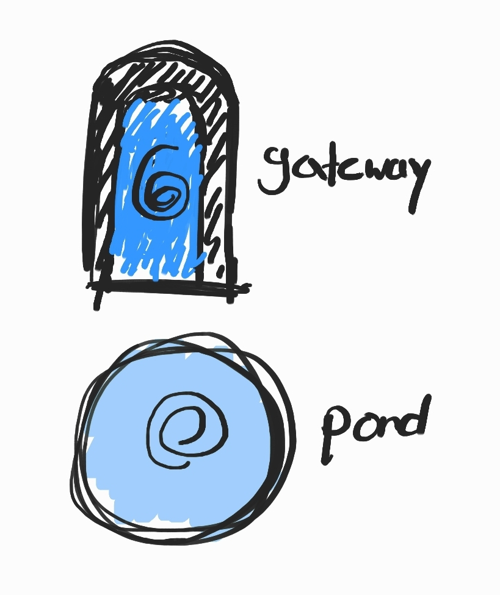

**Version 2.0** (_26.08.2020_)
* This is the very first design of the portal implemented in Sprint 1. Blue presents the colour of the portal, an addition of a whirl in the middle makes the portal more recognisable by users. Moreover, stone texture has been applied to the thick border around the actual portal.

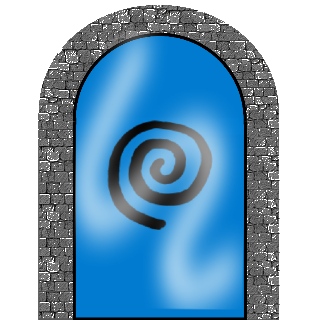

**Version 3.0** (_14.09.2020_)
* This is the new design of the portal built in the middle of Sprint 2 after finding out the previous model did not match the overall game design. It is made more simple, looking like a pond or well. The border of the portal is coloured brighter since the tutorial world's tiles are dark.

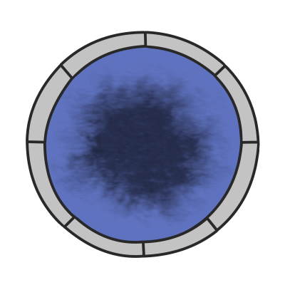

#### Target

**Version 1.0** (_24.08.2020_)
* This is the sketch of the target in the planning stage.
* The target is a simple decoration object which belongs to the tutorial world.

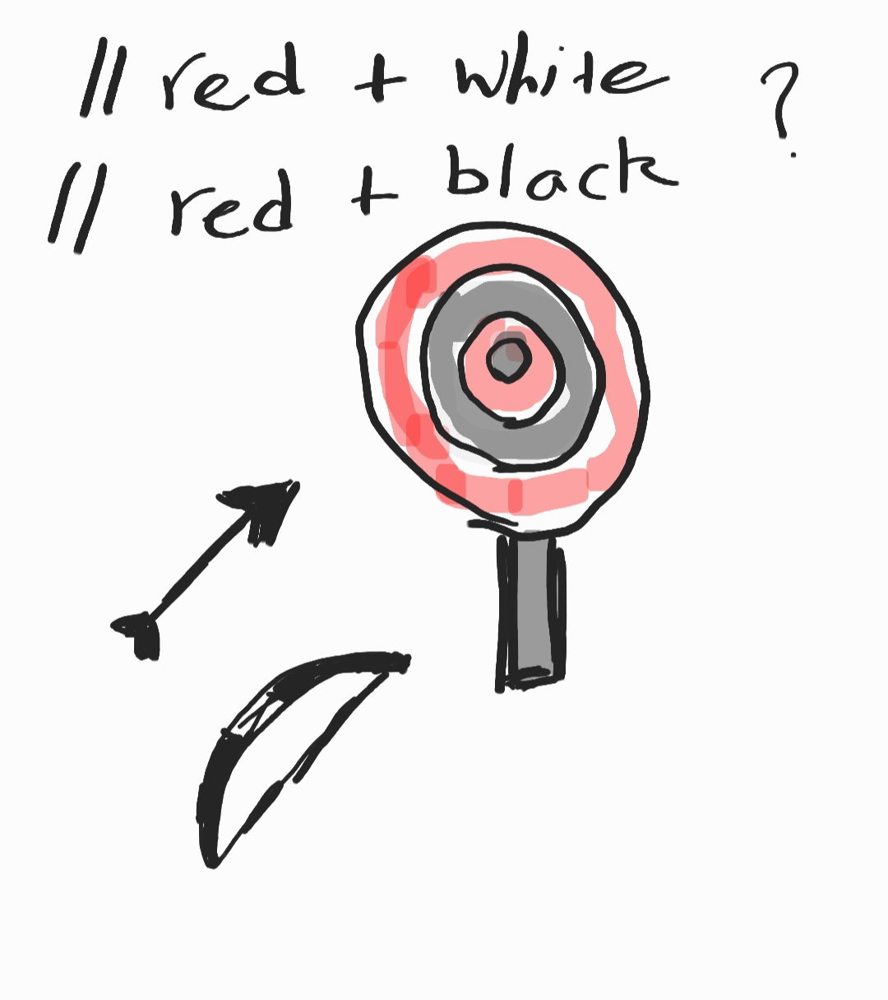

**Version 2.0** (_07.09.2020_)
* This is the developed target design during Sprint 2.

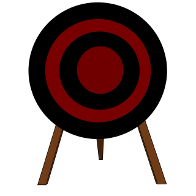

#### Stash

**Version 1.0** (_31.08.2020_)
* This is the sketch of the weapon stash in the planning stage.
* The stash is a simple decoration object which belongs to the tutorial world.

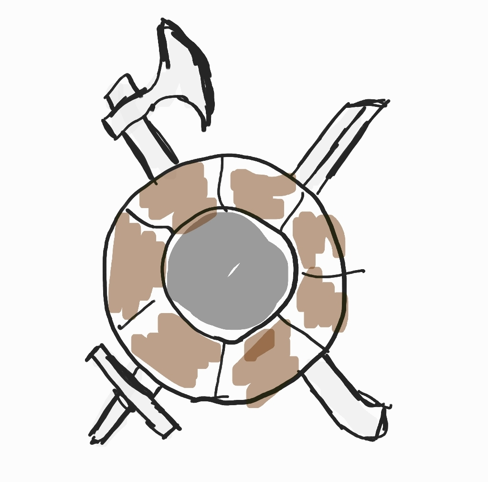

**Version 2.0** (_08.09.2020_)
* This is the created weapon stash design. It involves a shield, sword, and axe to match the medieval theme.

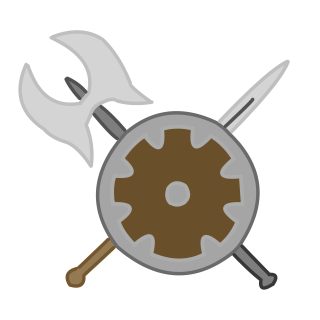

#### Chest

**Version 1.0** (_08.09.2020_)
* This is the chest implemented in Sprint 2. This additional object was created due to the possibility of inventory items being added to the game in the future. Which players will likely be able to access in the tutorial world and test it out before moving into the main world. If the tutorial world does not contain the inventory feature, this object will just act as a simple decoration object.

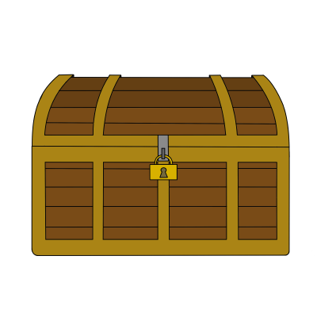

#### Leave Message

**Version Temporary** (_19.09.2020_)
* Referencing the user testing in [World Transition Screen Design](World Transition Screen Designs).
* In sprint 2, tutorial is combined with the main world. It is a step players must go through. But, the issue was users did not know how to leave the tutorial world. Due to lack of time, a quick and efficient method was used. Above the portal which teleport players to the main world, a "Leave" sign will be added. This would definitely improve the gaming experience by not leaving them behind confused.

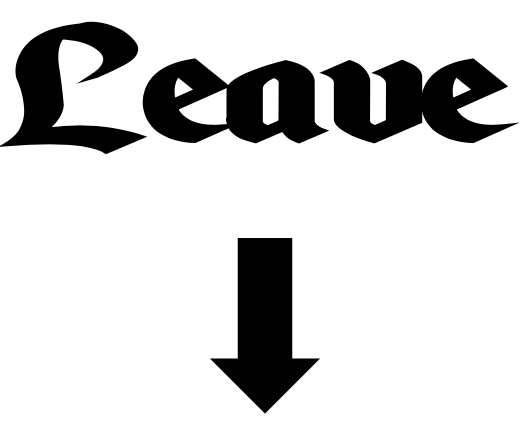

# Guideline

**Version 1.0** (_31.08.2020_)
* The plan was to make a guideline which gives players an insight into the story and controls.
* Without making this too luxurious, it was decided to make it simple as possible with a boxy design.
* Contents added in the guideline is provided by [Dialogue](dialogue).

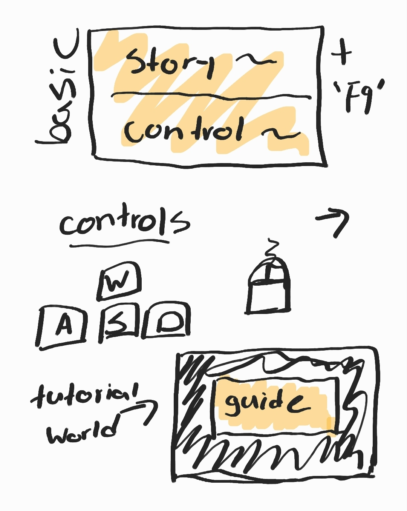

**Version 2.0** (_04.09.2020_)
* Guideline will appear when the player enters the tutorial world.
* Players can press F9 to toggle this box on and off.
* Gold frame utilised to grab player attention.
* Font "Enchanted Land" was found the most applicable considering its easy to read compared to other medieval style fonts.
* Underlined "Collect all the orbs" and "defeat all the daunting beings" for players to notice as those are the main objectives.
* Worn texture applied to give decaying vibe.
* Visual representation of control keys (movement and combat) instead of wordy explanation. More fast and efficient.
* Placed on the bottom half (UX).

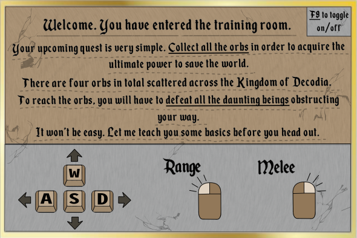

**User Testing** (_09.09.2020_)
* The guideline design looked quite skeptical, even in the designer's point of view. So a user testing session has been conducted with multiple participants.

Questions
* Would you prefer a wordy explanation of control keys or visual guide shown in this design?
* As a user, would you really care about the design of the guideline?
* Does this design give you a medieval vibe?

Results
* It was found that visual guide of the controls are much more effective since most users are already used to it. It only took them few seconds to completely go through it. While the wordy explanation required more time reading which users don't like to do. 
* Guideline does not really affect the experience of the game but having a nice design would be preferable. 
* It certainly does give a medieval vibe but too much. It reminds me of horse riding and stuff. Maybe more fantasy theme elements.
* Don't think the gold frame really fits with the game design. Looks too real.
* Design looks kind of boring.
* The wood texture and stone texture doesn't get along.

**Version 3.0** (_16.09.2020_)
* The guideline has been completely re-designed to meet the satisfaction of users.
* This time the box has been completely abandoned. It uses a base which is likely more applicable with the game theme. It utilises a scroll which can be seen in media. The medieval scroll usually contains messages, quests, or map. 
* Due to the lack of space, F9 key is added to the side of the design.

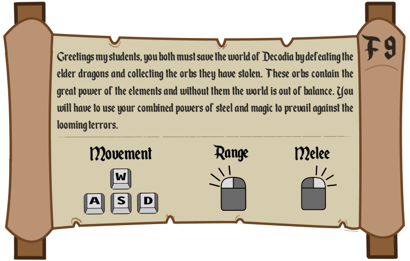

**User Testing 2** (_16.09.2020_)
* A quick user testing has been conducted before finalising this design as the guideline.

These were some brief feedbacks:
* Besides the wordy story introduction, everything else looks visually great and user friendly.
* Ignored F9 because it didn't look like it mattered. Don't know what it does.
* The word 'quest' or 'map' comes up to mind when looking at the overall design.
* The bright colour choices match the art style of the game. Bright colour is the way to go since the background (_tutorial world_) seems quite dark.
* What does the F9 do?

Thoughts:
* The design was praised by the participants. However, there were also some issues identified through this method.
* The F9 key placed on the side left users confused because it had no clear instructions on how and what it does. Nobody likes to read paragraphs in a game. But due to the game style and the need of story introduction, it cannot be abandoned.

**Version 3.1** (_17.09.2020_)
* Instead of solely having "F9" at the side which users couldn't instantly figure out what it does, now it has a clear instruction set of "Press F9 to toggle off".
* Players will now be able to exit the guideline without any delay or confusion.

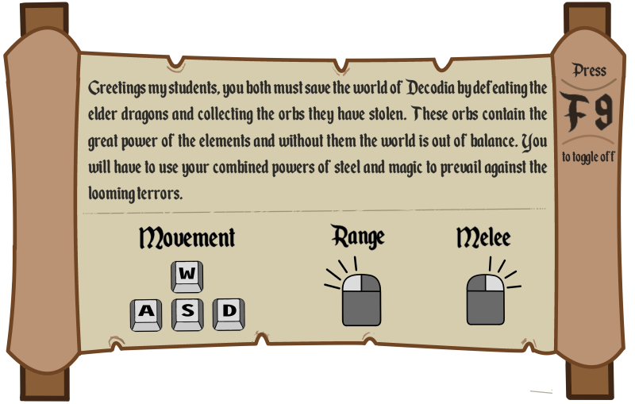

**Version 4.0** (18.09.2020_)
* _Referring to the major user testing in [World Transition Screen Design](World Transition Screen Designs)_.
* The guideline no longer consists of both story and control. It is now separated into two pieces.
* The story aspect of the guideline is not much different from the previous design. Due to an increase of leftover space, a button will be coded here for users to click to close.
* Control copied the [World Transition Screen Design](World Transition Screen Designs) respecting the suggestion users made. Only difference is the colour changes and an addition of instruction set "Press F9 to continue".

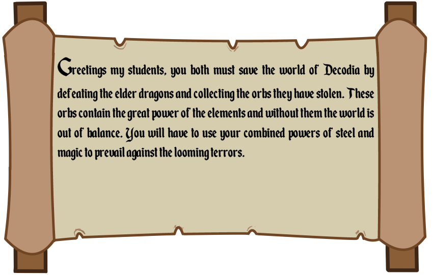
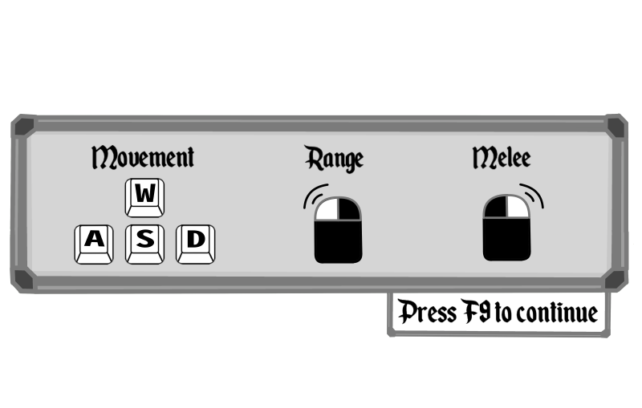

**Version 4.5** (_23.10.2020_)
* Two designs were polished. Added more control information players should know before entering the world.

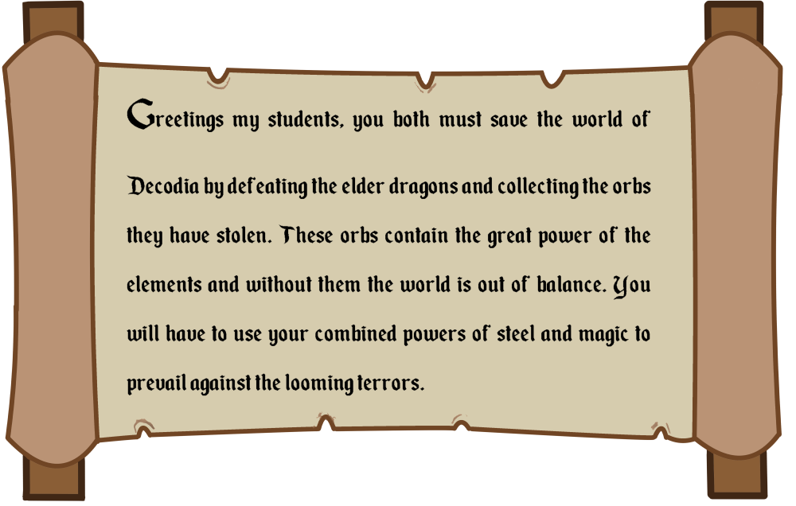
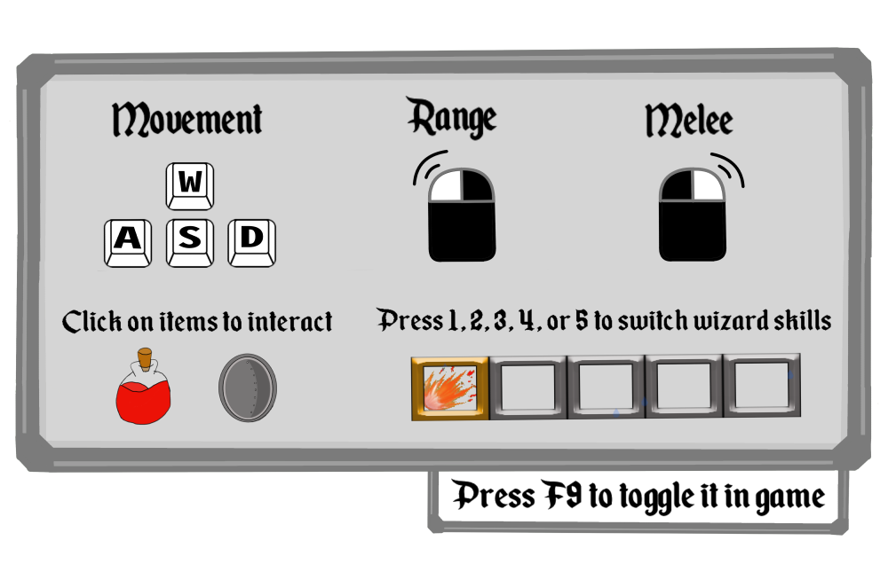

**Inspiration**
* The guideline design was inspired by:

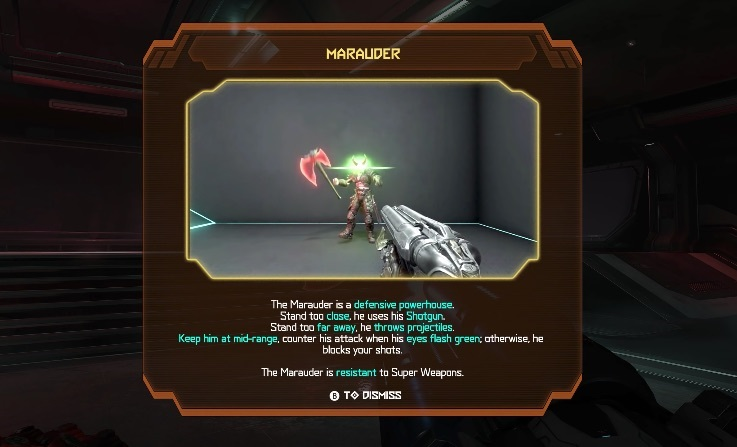
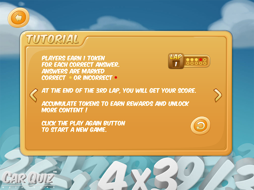

# References
* SADIYA (2012), Training Room/ Weapons Room. Image retrieved from: https://www.goodreads.com/topic/show/777614-training-room-weapons-room
* mrbondex (2020), A Doom Eternal tutorial pop-up. Image retrieved from: https://www.gamespot.com/articles/psa-doom-eternals-tutorials-are-a-menace-turn-them/1100-6475328/
* carquizgame (2015), Carquiz math game screenshoot gallery. Image retrieved from: http://www.carquizgame.com/screenshots.htm

### Designer: @jisungkim.k
### Programmer: @quan281999
### Documentation by @jisungkim.k